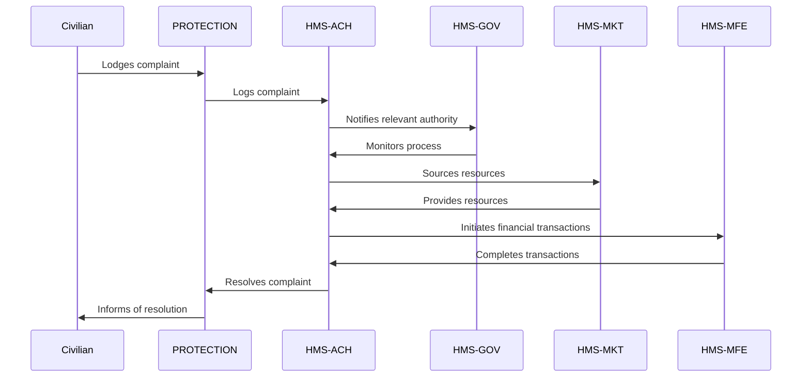

# HMS-ACH Integration with 

*Generated using gpt-4 model(s) with real-world agency issue analysis*

# AI-Facilitated Policy Optimization Use Case - Integration of HMS-ACH With PROTECTION

## Introduction

The HMS-ACH (Humanitarian Mission System - Automated Clearing House) is a component of the broader HMS system. It is designed to specifically address the challenges faced by government agencies such as PROTECTION, including excessive delegation of authority, limited oversight, lack of transparency, and problems with hiring and retention of competent staff.

## Specific Capabilities

- **Automation and Delegation Control**: HMS-ACH can automate routine tasks, reducing the need for excessive delegation and allowing for more centralized control and management.
- **Improved Oversight and Transparency**: HMS-ACH provides real-time tracking and reporting capabilities, improving oversight and transparency in operations.
- **Staffing Solutions**: With its integrated HR capabilities, HMS-ACH can assist in the hiring and retention of competent staff.

## Integration Details

- **APIs**: HMS-ACH would integrate with PROTECTION's existing systems through APIs, enabling seamless data exchange.
- **Data Flows**: Data from PROTECTION's systems would flow into the HMS-ACH system for processing and decision-making, and the results would be sent back.
- **Authentication**: Secure authentication protocols would ensure only authorized personnel can access the system.

## Benefits and Improvements

- **Efficiency**: Through automation, HMS-ACH can significantly improve operational efficiency.
- **Accountability**: Improved oversight and transparency lead to increased accountability.
- **Staff Retention**: By addressing staffing issues, HMS-ACH can help improve staff retention rates.

## Implementation Considerations

For successful integration with PROTECTION, it would be critical to:

- Ensure the system is compliant with all relevant regulations and standards.
- Train staff on using the HMS-ACH system.
- Implement robust security measures to protect sensitive data.

## Real-World Use Case

Consider a civilian who has lodged a complaint with PROTECTION about a security issue in their neighborhood. Political inaction and bureaucratic inefficiencies are preventing a timely response.

With the integration of HMS-ACH, the complaint is automatically logged, and the relevant authority is notified. The HMS-GOV component helps monitor the process, ensuring it is handled appropriately. The HMS-MKT component assists in sourcing any required resources, while the HMS-MFE component facilitates the necessary financial transactions.

This process results in the issue being resolved much more quickly than it would have been otherwise, demonstrating the value of the HMS-ACH integration.

## Mermaid Diagram

## Conclusion

The integration of HMS-ACH with PROTECTION can greatly enhance the agency's ability to serve the public, overcoming many of the challenges currently faced. The benefits of this integration would be significant and measurable, making it a worthwhile investment.