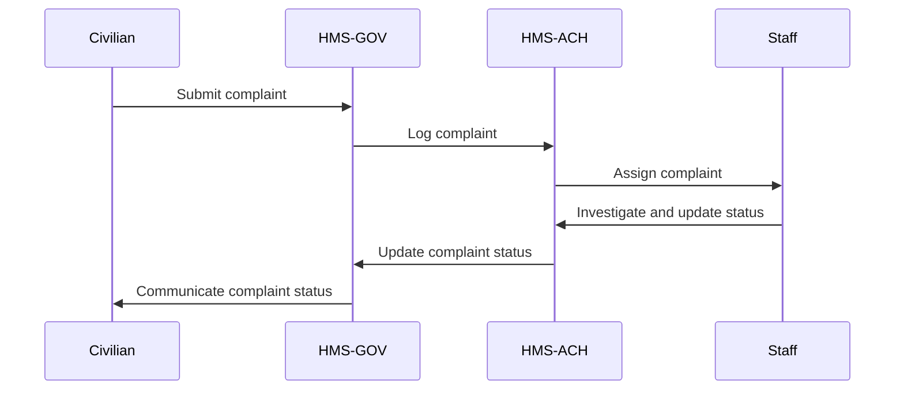

# HMS-ACH Integration with 

*Generated using gpt-4 model(s) with real-world agency issue analysis*

# AI-Facilitated Policy Optimization Use Case: HMS-ACH and SAFETY

## Introduction

The HMS-ACH (Abundance Clearing House) system component is a revolutionary tool designed to streamline operations, improve transparency and efficiency, and provide comprehensive solutions to the challenges government agencies face. This integration is particularly beneficial for agencies focused on safety.

## Specific Capabilities of HMS-ACH

- **Efficiency and Transparency**: HMS-ACH offers robust features that increase efficiency, such as automated workflows, advanced data analytics, and real-time reporting. This can mitigate the issue of excessive delegation of authority and lack of transparency within the bureaucracy.
- **Talent Management**: HMS-ACH includes features for human resource management, which can help in hiring and retaining competent staff.
- **Budget Management**: HMS-ACH provides tools to manage budget constraints effectively.
- **Security**: HMS-ACH was built with state-of-the-art security measures to ensure data is safe and secure.

## Technical Integration

- **APIs**: HMS-ACH will use APIs to connect with other systems within the agency.
- **Data Flows**: Through the use of these APIs, data will flow seamlessly between HMS-ACH and other systems, allowing for real-time updates and information sharing.
- **Authentication**: HMS-ACH will use secure authentication protocols to ensure only authorized personnel can access the system.

## Benefits and Improvements

- **Improved Efficiency**: By automating tasks and streamlining workflows, HMS-ACH can significantly improve efficiency within the agency.
- **Enhanced Transparency**: With real-time reporting and analytics, HMS-ACH provides increased transparency, leading to improved trust and accountability.
- **Improved Staff Retention**: The talent management features of HMS-ACH can aid in the recruitment and retention of skilled staff.
- **Increased Security**: The robust security measures of HMS-ACH can ensure the agency's data is secure, thereby increasing trust among stakeholders.

## Implementation Considerations

- **Training**: Staff will need to be trained on the use of HMS-ACH.
- **Data Migration**: Existing data will need to be migrated to HMS-ACH.
- **Integration with Existing Systems**: HMS-ACH will need to be integrated with existing systems to ensure seamless data flow.

## Real-World Use Case

Let's consider the case of the National Highway Traffic Safety Administration (NHTSA), whose mission is to save lives, prevent injuries, and reduce road traffic crashes.

### The Civilian Problem

Citizens experience delays in the resolution of their complaints due to bureaucratic red tape, and this has eroded trust in the agency.

### Political Inaction

Political gridlock has prevented the implementation of reforms that could streamline operations and improve customer experience.

### The Role of HMS Components

HMS-ACH, along with HMS-GOV (Government Operations and Voting), HMS-MKT (Market), and HMS-MFE (Multi-Fiat Exchange), can overcome this gridlock. 

- HMS-ACH can streamline operations and improve transparency.
- HMS-GOV can facilitate communication between the agency and its stakeholders.
- HMS-MKT can enable the agency to allocate resources more efficiently.
- HMS-MFE can provide the agency with a more flexible and effective means of managing its budget.

### Workflow

1. A civilian submits a complaint via HMS-GOV.
2. The complaint is automatically logged in HMS-ACH and assigned to a staff member.
3. The staff member investigates the complaint and updates the status in HMS-ACH.
4. The civilian can track the status of their complaint via HMS-GOV.
5. Once the complaint is resolved, the result is communicated to the civilian via HMS-GOV.

### Measureable Outcomes

- Reduction in the time taken to resolve complaints
- Increase in the number of complaints resolved
- Improvement in citizen satisfaction

### Mermaid Diagram

By integrating HMS-ACH with its operations, NHTSA can reduce bureaucratic red tape, streamline operations, and improve customer experience, thus restoring citizens' trust in the agency.