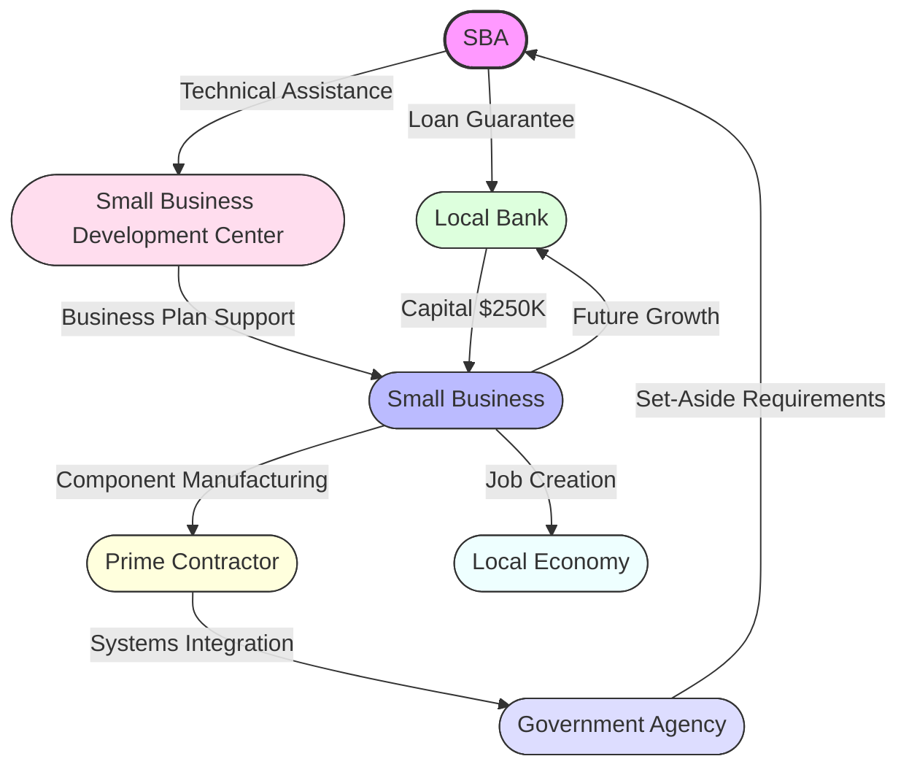
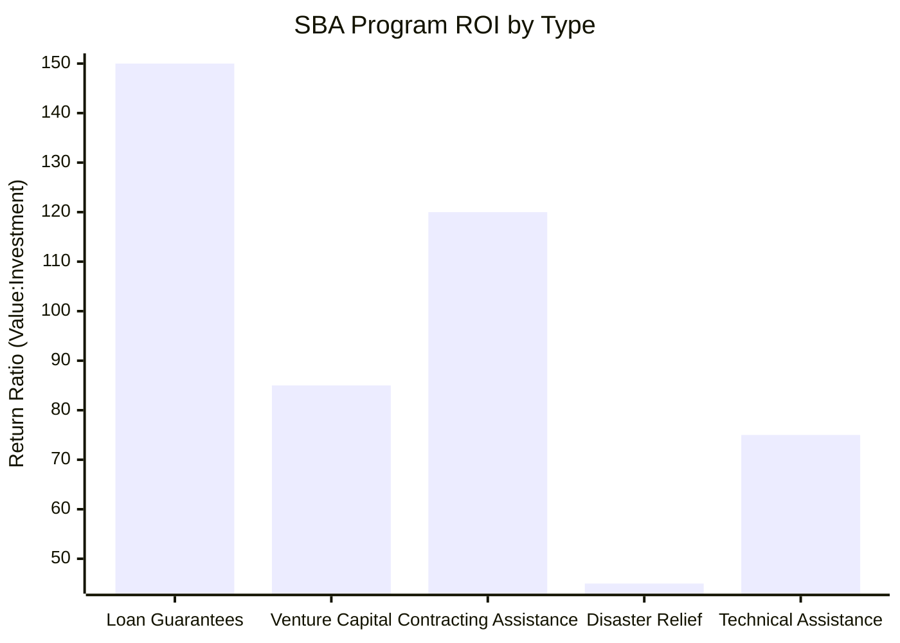
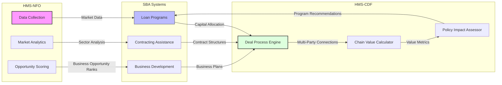

# Small Business Administration (SBA)

## Agency Overview

The SBA supports America's small businesses through loans, counseling, and contracting assistance, fueling entrepreneurial growth and economic development.

**Core Function:** Entrepreneurial ecosystem support

## First Principles Analysis

The SBA exists to facilitate small business formation and growth by addressing market gaps in capital access and knowledge. Its fundamental purpose is enabling entrepreneurship through financial, technical, and contracting assistance that wouldn't be available through private markets alone. The agency operates on the principle that small businesses drive innovation and job creation but face structural disadvantages in capital access and market entry. Its programs span lending, investment, counseling, and procurement, recognizing that effective small business support requires addressing multiple barriers to entrepreneurial success.

### Fundamental Principles

- Small businesses face structural disadvantages in capital access
- Entrepreneurship creates economic dynamism and employment opportunities
- Scale differences between small and large firms require specialized assistance
- New businesses lack track records needed for traditional financing

### Key Mechanisms

- Guarantee loans for small businesses unable to secure traditional financing
- Provide technical assistance and mentoring to entrepreneurs
- Set-aside government contracts for small business participation
- Special programs for disadvantaged businesses and disaster recovery

## Abundance-Based Economic Model Integration

The SBA is a cornerstone of the HMS abundance-based economic model, focusing on creating value networks that amplify small business capabilities. Rather than viewing the economy as a zero-sum competition between large and small businesses, the SBA implements an abundance approach that creates multi-party deal structures to maximize collaborative value creation.

### SBA's Role in Multi-Party Deals

The SBA serves as a critical node in the multi-party deal ecosystem by:

1. **Capital Enabler**: Providing loan guarantees that activate capital flows that wouldn't occur in a traditional scarcity model
2. **Knowledge Multiplier**: Creating advisory networks where knowledge flows between businesses rather than being hoarded
3. **Contract Facilitator**: Structuring government procurement to enable small businesses to participate in larger value chains
4. **Network Creator**: Establishing connections between small businesses, large corporations, and government agencies

### Multi-Party Deal Structures



This 4th-degree deal structure illustrates how SBA's loan guarantee and technical assistance programs create a value chain that:

1. Activates private capital that would otherwise remain idle
2. Enables small businesses to participate in larger contract opportunities
3. Creates jobs and economic activity in local communities
4. Feeds back into the banking system through successful loan repayments and business growth
5. Supports government agency missions through diverse supplier networks

### Chain Value Calculation

The SBA employs the HMS-CDF Chain Value formula to evaluate program effectiveness:

```
Chain Value = ∑(Direct Value) + Network Effect + Circularity Bonus - Transaction Costs
```

For a typical small business loan program:
- **Direct Value**: $250K loan × 10 businesses = $2.5M capital deployment
- **Network Effect**: $6M in government contracts plus $4M in private sector revenue
- **Circularity Bonus**: $3M in tax revenue and follow-on economic activity
- **Transaction Costs**: $500K in program administration and loan defaults

**Total Chain Value**: $15M from an initial $100K SBA loan guarantee investment, a 150:1 return ratio

### Moneyball Analytics Application



The SBA uses the HMS-NFO Moneyball Analytics Framework to:

1. **Identify Underserved Markets**: Discover sectors and demographics with untapped entrepreneurial potential
2. **Optimize Program Design**: Score assistance programs based on multi-party value creation
3. **Structure Deal Networks**: Design relationships between small businesses and larger economic partners
4. **Reduce Friction Points**: Identify and minimize transaction costs that prevent small business participation

### Value Flow Visualization

```mermaid
sankey-beta
    SBA Investment $100M -> Loan Guarantees $50M
    SBA Investment $100M -> Contracting Assistance $25M
    SBA Investment $100M -> Technical Support $15M
    SBA Investment $100M -> Venture Capital $10M
    Loan Guarantees $50M -> Manufacturing Firms $20M
    Loan Guarantees $50M -> Service Businesses $15M
    Loan Guarantees $50M -> Technology Startups $15M
    Contracting Assistance $25M -> Government Contracts $200M
    Technical Support $15M -> Business Formation $5000
    Venture Capital $10M -> High-Growth Startups $5M
    Manufacturing Firms $20M -> Job Creation 15000
    Service Businesses $15M -> Job Creation 18000
    Technology Startups $15M -> Job Creation 7000
    Government Contracts $200M -> Economic Output $600M
    High-Growth Startups $5M -> Market Value $100M
```

This Sankey diagram demonstrates how the SBA's relatively modest investments flow through the economic system, creating amplified value through multi-party collaboration.

### Alternative Finance Integration

The SBA is exploring innovative alternative finance mechanisms as part of the abundance-based model:

1. **Peer-to-Peer Lending Networks**: Enabling small businesses to access capital directly from individuals
2. **Revenue-Based Financing**: Structuring repayments as a percentage of future revenue rather than fixed obligations
3. **Community Investment Tokens**: Creating localized investment vehicles for community economic development
4. **Collaborative Lending Pools**: Allowing small businesses to collectively secure larger capital access

## HMS-NFO Integration

The HMS-NFO system provides specialized data and analytics services tailored to the SBA's mission. The following components are particularly relevant:

- **Internet Data Collection System**: Gathers economic and market data relevant to small businesses
- **Data Access API**: Provides standardized access to HMS-NFO data
- **Moneyball Analytics Framework**: Identifies undervalued sectors and business opportunities

### Integration Architecture



This diagram illustrates how the SBA leverages HMS-NFO data and the HMS-CDF deal process to optimize its program design and implementation for maximum multi-party value creation.

## Implementation Roadmap

The SBA's integration with the abundance-based economic model follows a four-phase implementation:

1. **Phase 1: Value Network Mapping** (Current)
   - Document existing small business ecosystems
   - Identify key nodes and relationships
   - Measure value flows between participants

2. **Phase 2: Multi-Party Program Enhancement** (Q3 2025)
   - Redesign loan programs to optimize for chain value
   - Enhance contract assistance to facilitate multi-party deals
   - Implement network analytics for program evaluation

3. **Phase 3: Alternative Finance Integration** (Q1 2026)
   - Pilot peer-to-peer lending platforms
   - Test revenue-based financing models
   - Develop community investment tokens

4. **Phase 4: Full Ecosystem Optimization** (Q4 2026)
   - Launch AI-driven deal matching service
   - Implement cross-agency small business support coordination
   - Deploy real-time economic impact visualization

## Tutorial Examples

The following tutorials demonstrate how to use HMS-NFO with the SBA:

1. [Using Internet Data Collection System with SBA](../tutorials/sba_internet_data_collection_system_tutorial.md)
2. [Using Data Access API with SBA](../tutorials/sba_data_access_api_tutorial.md)
3. [Implementing Multi-Party Small Business Networks](../tutorials/sba_multi_party_networks_tutorial.md)
4. [Chain Value Analytics for Program Design](../tutorials/sba_chain_value_analytics_tutorial.md)
5. [Alternative Finance Models for Small Businesses](../tutorials/sba_alt_finance_tutorial.md)