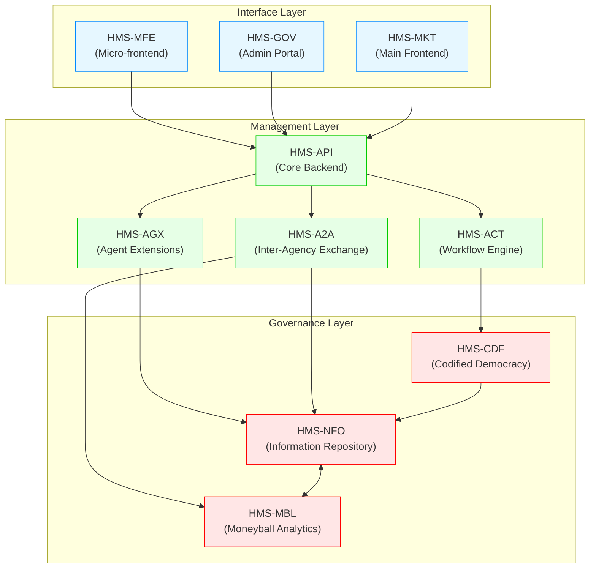
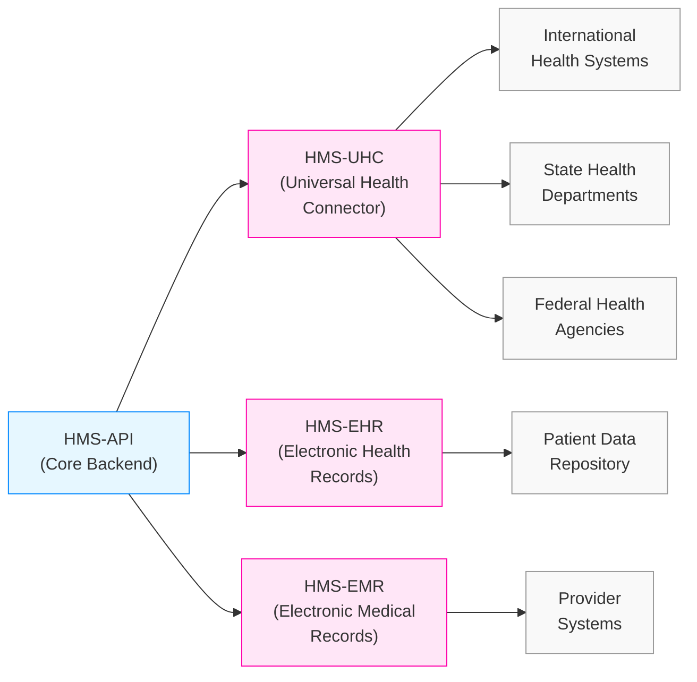
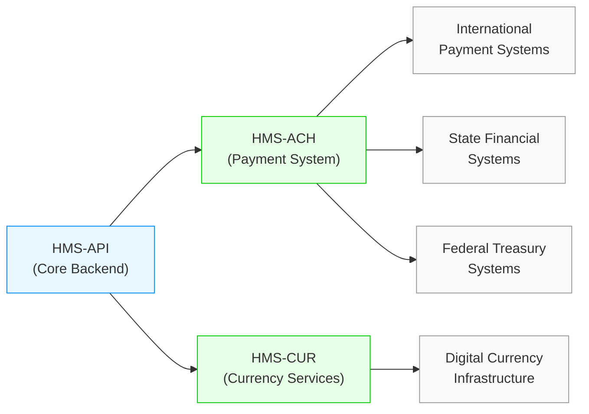
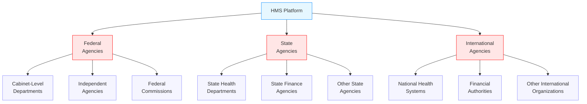

# HMS System Architecture

This document provides an overview of the HMS system architecture, showing how all components work together to support government agencies at federal, state, and international levels.

## Three-Layer Architecture

The HMS system follows a three-layer architecture:

### 1. Interface Layer
The Interface Layer provides user interfaces for different stakeholders:

- **HMS-MFE**: Micro-frontend components that can be embedded in various applications
- **HMS-GOV**: Administrative portal for government officials to manage policies
- **HMS-MKT**: Main frontend application for public users and service marketplace

### 2. Management Layer
The Management Layer handles business logic, workflow orchestration, and integration:

- **HMS-API**: Core backend API services that process business logic
- **HMS-ACT**: Workflow orchestration engine that manages process flows
- **HMS-AGX**: Agent extension system that provides AI capabilities
- **HMS-A2A**: Inter-agency exchange system for secure communication

### 3. Governance Layer
The Governance Layer provides policy management, data intelligence, and regulatory compliance:

- **HMS-CDF**: Codified Democracy Foundation engine for legislative processes
- **HMS-NFO**: Information repository for data intelligence
- **HMS-MBL**: Moneyball analytics for optimizing resource allocation

## Domain-Specific Components

In addition to the core architecture, HMS provides specialized components for different domains:

### Healthcare Components

### Financial Components

## Cross-Cutting Components

Several components provide cross-cutting functionality across the system:

- **HMS-OPS**: Operations and monitoring
- **HMS-MCP**: Model context protocol for AI interactions
- **HMS-UTL**: Utility services and shared libraries
- **HMS-SCM**: Supply chain management
- **HMS-ETL**: Extract, transform, load data pipeline

## Agency Integration

The architecture is designed to support multiple agency types:

## Data Flow

The data flow through the HMS system follows a consistent pattern:

1. User interfaces (HMS-MFE, HMS-GOV, HMS-MKT) collect and display information
2. Core backend (HMS-API) processes business logic and transactions
3. Specialized components handle domain-specific operations
4. Data is stored and managed in the central data repository
5. AI-powered analytics (HMS-NFO, HMS-MBL) provide insights and recommendations
6. Policy engines (HMS-CDF) ensure compliance with regulations

This architecture ensures that agencies of all types can leverage the HMS platform while maintaining their unique requirements and workflows.