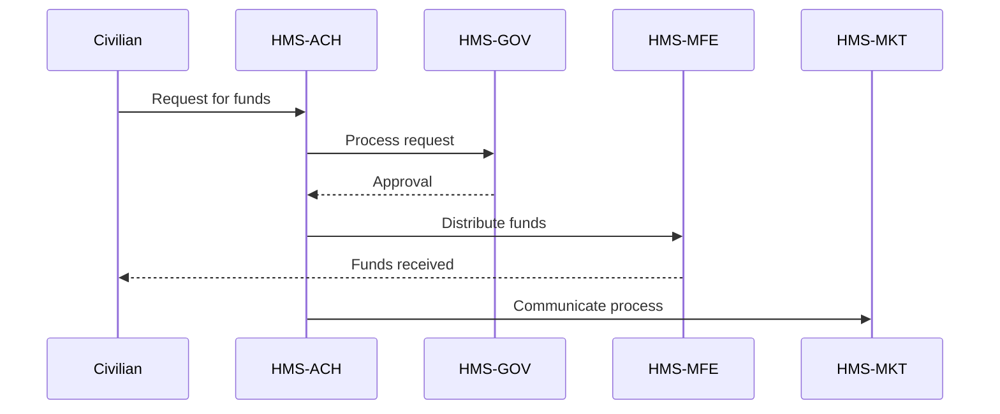

# HMS-ACH Integration with 

*Generated using gpt-4 model(s) with real-world agency issue analysis*

# AI-Facilitated Policy Optimization Use Case: HMS-ACH Integration with USADF

## Introduction

The U.S. African Development Foundation ((USADF)) faces several challenges, including budget constraints, aging technology, and recruitment and retention of competent staff. The HMS-ACH system component can effectively address these issues by optimizing operations, enhancing transparency, and improving user experience. This report discusses how HMS-ACH can integrate with the ((USADF)) system and the benefits it would offer.

## Specific Capabilities of HMS-ACH

1. **Transparent Transactions:** HMS-ACH promotes transparency by recording all transactions in an immutable, auditable ledger. This feature addresses the issue of limited oversight and lack of transparency in the ((USADF)) system.
2. **Optimized Operations:** The system provides advanced analytics capabilities that can help manage budget constraints and optimize resource allocation.
3. **Improved User Experience:** By leveraging modern technology, HMS-ACH can improve the customer experience by reducing response times and streamlining service delivery.

## Technical Integration

The integration can be achieved through API calls, with data flowing between the ((USADF)) existing system and HMS-ACH. User authentication can be managed through token-based authentication or OAuth protocol to ensure secure access.

## Benefits to Stakeholders

1. **Improved Transparency:** Stakeholders can track transactions and operations in real-time, enhancing trust in the system.
2. **Optimized Resource Allocation:** Advanced analytics can help stakeholders make data-driven decisions to optimize resource use.
3. **Enhanced User Experience:** Faster response times and streamlined service delivery will improve the user experience.

## Implementation Considerations

1. **Data Migration:** Existing ((USADF)) data will need to be migrated to the HMS-ACH system, requiring careful planning to prevent data loss.
2. **Training:** Staff members will need to be trained on how to use the new system, which may require additional resources.
3. **Security:** The HMS-ACH system must comply with all relevant data protection and privacy regulations.

## Real-World Use Case

Consider a situation where ((USADF)) has been struggling to distribute funds to grassroots organizations due to bureaucratic hurdles and political gridlock. The following outlines how HMS-ACH can address this issue:

- **Problem:** Difficulty in distributing funds due to bureaucratic hurdles and political gridlock.
- **Role of HMS Components:** HMS-GOV can streamline the approval process, HMS-MKT can facilitate effective communication, and HMS-MFE can manage the financial transactions. HMS-ACH integrates these components to deliver a seamless solution.
- **Workflow:** A civilian request is made on the HMS-ACH platform, which is then processed and approved through HMS-GOV. Funds are then distributed through HMS-MFE, with the entire process communicated effectively via HMS-MKT.
- **Outcomes:** Reduced time to fund distribution, increased number of successful grants, improved customer satisfaction.

By implementing HMS-ACH, ((USADF)) can overcome bureaucratic hurdles, deliver funds more effectively, and ultimately better fulfil its mission.