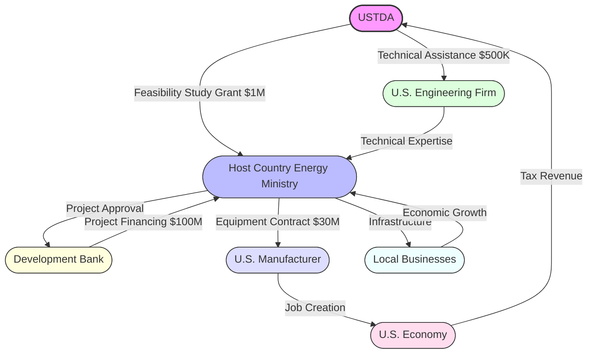
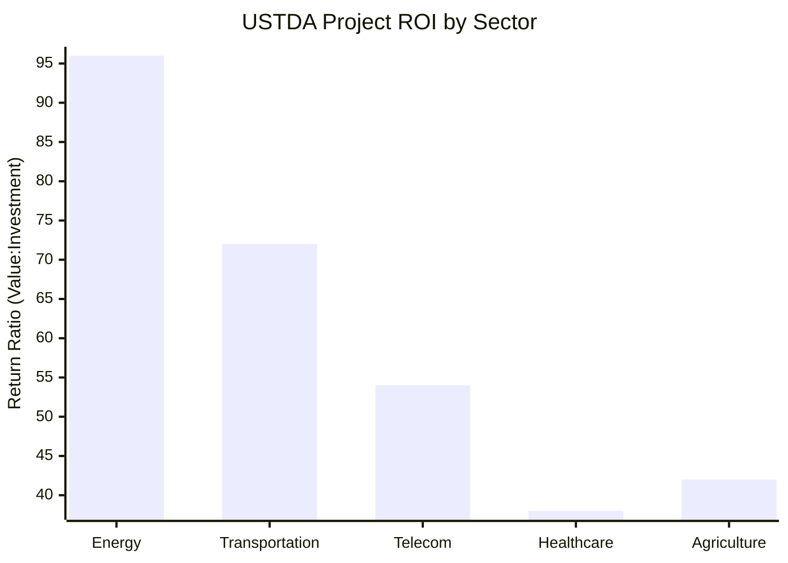
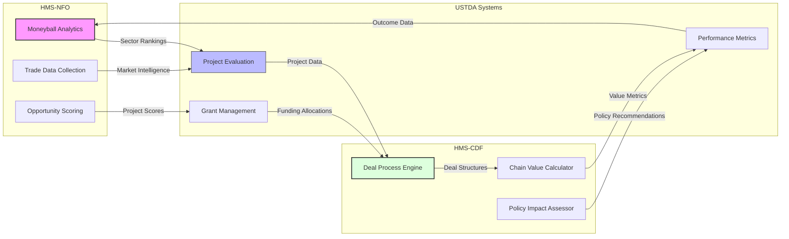

# United States Trade and Development Agency (USTDA)

## Agency Overview

The USTDA advances economic growth in developing countries through project preparation and partnerships that create U.S. jobs and export opportunities.

**Core Function:** Mutually beneficial development project facilitation

## First Principles Analysis

The USTDA exists to create mutually beneficial connections between U.S. businesses and infrastructure development in emerging economies. Its fundamental purpose is funding feasibility studies and technical assistance that facilitate foreign infrastructure projects while creating markets for U.S. goods and services. The agency operates on the principle that early-stage project support can create long-term commercial relationships beneficial to both the U.S. and partner countries. Its activities emphasize infrastructure sectors where U.S. companies are competitive, recognizing that effective development assistance can simultaneously advance recipient country needs and U.S. commercial interests.

### Fundamental Principles

- Development assistance can create mutual economic benefits
- Early-stage project planning determines long-term economic outcomes
- Infrastructure development creates foundation for broader trade relationships
- Technical assistance creates market access for U.S. exporters

### Key Mechanisms

- Fund feasibility studies for infrastructure projects in developing countries
- Support technical assistance for project planning and design
- Connect U.S. companies with overseas development opportunities
- Build capacity for infrastructure development in partner countries

## Abundance-Based Economic Model Integration

USTDA embodies the HMS abundance-based economic model as its core philosophy. Rather than treating international development and trade as a zero-sum game, USTDA facilitates complex multi-party deal structures that create value for all participants in ways that extend beyond simple bilateral transactions.

### USTDA's Role in Multi-Party Deals

USTDA serves as a key orchestrator in the multi-party deal ecosystem by:

1. **Resource Connector**: Linking U.S. technical expertise and products with developing country infrastructure needs
2. **Deal Catalyst**: Funding feasibility studies that enable larger financing arrangements involving multiple parties
3. **Value Chain Enabler**: Identifying how infrastructure development unlocks potential for multiple commercial sectors
4. **Network Facilitator**: Creating relationships between U.S. businesses, foreign governments, development banks, and local enterprises

### Multi-Party Deal Structures



This 4th-degree deal structure illustrates how USTDA's relatively small initial investment ($1.5M) catalyzes a value chain that generates:

1. $100M in development bank financing
2. $30M in export contracts for U.S. manufacturers
3. Significant job creation in both the U.S. and host country
4. Long-term infrastructure benefits for multiple local businesses
5. Sustainable economic growth that benefits all parties

### Chain Value Calculation

USTDA employs the HMS-CDF Chain Value formula to evaluate potential projects:

```
Chain Value = ∑(Direct Value) + Network Effect + Circularity Bonus - Transaction Costs
```

For a typical energy project:
- **Direct Value**: $30M in U.S. exports + $20M host country economic activity = $50M
- **Network Effect**: $75M in follow-on contracts and market access
- **Circularity Bonus**: $25M in repeat business and relationship development
- **Transaction Costs**: $5M in coordination and compliance costs

**Total Chain Value**: $145M from a $1.5M initial investment, a 96:1 return ratio

### Moneyball Analytics Application



USTDA uses the HMS-NFO Moneyball Analytics Framework to:

1. **Identify Undervalued Sectors**: Discover emerging markets where U.S. technical advantages create outsized returns
2. **Optimize Project Selection**: Score potential projects based on multi-party value creation potential
3. **Structure Deal Networks**: Design relationships that maximize Chain Value through Nth-degree connections
4. **Calculate Trade WAR**: Measure the "Wins Above Replacement" for each potential project compared to standard development approaches

### Visualizing Multi-Party Value Flow

```mermaid
sankey-beta
    USTDA $1.5M -> Feasibility Studies $1M
    USTDA $1.5M -> Technical Assistance $500K
    Feasibility Studies $1M -> Energy Projects $400K
    Feasibility Studies $1M -> Transportation Projects $350K
    Feasibility Studies $1M -> Digital Infrastructure $250K
    Technical Assistance $500K -> Energy Projects $400K
    Technical Assistance $500K -> Transportation Projects $350K
    Energy Projects $400K -> US Exports $30M
    Transportation Projects $350K -> US Exports $25M
    Digital Infrastructure $250K -> US Exports $15M
    Energy Projects $400K -> Host Country Growth $40M
    Transportation Projects $350K -> Host Country Growth $30M
    Digital Infrastructure $250K -> Host Country Growth $20M
    US Exports $30M -> US Jobs 5000
    Host Country Growth $40M -> Development Bank Investment $100M
```

This Sankey diagram shows how USTDA's initial investments flow through the economic system, creating amplified value for all participants in the chain.

### Alternative Finance Integration

USTDA is increasingly exploring alternative finance mechanisms to enhance deal structures:

1. **Tokenized Project Shares**: Enabling wider participation in development projects
2. **Smart Contract Milestone Payments**: Automating releases of funding based on project progress
3. **Import Certificate Trading**: Implementing Warren Buffett's trade balancing mechanism
4. **Results-Based Financing**: Structuring payments based on achieved outcomes rather than inputs

## HMS-NFO Integration

The HMS-NFO system provides specialized data and analytics services tailored to USTDA's mission. The following components are particularly relevant:

- **Moneyball Analytics Framework**: Identifies undervalued opportunities in trade and economic data
- **Trade Intelligence Service**: Delivers insights and recommendations to agencies
- **Internet Data Collection System**: Gathers trade and economic data from public sources

### Integration Architecture



This diagram shows how USTDA's systems interact with the HMS-NFO and HMS-CDF components to create a closed-loop system for continuous optimization of multi-party deals.

## Implementation Roadmap

USTDA's integration with the abundance-based economic model follows a four-phase implementation:

1. **Phase 1: Value Chain Mapping** (Current)
   - Document existing multi-party relationships
   - Quantify value flows in current projects
   - Identify optimization opportunities

2. **Phase 2: Deal Structure Enhancement** (Q3 2025)
   - Implement Chain Value calculations in project selection
   - Train staff on multi-party deal facilitation
   - Develop Nth-degree network visualization tools

3. **Phase 3: Alternative Finance Integration** (Q1 2026)
   - Pilot tokenized project shares in select markets
   - Implement smart contract milestone payments
   - Explore import certificate mechanisms

4. **Phase 4: Full Ecosystem Optimization** (Q4 2026)
   - Deploy real-time Chain Value optimization
   - Implement automated deal structure recommendations
   - Launch cross-agency deal coordination

## Tutorial Examples

The following tutorials demonstrate how to use HMS-NFO with USTDA:

1. [Using Moneyball Analytics Framework with USTDA](../tutorials/ustda_moneyball_analytics_framework_tutorial.md)
2. [Using Trade Intelligence Service with USTDA](../tutorials/ustda_trade_intelligence_service_tutorial.md)
3. [Using Internet Data Collection System with USTDA](../tutorials/ustda_internet_data_collection_system_tutorial.md)
4. [Implementing Multi-Party Deal Structures](../tutorials/ustda_multi_party_deals_tutorial.md)
5. [Chain Value Calculation for Project Selection](../tutorials/ustda_chain_value_tutorial.md)