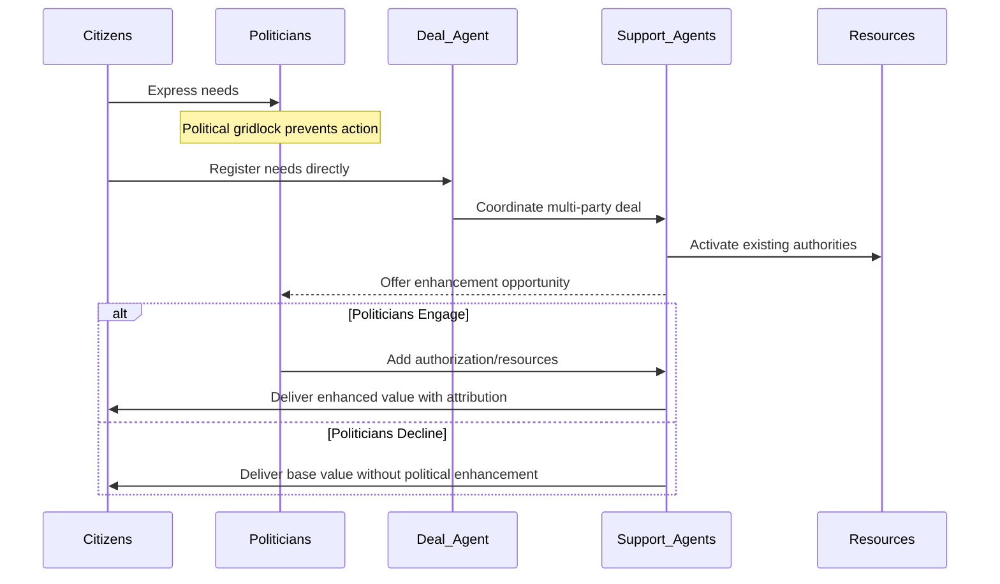
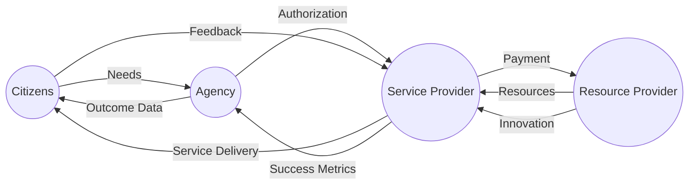
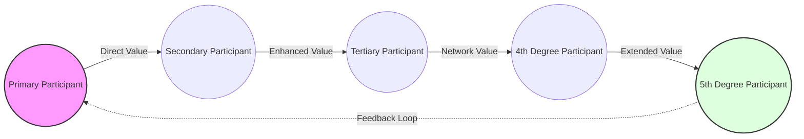

# HMS-A2A Specialized Collaboration Agents for Multi-Party Value Delivery

This document describes the HMS-A2A specialized collaboration agents framework used to implement the abundance-based economic model through multi-party deal structures. These agents facilitate complex deal arrangements that bypass political gridlock while creating direct value delivery pathways to citizens.

## Core Concepts

### The Deal-Centered Framework

The heart of this approach is the **Deal** concept - a structured multi-party value arrangement where:

1. Each participant contributes resources, capabilities, or authorization
2. The arrangement creates value beyond what any bilateral exchange could achieve
3. Value is equitably distributed among participants
4. The structure adapts to changing conditions over time
5. Attribution is properly maintained for all contributors

### Nth Degree Connections

Deals are particularly powerful when they enable **Nth degree connections** (3rd, 4th, or higher degrees) where:

1. Participants who would never interact directly create value through intermediate connections
2. Hidden resources or capabilities become visible in the context of the larger network
3. Network effects amplify the total value created
4. The multi-node structure creates resilience against disruption
5. Value loops generate ongoing improvement and innovation

### Chain Value Formula

The economic impact of these multi-party deals is quantified through the **Chain Value Formula**:

```
Chain Value = ∑(Direct Value) + Network Effect + Circularity Bonus - Transaction Costs
```

Where:
- **Direct Value**: Immediate benefits received by each participant
- **Network Effect**: Additional value created by the connections themselves
- **Circularity Bonus**: Added value from feedback loops and iterative improvement
- **Transaction Costs**: Expenses required to create and maintain the arrangement

## HMS-A2A Collaboration Agent Framework

The collaboration agent framework consists of specialized AI agents that work together to structure and execute complex multi-party deals:

### 1. Primary Deal Agent

This agent is domain-specific and adapted to the particular agency's mission. Examples include:
- **Education Deal Agent** (Department of Education)
- **Healthcare Deal Agent** (Health and Human Services)
- **Trade Deal Agent** (Small Business Administration)

**Primary Role**: Creates and structures complex multi-party deals involving multiple stakeholders to deliver value despite political gridlock.

### 2. Specialized Support Agents

Five specialized support agents provide key functions within each deal structure:

#### a. Discovery Agent
**Role**: Identifies non-obvious connections and opportunities
**Example Implementations**:
- Education: Learning Resource Discovery Agent
- Healthcare: Eligibility Orchestration Agent
- Trade: Opportunity Discovery Agent

#### b. Connection Agent
**Role**: Establishes and maintains participant network
**Example Implementations**:
- Education: Educator-Resource Connection Agent
- Healthcare: Provider Network Agent
- Trade: Network Connection Agent

#### c. Flow Agent
**Role**: Optimizes resource and value flows
**Example Implementations**:
- Education: Resource Allocation Agent
- Healthcare: Multi-Party Payment Agent
- Trade: Financial Flow Agent

#### d. Monitoring Agent
**Role**: Tracks outcomes and compliance
**Example Implementations**:
- Education: Learning Outcomes Monitor
- Healthcare: Outcomes Monitor Agent
- Trade: Compliance Monitor Agent

#### e. Adaptation Agent
**Role**: Adjusts the deal structure as conditions change
**Example Implementations**:
- Education: Curriculum Adaptation Agent
- Healthcare: Care Path Adjustment Agent
- Trade: Market Response Agent

## Implementation Patterns

The following patterns can be implemented across multiple domains:

### 1. Political Bypass With Attribution Preservation

This pattern maintains proper attribution while allowing value delivery despite political inaction:



### 2. Four-Party Optimization Pattern

This pattern creates value through a coordinated four-party arrangement:



### 3. Nth Degree Value Chain

This pattern enables value delivery through extended connections:



## Adapting to Agency-Specific Needs

To customize this framework for a specific agency:

1. **Identify Key Resources**: What resources, capabilities, or authorizations does the agency control?
2. **Map Value Creation Pathways**: How can these resources connect to citizen needs?
3. **Identify Political Gridlock Points**: What specific political barriers prevent value delivery?
4. **Design Agent Specializations**: Create domain-specific agent capabilities
5. **Implement Attribution Mechanisms**: Ensure proper credit is maintained for all participants

## Examples of Multi-Party Value Chains

### Education Resource Example (4th Degree)
Student → Teacher → School District → Educational Publisher → Technology Platform

### Healthcare Access Example (4th Degree)
Patient → Community Health Center → Pharmaceutical Assistance Program → Medication Management App → Transportation Provider

### Small Business Trade Example (5th Degree)
Small Manufacturer → Component Distributor → Export Consolidator → Global Logistics Provider → International Manufacturer → Retail Chain

## Integration with HMS Components

The HMS-A2A collaboration agents framework integrates with multiple HMS components:

- **HMS-GOV**: Provides governance framework and administrative interfaces
- **HMS-MKT**: Offers API marketplace for capability discovery and integration
- **HMS-MFE**: Delivers user interfaces for participant interaction
- **HMS-CDF**: Implements policy engines for regulatory compliance
- **HMS-ACH**: Facilitates financial transactions and value exchange
- **HMS-MBL**: Provides analytics for opportunity identification (Moneyball)
- **HMS-UHC**: Offers healthcare-specific connectivity (Universal Health Connector)

## Implementation Guidelines

When implementing the HMS-A2A collaboration agents framework:

1. Begin with the primary domain-specific Deal Agent
2. Add specialized support agents as needed
3. Ensure attribution mechanisms are properly maintained
4. Implement appropriate monitoring and governance controls
5. Create clear feedback loops for continuous improvement
6. Document the Chain Value calculation for each implementation
7. Preserve enhancement opportunities for political stakeholders

## Conclusion

The HMS-A2A specialized collaboration agent framework provides a powerful approach for implementing the abundance-based economic model through multi-party deals. By creating Nth degree connections and optimizing value creation beyond traditional bilateral exchanges, this approach enables government agencies to deliver direct value to citizens despite political gridlock while maintaining proper attribution pathways for all participants.