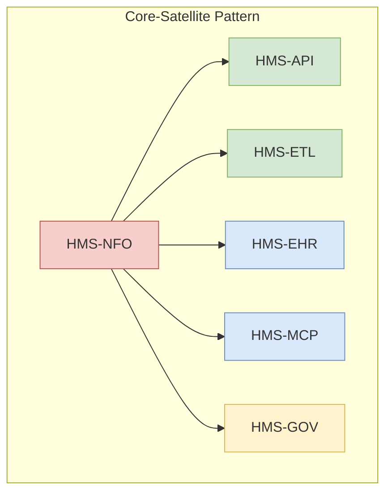
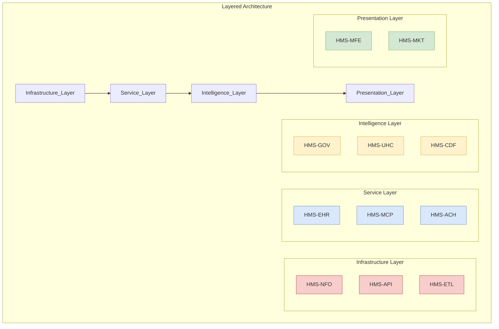
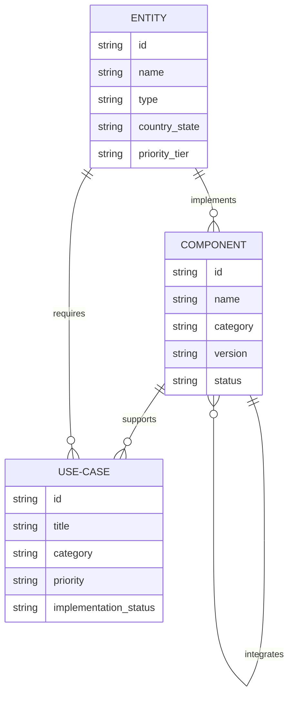

# HMS Component Reference Guide

## Overview

This document provides a comprehensive reference for all HMS (Hardison Management System) components used across healthcare documentation. Each component has specific features, integration points, and implementation considerations tailored to different entity types (international, federal, state).

## HMS Components List

HMS consists of 20 specialized components across five functional categories:

### Core Infrastructure

| Component | Description | Primary Use Cases | Key Features | Documentation Priority |
|-----------|-------------|-------------------|--------------|------------------------|
| **HMS-NFO** | Network Foundation Operations | Core data infrastructure, system interoperability, identity management | Data repository, identity services, security framework, integration fabric, analytics engine | High |
| **HMS-API** | Application Programming Interfaces | System integration, third-party connectivity, developer enablement | RESTful services, GraphQL endpoints, FHIR compliance, developer portal, versioning | High |
| **HMS-ETL** | Extract, Transform, Load | Data migration, system integration, reporting | Data pipelines, transformation rules, validation, scheduling, monitoring | High |

### Service Delivery

| Component | Description | Primary Use Cases | Key Features | Documentation Priority |
|-----------|-------------|-------------------|--------------|------------------------|
| **HMS-EHR** | Electronic Health Records | Clinical documentation, patient management, order management | Clinical workflows, documentation templates, order management, clinical decision support | High |
| **HMS-MCP** | Multi-Channel Platform | Mobile access, telemedicine, patient engagement | Mobile apps, offline capabilities, telemedicine, patient portal, multi-language | High |
| **HMS-ACH** | Automated Clearing House | Financial transactions, claims, payments | Claim processing, payment reconciliation, audit trails, financial reporting | Medium |

### Intelligence & Governance

| Component | Description | Primary Use Cases | Key Features | Documentation Priority |
|-----------|-------------|-------------------|--------------|------------------------|
| **HMS-GOV** | Governance | Compliance, auditing, policy management | Policy framework, audit logs, compliance reporting, role management | High |
| **HMS-UHC** | Universal Health Coverage | Population health, coverage analysis, healthcare planning | Coverage metrics, population segmentation, service planning, eligibility engine | High |
| **HMS-CDF** | Common Data Format | Data standardization, interoperability, mapping | Standard schemas, terminology services, mapping tools, validation | High |

### Platform Services

| Component | Description | Primary Use Cases | Key Features | Documentation Priority |
|-----------|-------------|-------------------|--------------|------------------------|
| **HMS-ACT** | Activity Tracking | User monitoring, audit trails, analytics | User activity logs, behavior analytics, compliance monitoring | Medium |
| **HMS-CUR** | Curation | Data quality, master data management | Data cleaning, de-duplication, enrichment, validation | Medium |
| **HMS-DEV** | Development | Developer tools, API sandbox, testing | Development environment, test harnesses, CI/CD pipelines | Medium |

### Extended Services 

| Component | Description | Primary Use Cases | Key Features | Documentation Priority |
|-----------|-------------|-------------------|--------------|------------------------|
| **HMS-EMR** | Electronic Medical Records | Clinical specialties, research, special workflows | Specialty templates, research protocols, advanced clinical features | Medium |
| **HMS-MFE** | Micro Frontend | UI components, widget framework | Component library, style guide, widget orchestration | Low |
| **HMS-MKT** | Market | App marketplace, solution exchange | Application catalog, rating system, deployment automation | Low |
| **HMS-OPS** | Operations | System monitoring, performance management | Monitoring dashboards, alerts, capacity planning | Medium |
| **HMS-SCM** | Supply Chain Management | Inventory, procurement, logistics | Inventory management, order processing, distribution | Medium |
| **HMS-SME** | Subject Matter Expertise | Knowledge management, clinical expertise | Knowledge base, clinical protocols, guidelines, references | Medium |
| **HMS-UTL** | Utilities | Common infrastructure services | Messaging, scheduling, printing, notifications | Low |
| **HMS-A2A** | Agency-to-Agency | Inter-agency communication, data sharing | Secure messaging, file transfer, data exchange protocols | Medium |

## Component Documentation Structure

For each HMS component, documentation follows a standardized structure based on the "Paraguay model":

1. **Overview**
   - Component purpose and primary functions
   - Core capabilities
   - Integration context

2. **Current State Assessment**
   - Entity's current capabilities in this domain
   - Key challenges and opportunities
   - Gap analysis

3. **Integration Architecture**
   - Three-tier technical architecture
   - Entity-specific adaptations
   - Integration points

4. **Implementation Approach**
   - Phased deployment plan
   - Milestones and success criteria
   - Resource requirements

5. **Technical Specifications**
   - Hardware requirements
   - Software stack
   - Security framework
   - Performance considerations

6. **Use Cases & Examples**
   - Entity-specific scenarios
   - Implementation examples
   - Expected outcomes and benefits

7. **Implementation Considerations**
   - Governance structure
   - Capacity building requirements
   - Risk management
   - Timeline considerations

8. **Component Relationships**
   - Integration with other HMS components
   - Dependencies and prerequisites
   - Data flows

## Entity-Specific Adaptations

Each component requires specific adaptations based on entity type:

### International Healthcare Systems

| Component | Key Adaptations | Example Entities |
|-----------|----------------|------------------|
| HMS-NFO | Multi-language support, cross-border data exchange, regional standards alignment | Paraguay, Brazil, Canada |
| HMS-EHR | Cultural competency features, diverse practice patterns, multilingual templates | UK, Germany, Japan |
| HMS-MCP | Offline capabilities for remote areas, multi-device support, variable connectivity | Paraguay, Brazil, Australia |

### US Federal Agencies

| Component | Key Adaptations | Example Entities |
|-----------|----------------|------------------|
| HMS-NFO | FedRAMP compliance, federal standards alignment, cross-agency interoperability | HHS, VA, CMS |
| HMS-EHR | Federal regulatory compliance, specialized clinical workflows, national reporting | VA, DOD, IHS |
| HMS-GOV | Federal policy framework, FISMA compliance, cross-agency governance | HHS, FDA, CDC |

### US State Health Departments

| Component | Key Adaptations | Example Entities |
|-----------|----------------|------------------|
| HMS-NFO | State reporting requirements, local HIE integration, state privacy laws | Florida, California, New York |
| HMS-API | State-specific interfaces, local system integration, county-level access | Texas, Illinois, Pennsylvania |
| HMS-UHC | State Medicaid integration, local program support, state-specific eligibility | Michigan, Ohio, Georgia |

## Component Integration Patterns

The HMS platform uses these common integration patterns across components:





1. **Core-Satellite Pattern**
   - HMS-NFO as central hub
   - Other components connect through standardized interfaces
   - Centralized security and governance

2. **Layered Architecture**
   - Infrastructure layer (NFO, API, ETL)
   - Service layer (EHR, MCP, ACH)
   - Intelligence layer (GOV, UHC, CDF)
   - Presentation layer (MFE, MKT)

3. **Event-Driven Communication**
   - Components publish and subscribe to events
   - Asynchronous processing for scale
   - Resilient to network issues

4. **Modular Deployment**
   - Components can be deployed independently
   - Progressive implementation approach
   - Phased adoption based on entity needs

## Documentation Prioritization

Documentation priority for combinations of entity types and HMS components is determined by:

1. **Core Functionality**
   - HMS-NFO, HMS-EHR, HMS-API are highest priority
   - Fundamental to system operations

2. **Entity Need Alignment**
   - Components addressing critical entity challenges
   - Mapped to entity strategic priorities

3. **Implementation Sequence**
   - Components that must be implemented first
   - Dependencies for other components

4. **User Impact**
   - Components with direct user interaction
   - Visible benefits to stakeholders

## Cross-Reference Implementation

The HMS documentation cross-reference system maps relationships between entities, components, and use cases:



This cross-reference system maps:

1. **Entity-Component Mapping**
   - Which components are relevant for specific entities
   - Special adaptations required

2. **Component-Component Relationships**
   - Dependencies between components
   - Integration points and data flows

3. **Use Case Library**
   - Standard use cases by component
   - Entity-specific implementations

4. **Implementation Patterns**
   - Common implementation approaches
   - Reusable solutions for similar contexts

## Component Documentation Examples

### Example: HMS-NFO for Paraguay Healthcare

```
# HMS-NFO Integration with Paraguay Healthcare System

## Overview
HMS-NFO provides the core data infrastructure and interoperability framework
for Paraguay's healthcare system, enabling secure data exchange across public,
social security, and private healthcare sectors while addressing unique
connectivity and multilingual requirements.

## Integration Architecture
- Data Repository Tier
  - Distributed data stores with local caching
  - Offline-first architecture for rural areas
  - Multilingual metadata support (Spanish/Guaraní)

- Identity Services Tier
  - National ID integration (Cédula de Identidad)
  - Biometric verification options
  - Role-based access control with cultural considerations

- Integration Fabric Tier
  - HL7 FHIR adaptation for Paraguay context
  - MERCOSUR health data standards alignment
  - Cross-border exchange protocols
...
```

### Example: HMS-EHR for Veterans Affairs

```
# HMS-EHR Integration with Veterans Affairs

## Overview
HMS-EHR provides comprehensive electronic health record capabilities tailored
to the unique needs of the Veterans Health Administration, supporting specialized
care workflows, interoperability with DOD systems, and compliance with federal
healthcare regulations.

## Integration Architecture
- Clinical Documentation Tier
  - Veteran-centric templates and workflows
  - Military health history integration
  - Trauma-informed care support

- Order Management Tier
  - VA formulary integration
  - Veterans Choice Program coordination
  - Specialized consult management

- Decision Support Tier
  - Evidence-based protocols for veteran population
  - PTSD and TBI screening integration
  - Suicide prevention tools
...
```

## HMS Component Version Compatibility

| Component | Current Version | Compatible With | Minimum Requirements |
|-----------|----------------|----------------|----------------------|
| HMS-NFO | 4.2.1 | HMS-API 3.x+, HMS-ETL 2.x+ | 16GB RAM, 4 cores, 100GB storage |
| HMS-API | 3.5.0 | HMS-NFO 3.x+, HMS-MCP 2.x+ | 8GB RAM, 2 cores, 50GB storage |
| HMS-EHR | 5.1.2 | HMS-NFO 4.x+, HMS-CDF 3.x+ | 16GB RAM, 4 cores, 200GB storage |
| HMS-MCP | 2.8.3 | HMS-NFO 3.x+, HMS-API 3.x+ | 8GB RAM, 2 cores, 50GB storage |
| HMS-CDF | 3.2.0 | HMS-NFO 3.x+, HMS-ETL 2.x+ | 8GB RAM, 2 cores, 100GB storage |

## References and Resources

- **Documentation Master Plan**: `/Users/arionhardison/Desktop/CodifyHQ/HMS-DOC/hms_documentation_master_plan.md`
- **Entity Research Template**: `/Users/arionhardison/Desktop/CodifyHQ/HMS-DOC/entity_research_template.md`
- **Paraguay Model Example**: `/Users/arionhardison/Desktop/CodifyHQ/HMS-DOC/docs/International/py-health/index.md`
- **Cross-Reference Data Model**: `/Users/arionhardison/Desktop/CodifyHQ/HMS-DOC/hms_documentation_xref_model.json`