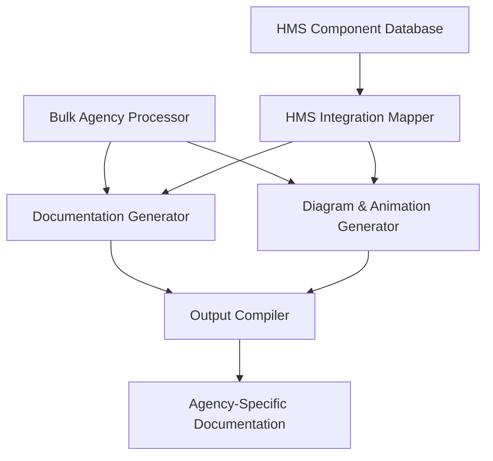

# HMS Government Agency Documentation Generation Plan

## Executive Summary

This implementation plan outlines the strategy for generating comprehensive documentation and animations for all 43 federal agencies listed in fed.agents.js. By leveraging our unified animation framework, we will create standardized yet agency-specific documentation that demonstrates how HMS components and capabilities map to each agency's core functions and mission requirements.

The documentation will include interactive Mermaid diagrams, step-by-step animations, and detailed integration guides that showcase HMS value propositions tailored to each agency's unique needs based on their first principles analysis.

## System Architecture

The documentation generation system consists of five core components:

1. **Bulk Agency Processor**: Extracts and normalizes all agency data from fed.agents.js
2. **Documentation Generator**: Creates agency-specific documentation based on templates
3. **Diagram & Animation Generator**: Produces Mermaid diagrams and animation sequences
4. **HMS Integration Mapper**: Maps HMS components to agency functions
5. **Output Compiler**: Assembles final documentation in HTML and markdown formats



## Implementation Strategy

### Phase 1: Data Processing and Analysis (Week 1)

1. **Extract Agency Data**
   - Process all 43 agencies from fed.agents.js using the AgencyDataProcessor
   - Normalize data structure for consistent processing
   - Create a unified database of agency information

2. **HMS Component Mapping**
   - Define relevance algorithms for matching HMS components to agency functions
   - Create a scoring model based on core functions and fundamental principles
   - Generate preliminary component mappings for all agencies

3. **Template Design**
   - Create standardized documentation templates
   - Design agency-specific Mermaid diagram templates
   - Define animation sequence patterns based on agency categories

### Phase 2: Documentation Framework Development (Week 2)

1. **Core Documentation Engine**
   - Implement agency profile generator
   - Create HMS integration map generator
   - Develop use case generator based on agency needs

2. **Diagram Generation System**
   - Extend MermaidGenerator for bulk agency processing
   - Implement agency-specific styling and theming
   - Create diagram validation and optimization pipeline

3. **Animation Sequence Generator**
   - Implement standardized animation steps for all agencies
   - Create agency-specific animations based on core functions
   - Develop animation preview and testing system

### Phase 3: Batch Documentation Generation (Weeks 3-4)

1. **Independent Agencies (Week 3)**
   - Generate documentation for all independent federal agencies
   - Create animations for each independent agency
   - Implement agency-specific themes and styling

2. **Executive Departments (Week 4)**
   - Generate documentation for all executive department agencies
   - Create animations for each executive department
   - Implement department-specific themes and styling

3. **Quality Control**
   - Validate all generated documentation against templates
   - Test animations across different browsers and devices
   - Verify HMS component mapping accuracy

### Phase 4: Interactive Interface Development (Weeks 5-6)

1. **Web-Based Documentation Viewer**
   - Create unified interface for browsing agency documentation
   - Implement agency filtering and search functionality
   - Develop component-based navigation system

2. **Animation Controls**
   - Implement standardized animation playback controls
   - Create step-by-step navigation interface
   - Develop presentation mode for demonstrations

3. **Export Functionality**
   - Create PDF export for static documentation
   - Implement SVG export for diagrams
   - Develop HTML package export for offline viewing

### Phase 5: Integration and Publishing (Week 7)

1. **HMS Component Integration**
   - Connect documentation to HMS-NFO for content enrichment
   - Integrate with HMS-DEV for development examples
   - Link with codex-rs and codex-cli for terminal demos

2. **Final Review and Publishing**
   - Conduct comprehensive review of all documentation
   - Finalize agency-specific animations and diagrams
   - Publish documentation to central repository

3. **Demo Preparation**
   - Create demonstration scripts for each agency category
   - Prepare presentation materials for stakeholders
   - Develop quick-start guides for agency representatives

## Documentation Structure

Each agency's documentation will follow a standardized structure:

### 1. Agency Profile
- Agency name, mission, and core function
- First principles analysis with fundamental principles and key mechanisms
- HMS relevance summary

### 2. HMS Component Integration
- Primary HMS components mapped to agency needs
- Relevance scores and justifications
- Integration diagrams using Mermaid

### 3. Use Cases
- 3-5 agency-specific use cases
- Step-by-step workflows
- Expected outcomes and metrics

### 4. Animation Sequences
- Mission introduction animation
- Component integration animations
- Use case demonstration animations
- Full system visualization

### 5. Implementation Guide
- Technical requirements
- Integration steps
- Configuration recommendations
- Best practices

### 6. References
- Related documentation
- HMS component specifications
- Government mandates and requirements

## Agency Categories and Themes

Agencies will be grouped into categories with specific themes:

### 1. Financial Oversight Agencies
- **Agencies**: SEC, FDIC, CFTC, CFPB, NCUA, FHFA, FCA, PBGC
- **Theme**: Blue-based color scheme with financial iconography
- **HMS Focus**: MBL, ACH, OMS components
- **Animation Pattern**: Financial flow visualizations

### 2. Security and Defense Agencies
- **Agencies**: CIA, DNFSB, SSB, NRC, NWTRB
- **Theme**: Dark-themed interface with security patterns
- **HMS Focus**: CDF, GOV, UTL components
- **Animation Pattern**: Secure information flow animations

### 3. Development and Support Agencies
- **Agencies**: USAID, ADF, IAF, EXIM, USTDA, SBA
- **Theme**: Growth-oriented green themes with global patterns
- **HMS Focus**: MBL, NFO, DEV components
- **Animation Pattern**: Growth and development visualizations

### 4. Regulatory Agencies
- **Agencies**: FTC, CPSC, FCC, FMC, OSHRC, NTSB, MSPB
- **Theme**: Structured grid patterns with governance iconography
- **HMS Focus**: GOV, CDF, DOC components
- **Animation Pattern**: Compliance and oversight workflows

### 5. Research and Information Agencies
- **Agencies**: NSF, NASA, NARA, NCD, NEA
- **Theme**: Knowledge-focused purple themes with information patterns
- **HMS Focus**: ETL, NFO, DEV components
- **Animation Pattern**: Knowledge discovery and dissemination flows

### 6. Labor and Social Insurance Agencies
- **Agencies**: FLRA, FMCS, NLRB, NMB, RRB, SSA, SSAB
- **Theme**: People-focused orange themes with social patterns
- **HMS Focus**: UHC, API, OMS components
- **Animation Pattern**: Service delivery and human-centered flows

### 7. Administrative Agencies
- **Agencies**: OGE, OPM, OSC, GSA, USPS
- **Theme**: Efficient gray themes with workflow patterns
- **HMS Focus**: DEV, API, DOC components
- **Animation Pattern**: Process optimization and system integration

## Technical Implementation

### AgencyDataProcessor Enhancement
```javascript
class BulkAgencyProcessor {
  /**
   * Process all agencies from fed.agents.js data
   */
  static processAllAgencies(federalAgencies) {
    const allAgencies = [];
    
    // Process each category and agency
    federalAgencies.forEach(category => {
      category.domains.forEach(agency => {
        const processedAgency = this.processAgency(agency, category.category);
        allAgencies.push(processedAgency);
      });
    });
    
    return allAgencies;
  }
  
  /**
   * Process individual agency
   */
  static processAgency(agency, categoryName) {
    return {
      id: agency.label.toLowerCase(),
      label: agency.label,
      category: categoryName,
      name: agency.name,
      mission: agency.mission,
      icon: agency.icon || null,
      coreFunction: agency.firstPrinciplesAnalysis?.coreFunction,
      fundamentalPrinciples: agency.firstPrinciplesAnalysis?.fundamentalPrinciples || [],
      keyMechanisms: agency.firstPrinciplesAnalysis?.keyMechanisms || [],
      firstPrinciplesAnalysis: agency.firstPrinciplesAnalysis?.first_principles_analysis || '',
      capabilities: this.mapHMSCapabilities(agency),
      useCases: this.generateUseCases(agency),
      themeColor: this.getAgencyThemeColor(agency.label)
    };
  }
  
  /**
   * Get theme color based on agency category
   */
  static getAgencyThemeColor(agencyLabel) {
    const agencyCategories = {
      // Financial agencies
      'SEC': '#1a5276', 'FDIC': '#2874a6', 'CFTC': '#3498db', 'CFPB': '#85c1e9',
      'NCUA': '#5dade2', 'FHFA': '#7fb3d5', 'FCA': '#a9cce3', 'PBGC': '#aed6f1',
      
      // Security agencies
      'CIA': '#282c34', 'DNFSB': '#34495e', 'SSB': '#2c3e50', 'NRC': '#1c2833',
      'NWTRB': '#212f3d',
      
      // Development agencies
      'USAID': '#27ae60', 'ADF': '#2ecc71', 'IAF': '#58d68d', 'EXIM': '#229954',
      'USTDA': '#145a32', 'SBA': '#52be80',
      
      // Regulatory agencies
      'FTC': '#8e44ad', 'CPSC': '#9b59b6', 'FCC': '#a569bd', 'FMC': '#bb8fce',
      'OSHRC': '#884ea0', 'NTSB': '#6c3483', 'MSPB': '#7d3c98',
      
      // Research agencies
      'NSF': '#6c3483', 'NASA': '#7d3c98', 'NARA': '#8e44ad', 'NCD': '#9b59b6',
      'NEA': '#a569bd',
      
      // Labor agencies
      'FLRA': '#e67e22', 'FMCS': '#f39c12', 'NLRB': '#f5b041', 'NMB': '#f8c471',
      'RRB': '#d35400', 'SSA': '#e59866', 'SSAB': '#dc7633',
      
      // Administrative agencies
      'OGE': '#616a6b', 'OPM': '#707b7c', 'OSC': '#7f8c8d', 'GSA': '#566573',
      'USPS': '#5d6d7e'
    };
    
    return agencyCategories[agencyLabel] || '#3498db'; // Default blue if not found
  }
  
  /**
   * Enhanced HMS capability mapping with tailored descriptions
   */
  static mapHMSCapabilities(agency) {
    // Implementation as in previous version, enhanced for agency specificity
    // This will use comprehensive mapping of agency functions to HMS components
  }
  
  /**
   * Generate tailored use cases based on agency first principles
   */
  static generateUseCases(agency) {
    // Enhanced implementation with more specific use cases based on
    // agency first principles analysis and key mechanisms
  }
}
```

### Documentation Generator
```javascript
class DocumentationGenerator {
  /**
   * Generate complete documentation for an agency
   */
  static generateAgencyDocumentation(agency) {
    return {
      profile: this.generateProfile(agency),
      hmsIntegration: this.generateHMSIntegration(agency),
      useCases: this.generateUseCases(agency),
      animationSequence: this.generateAnimationSequence(agency),
      implementationGuide: this.generateImplementationGuide(agency),
      references: this.generateReferences(agency)
    };
  }
  
  /**
   * Generate agency profile section
   */
  static generateProfile(agency) {
    return `# ${agency.name} (${agency.label})
    
## Mission
${agency.mission}

## Core Function
${agency.coreFunction}

## First Principles Analysis
${agency.firstPrinciplesAnalysis}

## Fundamental Principles
${agency.fundamentalPrinciples.map(principle => `- ${principle}`).join('\n')}

## Key Mechanisms
${agency.keyMechanisms.map(mechanism => `- ${mechanism}`).join('\n')}
`;
  }
  
  /**
   * Generate HMS integration section
   */
  static generateHMSIntegration(agency) {
    return `# HMS Integration for ${agency.label}

## Primary HMS Components
${agency.capabilities.map(capability => `
### HMS-${capability.component}
**Relevance Score:** ${capability.relevance}/10
**Description:** ${capability.description}
**Integration Points:** 
- ${this.generateIntegrationPoints(capability, agency).join('\n- ')}
`).join('\n')}
`;
  }
  
  /**
   * Generate integration points based on capability and agency
   */
  static generateIntegrationPoints(capability, agency) {
    // Implementation to generate specific integration points
    // This will be tailored based on the HMS component and agency needs
  }
  
  /**
   * Generate use cases section
   */
  static generateUseCases(agency) {
    // Implementation to generate detailed use cases
  }
  
  /**
   * Generate animation sequence description
   */
  static generateAnimationSequence(agency) {
    // Implementation to describe the animation steps
  }
  
  /**
   * Generate implementation guide
   */
  static generateImplementationGuide(agency) {
    // Implementation to generate technical integration guide
  }
  
  /**
   * Generate references section
   */
  static generateReferences(agency) {
    // Implementation to generate references to related documentation
  }
}
```

### Diagram Generator
```javascript
class DiagramGenerator {
  /**
   * Generate Mermaid diagram definition for an agency
   */
  static generateAgencyDiagram(agency) {
    // Implementation to generate agency-specific Mermaid diagram
  }
  
  /**
   * Generate animation steps for agency diagram
   */
  static generateAnimationSteps(agency) {
    // Implementation to generate animation steps for the diagram
  }
}
```

## Output Structure

The documentation generation system will create the following outputs for each agency:

### 1. Markdown Documentation
- `{agency-id}-documentation.md`: Complete agency documentation in markdown format
- `{agency-id}-integration.md`: HMS integration details
- `{agency-id}-implementation.md`: Implementation guide

### 2. HTML Animation and Visualization
- `{agency-id}-animation.html`: Interactive animation and visualization for the agency
- `{agency-id}-diagram.html`: Static Mermaid diagram with explanations

### 3. Centralized Viewer
- `gov-agencies-viewer.html`: Central web application for browsing all agency documentation
- `agency-index.js`: Index of all agencies with metadata

## Success Metrics

The documentation generation project success will be measured by:

1. **Completeness**: 100% coverage of all 43 federal agencies
2. **Accuracy**: Correctly mapped HMS components to agency needs
3. **Usability**: Interactive animations work across all modern browsers
4. **Integration**: Full integration with HMS-DEV, HMS-NFO, and Codex tools
5. **Performance**: Fast loading and rendering of animations

## Risk Mitigation

Potential risks and mitigation strategies:

1. **Data Inconsistency**: Implement data validation and cleanup routines
2. **Rendering Performance**: Optimize animations for performance across devices
3. **Component Mapping Accuracy**: Review and validate mappings with domain experts
4. **Scale Challenges**: Implement batch processing and parallel generation
5. **Browser Compatibility**: Use progressive enhancement and fallback options

## Conclusion

This documentation generation plan provides a comprehensive approach for creating standardized yet agency-specific documentation for all 43 federal agencies. By leveraging our unified animation framework and agency data processor, we can efficiently generate interactive visualizations that demonstrate how HMS components and capabilities address each agency's unique mission and needs.

The implementation follows a structured seven-week timeline, with clear deliverables at each phase. The result will be a comprehensive documentation system that showcases HMS capabilities in the context of government agency missions and functions.