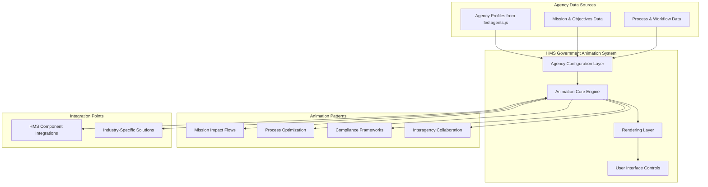

# HMS Government Agency Animation Framework

## Executive Summary

This implementation plan outlines a comprehensive strategy for creating animated Mermaid diagrams that demonstrate how the Hardison Management Systems (HMS) platform helps government agencies achieve their mission-critical objectives. By leveraging the first principles analysis of federal agencies from `fed.agents.js` and integrating with HMS's multi-industry capabilities, this framework will provide compelling, interactive visualizations that clearly communicate HMS value propositions to government stakeholders.

The animation system will transform static diagrams into dynamic visual stories that showcase HMS's capabilities to address unique government agency challenges, demonstrating both technical integration and mission impact.

## Strategic Analysis

### Government Agency Context

The `fed.agents.js` data reveals that federal agencies operate on distinct first principles:

1. **Core Functions**: Each agency has a fundamental purpose (e.g., "Banking system confidence maintenance" for FDIC, "Information gathering and analysis for state advantage" for CIA)

2. **Fundamental Principles**: Agencies operate on specific principles that guide their decision-making (e.g., "Merit-based employment requires removal of irrelevant barriers" for EEOC)

3. **Key Mechanisms**: Each uses specific operational approaches to fulfill their mission (e.g., "License spectrum bands for specific use cases" for FCC)

### HMS Value Proposition for Government

HMS provides cross-cutting capabilities that enhance agency operations through:

1. **Multi-Agent System (MAS)**: Enabling collaboration between specialized agents to solve complex problems
2. **Chain of Recursive Thoughts (CoRT)**: Providing advanced reasoning for policy and decision analysis
3. **Verification-First Approach**: Ensuring compliance, security, and reliability in government contexts
4. **Cross-Industry Knowledge**: Applying relevant expertise from other sectors to government challenges

## Animation Framework Design

### Core Visualization Types

The framework will support four primary animation patterns tailored to government use cases:

1. **Mission Impact Flows**: Visualizing how HMS helps agencies fulfill their core missions
   
2. **Process Optimization Sequences**: Demonstrating improvements to agency workflows and operations

3. **Compliance & Security Frameworks**: Illustrating how HMS ensures adherence to government requirements

4. **Interagency Collaboration Networks**: Showing how HMS facilitates coordination across government entities

### Technical Architecture



## Implementation Plan

### Phase 1: Foundation (Weeks 1-3)

1. **Animation Engine Development**
   - Create core CSS animation framework
   - Develop agency-specific styling themes
   - Implement base animation patterns
   - Build SVG element identification system

2. **Government Agency Data Integration**
   - Convert fed.agents.js data to animation configuration format
   - Create agency profile visualizations
   - Develop mission/mechanism mapping system
   - Implement agency-specific theming

3. **Proof of Concept**
   - Create animated diagram for 3 diverse agencies (e.g., FDIC, NASA, USAID)
   - Implement mission impact visualization
   - Develop basic controls for agency selection and animation playback

### Phase 2: Agency-Specific Patterns (Weeks 4-6)

1. **Mission-Specific Animation Patterns**
   - Develop animation patterns for regulatory agencies
   - Create visualizations for service-oriented agencies
   - Implement patterns for intelligence and defense agencies
   - Build economic and development agency visualizations

2. **HMS Integration Mapping**
   - Map HMS components to agency needs
   - Create visual representation of HMS value by agency type
   - Develop integration point animations
   - Implement compliance framework visualization

3. **Interagency Collaboration Visuals**
   - Create network visualization of interagency connections
   - Develop data flow animations between agencies
   - Build shared service visualization patterns
   - Implement multi-agency coordination animations

### Phase 3: Advanced Features (Weeks 7-9)

1. **Policy and Decision Support Animations**
   - Implement CoRT visualization for policy analysis
   - Create governance framework animations
   - Develop compliance verification sequences
   - Build security model visualizations

2. **Performance and Optimization Patterns**
   - Create ROI and efficiency visualization patterns
   - Develop budget impact animations
   - Implement service improvement sequences
   - Build technical debt reduction visualizations

3. **User Controls and Interactivity**
   - Develop agency selector interface
   - Implement scenario navigation controls
   - Create animation playback controls
   - Build custom view configuration options

### Phase 4: Production Readiness (Weeks 10-12)

1. **Documentation and Examples**
   - Create comprehensive documentation
   - Develop agency-specific showcases
   - Build example gallery
   - Create user guides for implementation

2. **Integration with Existing HMS Systems**
   - Integrate with HMS-DOC for documentation generation
   - Implement with HMS-GOV for administrative interfaces
   - Connect with HMS-MKT for marketing materials
   - Build export functionality for presentations

3. **Performance Optimization and Testing**
   - Conduct browser compatibility testing
   - Optimize animation performance
   - Implement loading optimizations
   - Ensure accessibility compliance

## Government Agency Showcase Implementations

### Case Study 1: Financial Regulatory Visualization (FDIC, SEC, CFTC)

#### Animation Sequence

1. **Core Mission Visualization**
   - Highlight agency's core function (e.g., "Banking system confidence maintenance")
   - Animate key principles as connected nodes
   - Demonstrate HMS integration points

2. **Risk Analysis and Mitigation Flow**
   - Show data collection and analysis process
   - Visualize HMS-A2A providing enhanced analytics
   - Demonstrate regulatory compliance verification
   - Illustrate incident response capabilities

3. **Stakeholder Interaction Model**
   - Show communication flow between regulator and institutions
   - Visualize reporting and disclosure processes
   - Demonstrate HMS enhancing transparency and efficiency

```javascript
// Example Animation Configuration for FDIC
const fdicAnimation = {
  agencyId: "FDIC",
  coreFunction: "Banking system confidence maintenance",
  sequences: [
    {
      name: "mission-highlight",
      elements: ["#fdic-core-function", "#fdic-principles"],
      animation: "fade-in-sequence",
      duration: 2000
    },
    {
      name: "hms-integration",
      elements: ["#hms-verification", "#hms-analytics", "#hms-reporting"],
      animation: "pulse-and-connect",
      duration: 3000
    },
    {
      name: "risk-analysis-flow",
      elements: ["#data-collection", "#analysis", "#verification", "#response"],
      animation: "process-flow",
      duration: 4000
    }
  ]
};
```

### Case Study 2: Intelligence and Security Visualization (CIA, FBI, DHS)

#### Animation Sequence

1. **Information Processing Workflow**
   - Visualize data collection mechanisms
   - Show analysis and processing steps
   - Demonstrate HMS-CoRT enhancing intelligence analysis
   - Illustrate verification and validation process

2. **Security Framework Integration**
   - Show multi-layered security model
   - Visualize threat detection and response
   - Demonstrate HMS security controls
   - Illustrate compliance verification

3. **Collaborative Intelligence Network**
   - Show interagency coordination nodes
   - Visualize secure information sharing
   - Demonstrate HMS facilitating collaboration
   - Illustrate improved decision support

### Case Study 3: Service Delivery Visualization (USPS, SSA, VA)

#### Animation Sequence

1. **Citizen Service Journey**
   - Visualize citizen interaction points
   - Show service delivery workflow
   - Demonstrate HMS optimizing touchpoints
   - Illustrate outcome and satisfaction measurement

2. **Operational Efficiency Improvements**
   - Show before/after process comparisons
   - Visualize resource optimization
   - Demonstrate HMS automation capabilities
   - Illustrate cost and time savings

3. **Service Integration Network**
   - Show connected service components
   - Visualize data flow between systems
   - Demonstrate HMS integration capabilities
   - Illustrate improved citizen experience

## Technical Implementation Details

### CSS Animation Framework

The animation system will use a specialized CSS framework for government agency visualizations:

```css
/* Agency Theme Variables */
:root {
  --regulatory-primary: #1a3a5f;
  --service-primary: #2e5a4e;
  --defense-primary: #4a3c31;
  --development-primary: #4f345a;
  
  --gov-accent: #c2b276;
  --gov-highlight: #d0a144;
  
  --animation-timing-function: cubic-bezier(0.4, 0.0, 0.2, 1);
}

/* Mission Highlight Animation */
@keyframes mission-pulse {
  0% { 
    fill: var(--gov-accent);
    filter: drop-shadow(0 0 2px rgba(194, 178, 118, 0.3));
    transform: scale(1);
  }
  50% { 
    fill: var(--gov-highlight);
    filter: drop-shadow(0 0 10px rgba(208, 161, 68, 0.8));
    transform: scale(1.05);
  }
  100% { 
    fill: var(--gov-accent);
    filter: drop-shadow(0 0 5px rgba(194, 178, 118, 0.5));
    transform: scale(1);
  }
}

/* Process Flow Animation */
@keyframes process-flow {
  0% {
    stroke-dashoffset: 100%;
    opacity: 0.3;
  }
  100% {
    stroke-dashoffset: 0%;
    opacity: 1;
  }
}

/* Agency-specific animation classes */
.agency-mission-highlight {
  animation: mission-pulse 2s var(--animation-timing-function);
}

.agency-process-flow {
  stroke-dasharray: 100%;
  stroke-dashoffset: 100%;
  animation: process-flow 1.5s var(--animation-timing-function) forwards;
}
```

### Agency Data Integration

The system will process agency data from fed.agents.js into an animation-ready format:

```javascript
function prepareAgencyData(agencyData) {
  return {
    id: agencyData.label,
    name: agencyData.name,
    mission: agencyData.mission,
    coreFunction: agencyData.firstPrinciplesAnalysis.coreFunction,
    principles: agencyData.firstPrinciplesAnalysis.fundamentalPrinciples,
    mechanisms: agencyData.firstPrinciplesAnalysis.keyMechanisms,
    animationConfig: generateAnimationConfig(agencyData)
  };
}

function generateAnimationConfig(agencyData) {
  // Generate agency-specific animation configuration
  const agencyType = determineAgencyType(agencyData);
  
  return {
    theme: getAgencyTheme(agencyType),
    elementIds: generateElementIds(agencyData.label),
    sequences: generateSequences(agencyData, agencyType)
  };
}
```

### Animation Sequence Controller

A JavaScript controller will manage animation sequences and user interaction:

```javascript
class GovAgencyAnimationController {
  constructor(agencyId, mermaidDiagramId) {
    this.agencyId = agencyId;
    this.diagramId = mermaidDiagramId;
    this.agencyData = this.loadAgencyData(agencyId);
    this.currentStep = 0;
    this.svg = null;
    
    this.initialize();
  }
  
  initialize() {
    // Wait for Mermaid diagram to render
    mermaid.initialize({ startOnLoad: true });
    
    // After rendering, initialize the controller
    setTimeout(() => {
      this.svg = document.querySelector(`#${this.diagramId} svg`);
      this.prepareAnimationElements();
      this.setupControls();
    }, 1000);
  }
  
  prepareAnimationElements() {
    // Process SVG elements for animation
    if (!this.svg) return;
    
    // Apply agency theme
    this.applyAgencyTheme();
    
    // Prepare elements for animation
    this.prepareNodes();
    this.prepareEdges();
    this.prepareLabels();
  }
  
  executeStep(index) {
    const step = this.agencyData.animationConfig.sequences[index];
    if (!step) return;
    
    // Apply animation classes based on sequence configuration
    step.elements.forEach(selector => {
      const elements = this.svg.querySelectorAll(selector);
      elements.forEach(el => {
        // Remove existing animations
        this.clearAnimations(el);
        
        // Apply new animation
        el.classList.add(step.animation);
        
        // Handle animation completion
        el.addEventListener('animationend', () => {
          if (!step.persistent) {
            el.classList.remove(step.animation);
          }
        }, { once: true });
      });
    });
    
    // Update narration if available
    this.updateNarration(step);
  }
  
  // Additional controller methods...
}
```

## Government-Specific Integration Points

### HMS Component Mapping

Each animation will clearly demonstrate how HMS components address specific agency needs:

| Agency Type | Primary HMS Components | Animation Focus |
|-------------|------------------------|----------------|
| Regulatory | HMS-CDF, HMS-AGX, HMS-VER | Compliance verification, policy analysis, regulatory framework |
| Service Delivery | HMS-API, HMS-UHC, HMS-MKT | Citizen experience, service optimization, multi-channel delivery |
| Intelligence/Security | HMS-SEC, HMS-A2A, HMS-CoRT | Secure communication, advanced analysis, risk detection |
| Economic/Development | HMS-FIN, HMS-ACH, HMS-RED | Financial modeling, economic analysis, program evaluation |

### Integration with Agency Systems

Animations will visualize HMS integration with common government systems:

1. **Enterprise Systems**: HR, Finance, Procurement
2. **Mission Systems**: Agency-specific applications
3. **External Systems**: Cross-agency platforms, public interfaces

### Compliance and Security Visualization

Special attention will be given to animating HMS compliance with government requirements:

1. **FedRAMP Compliance**: Security controls and authorization
2. **FISMA Requirements**: Security management and reporting
3. **Section 508 Compliance**: Accessibility standards
4. **Privacy Requirements**: PII handling and protection

## Deployment Strategy

### Delivery Formats

The animation system will support multiple deployment formats:

1. **Interactive Web Component**: For agency websites and portals
2. **Presentation Export**: For briefings and stakeholder meetings
3. **Documentation Integration**: For RFP responses and technical documentation
4. **Demo Mode**: For sales presentations and trade shows

### Agency Customization Options

Each animation can be customized for specific agency needs:

1. **Agency Branding**: Colors, logos, and visual identity
2. **Mission Focus**: Emphasis on specific agency priorities
3. **Integration Points**: Highlighting specific systems and workflows
4. **Compliance Requirements**: Focusing on agency-specific regulations

## Implementation Timeline

| Phase | Duration | Key Deliverables |
|-------|----------|------------------|
| Foundation | Weeks 1-3 | Core animation engine, agency data integration, initial POCs |
| Agency Patterns | Weeks 4-6 | Agency-specific animations, HMS integration mapping, collaboration visuals |
| Advanced Features | Weeks 7-9 | Decision support animations, performance visualizations, interactive controls |
| Production | Weeks 10-12 | Documentation, system integration, optimization, browser testing |

## Success Metrics

1. **Agency Engagement**: Increased interest and understanding from government stakeholders
2. **Proposal Effectiveness**: Improved win rates for government RFPs
3. **Implementation Clarity**: Reduced time to onboard agencies to HMS platform
4. **Cross-Selling**: Increased adoption of multiple HMS components by agencies

## Conclusion

The HMS Government Agency Animation Framework will transform how Hardison Management Systems communicates its value proposition to federal agencies. By creating dynamic, engaging visualizations that directly connect HMS capabilities to agency first principles, we will enhance understanding, accelerate adoption, and improve implementation success.

This framework leverages the deep agency insights from fed.agents.js combined with HMS's multi-industry expertise to create compelling visual narratives that demonstrate not just what HMS does, but how it specifically helps each agency fulfill its unique mission and serve the American people.

## Next Steps

1. Form implementation team with government domain expertise
2. Select initial target agencies for pilot implementations
3. Develop proof-of-concept animations for priority agencies
4. Create agency feedback mechanism for continuous improvement