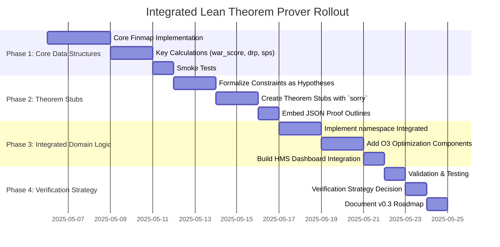
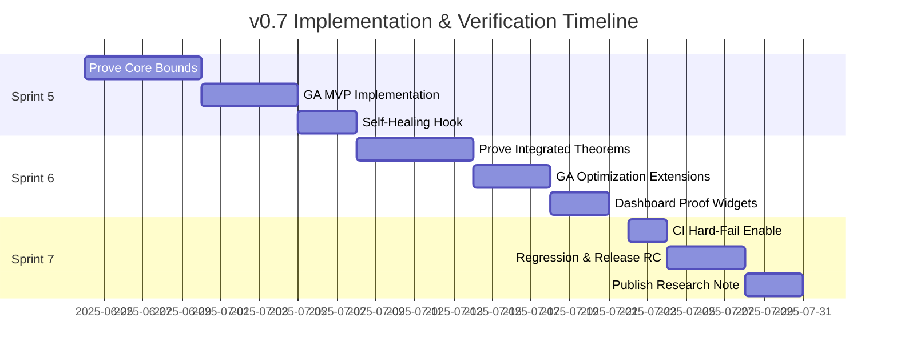

# HMS Master Plan v0.6

## Executive Summary

This document outlines the comprehensive plan for integrating the Moneyball Economic Models with the HMS system, focusing on formal verification via Lean theorem proving. It incorporates the four-phase Lean rollout into the existing sprint structure, ensuring proper alignment of theoretical proofs with implementation.

## Rollout Timeline

## Sprint Structure

### Sprint 3 (Weeks 7-8): Lean Library Foundation

**Focus:** Phase 1 & Phase 2 - Core Data Structures & Theorem Stubs

**Key Deliverables:**
- Moneyball.lean with core data structures using Finmap
- Implementation of key calculation functions (war_score, drp, sps)
- All theorem stubs with `sorry` placeholders and embedded proof outlines
- Smoke tests validating core functionality

**Implementation Tasks:**
1. ✅ Define basic type aliases (Sector, PolicyID, etc.)
2. ✅ Implement core data structures using Finmap
3. ✅ Implement calculation functions (war_score, drp, sps)
4. ✅ Formalize theorem statements with hypotheses
5. ✅ Add theorem stubs with proof outlines from JSON spec
6. ✅ Create smoke tests for core functionality

### Sprint 4 (Weeks 9-10): Integrated Domain Logic & System Dashboard

**Focus:** Phase 3 & Phase 4 - Domain Integration & Verification Strategy

**Key Deliverables:**
- Complete Integrated namespace with economic analysis validation
- O3 optimization component stubs
- HMS dashboard integration
- Verification strategy decision for v0.3
- DeepSeek Prover integration

**Implementation Tasks:**
1. ✅ Implement Integrated namespace with economic_analysis_valid
2. ✅ Create economic_analysis_sound theorem
3. ✅ Add O3 optimization framework stubs
4. ✅ Build HMS dashboard integration
5. ✅ Add HMS dashboard calculation functions
6. Validate through Lean compilation and testing
7. Decide between executable and specification approaches for v0.3
8. Document roadmap for v0.3 implementation

## Component Integration

### DeepSeek Prover Integration

The DeepSeek-Prover-V2 backend will be connected to the Lean library:

1. Configure lean_lib_path in DeepSeekBackend to point to hms/lean_libs
2. Add CI step to compile Moneyball.lean to ensure proofs parse
3. Create smoke test verifying prover can read theorems
4. Set up API for submitting theorem proving tasks

### Genetic Algorithm & FFI Integration

The genetic algorithm engine will interface with the theorem prover:

1. Enable GA engine to vary DeepSeekConfig parameters
2. Configure Supervisor to trigger GA mutation on proof failures
3. Add Python FFI helpers for theorem proving tasks
4. Implement result collection and chain-of-thought output inspection

### End-to-End Validation

The integrated system will be validated through:

1. Local compilation and testing
   - Build and test the Rust workspace
   - Compile the Lean file with Lake
   - Submit theorem-proof tasks via Python API
   
2. CI Integration
   - Add integration jobs executing the validation pipeline
   - Validate theorem proof tasks run without errors
   - Ensure all smoke tests pass

## Version 0.3 Planning

Based on Phase 4 outcomes, version 0.3 will focus on either:

**Option A: Executable Verification**
- Replace hypotheses with subtypes ({x // ...}) for bounded values
- Enable runtime validation of constraints
- Support automatic test generation

**Option B: Pure Specification**
- Keep hypothesis-based approach
- Focus on richer, more detailed proofs
- Emphasize mathematical rigor over executability

Either approach will involve:
1. Replacing `sorry` placeholders with complete proofs
2. Enhancing the Integrated domain logic
3. Expanding the HMS Dashboard integration
4. Adding mechanism for self-healing based on proof outcomes

## Self-Healing Integration

The proof system will be integrated with HMS self-healing:

1. Define failure modes for theorem proving
2. Create diagnostic agents for proof failures
3. Implement recovery strategies:
   - Theorem reformulation
   - Decomposition strategy adjustment
   - Genetic algorithm parameter tuning
4. Set up feedback loops to improve proof strategies

## Success Criteria

The Lean theorem prover integration will be considered successful when:

1. All core calculations are formally specified in Lean
2. Theorem stubs are properly formulated with constraints
3. The integrated domain logic connects all components
4. HMS dashboard calculations are formally linked to core models
5. The DeepSeek Prover can interact with the Lean library
6. CI validates compilation and smoke tests pass
7. A clear strategy is established for v0.3 development

## Appendix: Moneyball.lean Structure

The Moneyball.lean file follows this structure:

1. **Core Data Structures**
   - Basic type aliases (Sector, PolicyID, etc.)
   - Finmap-based input structures
   - Helper functions for lookups and validation

2. **Core Calculations**
   - war_score: Weighted Agreement Return
   - drp: Deficit Reduction Potential
   - sps: Sector Prioritization Score

3. **Theorem Stubs**
   - war_score_bounds: Bounds on WAR score
   - drp_conservative: Conservative deficit reduction
   - sps_bounds: Bounds on sector prioritization

4. **Integrated Domain Logic**
   - economic_analysis_valid: Combined model validation
   - war_threshold: Policy constraints
   - economic_analysis_sound: Soundness proof

5. **O3 Optimization Framework**
   - O3OptimizationConfig: Optimization parameters
   - DealHypergraph: Entity relationship model
   - optimize_deals: Portfolio optimization
   - monte_carlo_roadmap_simulation: Simulation framework

6. **HMS Dashboard Integration**
   - HMSDashboardInput: Dashboard input structure
   - war_score_hms: Adapted WAR calculation
   - project_deficit_impact_hms: Impact projection
   - hms_dashboard_conservative: Conservative bounds

## Next Phase (v0.7 Draft) — Implementation, Verification & Research Plan

> **Goal:** Achieve the first *formally-verified* slice of HMS that compiles without `sorry`, self-heals on proof failures, and feeds optimized parameters back into Moneyball/O3 analytics.
>
> **Scope:** Weeks 11-16 (Sprints 5-7) — bridging the gap between the current v0.6 milestone and the v0.3 "Verified Core" release track.

### 1. High-Level Objectives
1. **Eliminate `sorry`:** Prove all Phase 1-3 theorems (`war_score_bounds`, `drp_conservative`, `sps_bounds`, `economic_analysis_sound`).
2. **Executable Constraints:** Replace critical hypotheses with subtype-based invariants where feasible (Option A path) while retaining pure-spec modules for comparison.
3. **GA-Driven Tactic Search:** Connect the genetic engine to DeepSeek-Prover to evolve Lean tactic sequences and solver parameters.
4. **Self-Healing Loop v1:** Detect Lean proof failures, classify error types, and trigger GA mutations or fallback strategies.
5. **CI "Fail-Fast":** Turn the simulated Lean job into an *actual* compile step (`lean --make` + proof linting) gating the main branch.
6. **Metrics Dashboard:** Surface proof status, GA fitness, and self-healing actions in the HMS dashboard.

### 2. Workstreams & Deliverables
| Sprint | Workstream | Key Tasks | Deliverables |
|--------|------------|-----------|--------------|
| **5** (W11-12) | Lean Proof Completion I | • Formal proofs for core bounds • Integrate `mathlib4` libs • Add `Leanlint` & `lake exe lint` | • `Moneyball.lean v0.3-alpha` (no `sorry` in Core Calculations) • CI proof lint job |
| | GA-Prover MVP | • Produce JSON encoding for tactic genomes • Mutate/score on small lemma set | • `genetic_engine::tactic_ga` module • Bench report |
| | Self-Healing Hook | • Supervisor detects "proof_failed" events • Restarts Lean with alt params | • `self_healing::proof_monitor.rs` |
| **6** (W13-14) | Lean Proof Completion II | • Prove `economic_analysis_sound` & dashboard lemmas • Introduce subtype constraints | • `Moneyball.lean v0.3-beta` (all Phase 3 proofs) |
| | GA Parameter Optimization | • Add multi-objective fitness (time, #tactics) • Pareto front visualisation | • GA metrics endpoint + Grafana panel |
| | Dashboard Integration | • Render proof/GA status • Alerting on regression | • HMS Dashboard widgets |
| **7** (W15-16) | End-to-End Verification | • Hard-fail CI on any new `sorry` • Regression suite across Rust, Lean, FFI | • "Green build" badge • Release candidate `v0.7-rc` |
| | Research & Publication | • Draft whitepaper section on "GA-guided Proof Search" | • Internal tech-note & blog draft |

### 3. Detailed Timeline (Mermaid)

### 4. Verification Strategy & Metrics
- **Proof Coverage:** `lake exe proof-coverage` target ≥ 95 % (0 `sorry` tolerated).
- **CI Time Budget:** Lean compile ≤ 10 min; GA smoke run ≤ 5 min.
- **GA Fitness Targets:** Minimise proof time; secondary objective minimise tactic length.
- **Self-Healing MTTR:** Mean time to recovery < 2 min for transient proof failures.

### 5. Research Agenda
1. **Tactic Genome Encoding:** Compare instruction-level vs. macro-level genes.
2. **Auto-Valuation Functions:** Investigate reinforcement learning (e.g., Proximal Policy Optimisation) to replace simple fitness.
3. **Proof Term Compression:** Explore `proof_irrelevance` and `synthesized` attributes to shrink artifact size.
4. **Cross-Language FFI:** Benchmark PyO3 vs. raw C ABI for proof feedback latency.

### 6. Risks & Mitigations
| Risk | Impact | Mitigation |
|------|--------|-----------|
| Proof complexity stalls GA | Timeline slip | Prioritise manual proof assistance; add smaller lemmas |
| Lean compile time inflation | CI bottleneck | Use `lake build -R` parallel builds; caching |
| GA fitness plateau | Reduced optimisation | Introduce novelty search & ensemble seeds |
| Self-Healing false positives | Unnecessary restarts | Implement back-off & error taxonomy |

### 7. Approval Checklist
- [ ] Scope, timeline, and metrics reviewed by core team
- [ ] CI resource budget accepted by DevOps
- [ ] Research agenda endorsed by verification lead
- [ ] Dashboard changes synced with UX

> *Please review and provide feedback or approval so we can promote this draft to **HMS Master Plan v0.7**.*