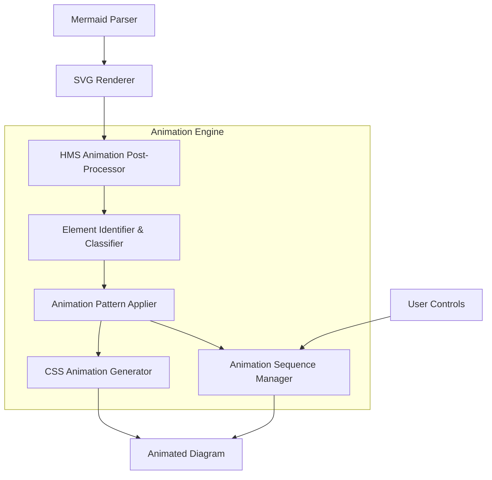

# HMS Mermaid Animation Implementation Plan

## Executive Summary

This document outlines a comprehensive strategy for implementing animated Mermaid diagrams within the Hardison Management Systems (HMS) ecosystem. By leveraging Mermaid's diagramming capabilities and extending them with animation techniques, we aim to create dynamic, engaging visualizations of HMS architecture, processes, and data flows that enhance understanding and communication of complex systems.

## Background Analysis

### Current State Assessment

Based on our analysis of the HMS-UTL component and Mermaid implementation:

1. **HMS-UTL Component** contains a fork of the mermaid-live-editor, indicating existing interest in Mermaid diagramming
2. **Mermaid Core Capabilities** include flowcharts, sequence diagrams, class diagrams, state diagrams, and more
3. **Animation Gap** - Mermaid itself does not natively support animations, representing a capability gap
4. **Integration Needs** - Animations need to work within the HMS documentation and visualization system

### Technical Constraints

1. Mermaid generates static SVG output that requires external techniques for animation
2. Animation must be performant even with complex diagrams
3. Consistent user experience across browsers and platforms
4. Maintain accessibility standards

## Animation Techniques Overview

After extensive research, we've identified four primary approaches for animating Mermaid diagrams:

### 1. CSS Animation Approach

This approach applies CSS animations to the SVG elements generated by Mermaid.

**Advantages:**
- Lightweight solution that doesn't require additional JavaScript frameworks
- Good performance characteristics even for complex diagrams
- Built-in browser support

**Disadvantages:**
- Limited to simpler animations without complex sequencing
- Requires detailed understanding of Mermaid's SVG structure

### 2. Sequential Diagram Approach

This approach uses multiple Mermaid diagrams with slight modifications, displayed in sequence.

**Advantages:**
- Maintains Mermaid's native rendering
- Precise control over animation states
- Easier to understand and implement

**Disadvantages:**
- Less smooth transitions between states
- Limited to "step-by-step" animations
- Higher rendering overhead

### 3. JavaScript Animation Framework Integration

This approach uses libraries like GSAP, anime.js, or Motion One to animate Mermaid SVG elements.

**Advantages:**
- Rich animation capabilities including complex sequencing
- Precise control over timing and easing
- Unified API for all animation needs

**Disadvantages:**
- Additional dependencies and bundle size
- Potential performance impact on complex diagrams
- Requires more JavaScript expertise

### 4. Custom Mermaid Renderer Approach

This approach involves extending Mermaid's rendering engine to support animations natively.

**Advantages:**
- Deepest integration with Mermaid internals
- Potential to create domain-specific animation capabilities
- Future-proof against Mermaid updates (if properly maintained)

**Disadvantages:**
- Most complex approach requiring deep understanding of Mermaid internals
- Highest development effort
- Maintenance overhead when new Mermaid versions are released

## Recommended Technical Approach

After evaluating all options, we recommend a **hybrid approach** combining multiple techniques:

### Primary Implementation: CSS Animation Framework

1. Create a purpose-built CSS animation framework specifically for Mermaid diagrams
2. Develop a standard library of animation patterns for common HMS visualization needs
3. Use JavaScript only for animation sequencing and coordination
4. Implement automatic detection of Mermaid SVG structure for robustness
5. Leverage CSS custom properties for animation customization

### Secondary Implementation: Sequenced Diagram System

1. For more complex animations, implement a step-by-step diagram sequence system
2. Create standardized diagram templates with animation "keyframes"
3. Build a transition manager to handle the sequencing and transitions
4. Add user controls for stepping through animations manually

### Technical Architecture



## Implementation Plan

### Phase 1: Foundation (Weeks 1-3)

1. **CSS Animation Framework Development**
   - Create a core CSS animation library focused on Mermaid SVG elements
   - Implement standard animations for nodes, edges, and text elements
   - Develop animation sequencing and timing controls

2. **Mermaid Integration Layer**
   - Create a post-processor for Mermaid SVG output
   - Develop element identifier to systematically target SVG elements
   - Build animation class applicator system

3. **Proof of Concept Demos**
   - Implement simple flowchart animations
   - Create animated sequence diagrams
   - Develop state transition animations

### Phase 2: HMS-Specific Patterns (Weeks 4-6)

1. **HMS Architecture Animation Patterns**
   - Develop component highlight/focus animations
   - Create data flow animations
   - Implement system state transition animations

2. **Animation Configuration System**
   - Build YAML/JSON configuration for animation definitions
   - Create animation theme system
   - Implement animation timing controls

3. **User Controls**
   - Develop animation playback controls
   - Create step-by-step navigation interface
   - Implement animation speed controls

### Phase 3: Advanced Features (Weeks 7-9)

1. **Sequential Diagram System**
   - Implement diagram keyframe system
   - Create transition engine between diagram states
   - Build diagram difference calculator

2. **Performance Optimization**
   - Implement animation throttling for complex diagrams
   - Create optimized rendering path for animations
   - Build browser capability detection

3. **Documentation and Examples**
   - Create comprehensive documentation for HMS animation system
   - Develop example gallery of animated diagrams
   - Build animation pattern library

### Phase 4: Integration and Deployment (Weeks 10-12)

1. **HMS-UTL Integration**
   - Integrate animation system with HMS-UTL
   - Update existing mermaid-live-editor to support animations
   - Create animation export functionality

2. **HMS Component Integration**
   - Add animation support to HMS documentation system
   - Integrate with HMS-DOC for automated diagram generation
   - Create animation presets for each HMS component

3. **Testing and Optimization**
   - Conduct comprehensive browser testing
   - Optimize for performance across devices
   - Ensure accessibility compliance

## Technical Implementation Details

### CSS Animation Framework

The core of our approach will be a CSS animation framework specifically designed for Mermaid diagrams. Key components include:

```css
/* Example CSS Animation Pattern */
@keyframes nodeHighlight {
  0% {
    filter: drop-shadow(0 0 0 rgba(0, 0, 0, 0));
    transform: scale(1);
  }
  50% {
    filter: drop-shadow(0 0 10px rgba(255, 165, 0, 0.6));
    transform: scale(1.05);
  }
  100% {
    filter: drop-shadow(0 0 5px rgba(255, 165, 0, 0.3));
    transform: scale(1);
  }
}

.hms-node-highlight {
  animation: nodeHighlight 1s ease-in-out;
}
```

### JavaScript Controller

A lightweight JavaScript controller will manage animation sequencing and user interactions:

```javascript
class MermaidAnimationController {
  constructor(svgElement, config) {
    this.svg = svgElement;
    this.config = config;
    this.currentStep = 0;
    this.steps = config.steps || [];
    this.initialize();
  }
  
  initialize() {
    // Process SVG structure and prepare for animation
    this.identifyElements();
    this.setupControls();
  }
  
  identifyElements() {
    // Identify nodes, edges, and other SVG elements
    this.nodes = Array.from(this.svg.querySelectorAll('.node'));
    this.edges = Array.from(this.svg.querySelectorAll('.edge'));
  }
  
  playStep(stepIndex) {
    const step = this.steps[stepIndex];
    if (!step) return;
    
    // Apply animations defined in this step
    step.animations.forEach(animation => {
      const elements = this.querySelector(animation.selector);
      elements.forEach(el => {
        el.classList.add(animation.className);
        el.addEventListener('animationend', () => {
          if (!animation.persistent) {
            el.classList.remove(animation.className);
          }
        }, { once: true });
      });
    });
  }
  
  // Additional controller methods
}
```

### Animation Configuration Format

We'll implement a declarative configuration format for defining animations:

```json
{
  "diagram": "architecture",
  "version": "1.0",
  "steps": [
    {
      "name": "highlight-api",
      "description": "Highlight HMS-API component",
      "duration": 1000,
      "animations": [
        {
          "selector": "#HMS-API",
          "className": "hms-node-highlight",
          "persistent": true
        }
      ]
    },
    {
      "name": "show-data-flow",
      "description": "Show data flow between components",
      "duration": 1500,
      "animations": [
        {
          "selector": "path.edge.HMS-API-to-HMS-DB",
          "className": "hms-edge-flow",
          "persistent": false
        }
      ]
    }
  ]
}
```

## Sequential Diagram Implementation

For more complex animations, we'll implement a sequential diagram system:

1. **Keyframe Definition**:
   - Create diagram keyframes using standard Mermaid syntax
   - Add metadata to indicate sequence order
   - Support branching/conditional flows

2. **Diff Calculation**:
   - Implement diagram diffing algorithm
   - Identify changed nodes/edges between frames
   - Generate transition animations

3. **Sequence Manager**:
   - Build a manager for stepping through diagram stages
   - Add controls for forward/backward navigation
   - Support for automatic playback

## Integration with HMS Components

The animation system will integrate with other HMS components:

1. **HMS-DOC Integration**:
   - Extend documentation to include animated diagrams
   - Auto-generate animations for architecture diagrams
   - Add animation controls to documentation viewer

2. **HMS-MCP Integration**:
   - Support animation generation as part of model-compute-publish pipeline
   - Create dynamic animations based on system state

3. **HMS-UTL Integration**:
   - Enhance mermaid-live-editor to support animation creation
   - Add animation export functionality
   - Create animation library/gallery

## Usage Examples

### Basic Animation Definition

```html
<div class="mermaid-diagram">
  <pre class="mermaid">
    graph TD
      A[Client] --> B[Load Balancer]
      B --> C[Server 1]
      B --> D[Server 2]
  </pre>
  
  <script type="application/json" class="mermaid-animation">
    {
      "steps": [
        {
          "name": "highlight-client",
          "selector": "#A",
          "animation": "pulse"
        },
        {
          "name": "show-request",
          "selector": "path.A-B",
          "animation": "flow-right"
        },
        {
          "name": "load-balancer",
          "selector": "#B",
          "animation": "process"
        },
        {
          "name": "distribute",
          "selectors": ["path.B-C", "path.B-D"],
          "animation": "flow-right",
          "staggered": true
        }
      ]
    }
  </script>
</div>
```

### HMS Architecture Animation Example

```javascript
// HMS Architecture Animation
const architectureAnimation = new HMSAnimation('system-architecture', {
  autoPlay: false,
  controls: true,
  steps: [
    {
      name: 'overview',
      animations: [
        { selector: '.hms-component', animation: 'fade-in', staggered: true }
      ]
    },
    {
      name: 'governance-layer',
      animations: [
        { selector: '.governance-layer', animation: 'highlight' },
        { selector: '.component.HMS-GOV', animation: 'pulse' }
      ]
    },
    {
      name: 'communication',
      animations: [
        { selector: '.path.HMS-A2A', animation: 'flow', repeat: 3 }
      ]
    }
  ]
});

// Initialize the animation
architectureAnimation.initialize();
```

## Resource Requirements

### Development Team

- 1 CSS Animation Specialist
- 1 JavaScript Developer
- 1 SVG/Mermaid Expert
- 1 HMS Integration Developer
- 1 Technical Writer for documentation

### Infrastructure

- Animation testing framework
- Browser compatibility testing suite
- Performance monitoring tools

### Timeline

- 12 weeks total development time
- Key milestones at weeks 3, 6, 9, and 12
- Week 12: Production deployment

## Success Metrics

1. **Performance**: Animation frame rate consistently above 30fps
2. **Browser Support**: Full support in Chrome, Firefox, Safari, Edge
3. **Adoption**: Animation used in >50% of HMS component documentation
4. **User Satisfaction**: Positive feedback from >80% of users
5. **Developer Experience**: Animation creation time <30 minutes per diagram

## Conclusion

The HMS Mermaid Animation System will significantly enhance the visualization capabilities of the Hardison Management Systems platform. By implementing this plan, we will create a powerful tool for communicating complex system architectures, processes, and data flows through intuitive, engaging animations. This capability will improve understanding among technical and non-technical stakeholders alike, advancing HMS's mission of providing comprehensive, accessible management systems across multiple industries.

## Next Steps

1. Assemble development team
2. Finalize technical specifications
3. Develop initial proof-of-concept
4. Review with stakeholders
5. Begin Phase 1 implementation