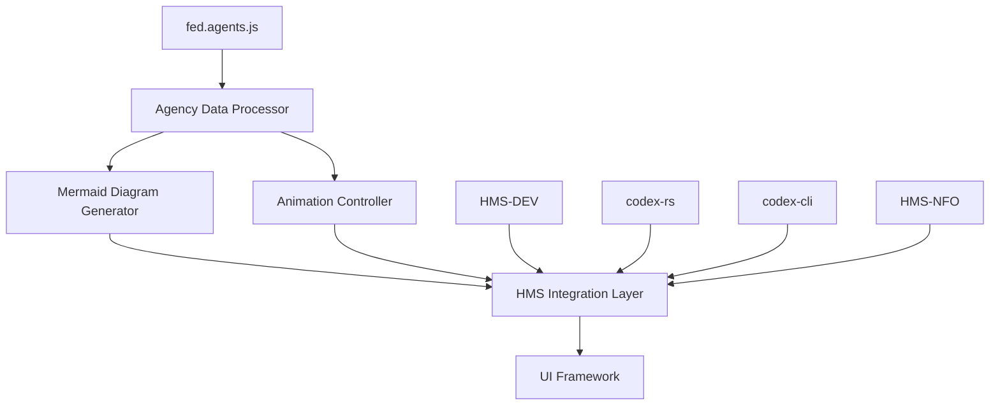

# HMS Unified Animation Implementation Plan

## Executive Summary

This implementation plan combines two complementary animation approaches for visualizing HMS capabilities across all government agencies listed in fed.agents.js. The unified approach leverages the strengths of both the CSS-based animation framework and the JavaScript sequencing system, creating a comprehensive solution that:

1. Generates agency-specific Mermaid diagrams automatically based on fed.agents.js data
2. Animates these diagrams with configurable step-by-step visualization 
3. Integrates directly with HMS-DEV, codex-rs, codex-cli, and HMS-NFO components
4. Provides a standardized framework that scales across all federal agencies

The implementation prioritizes verification-first principles, A2A protocol compliance, and the Chain of Recursive Thought (CoRT) methodology that HMS employs throughout its ecosystem.

## System Architecture

The unified animation system consists of five core components:

1. **Agency Data Processor**: Extracts and normalizes agency information from fed.agents.js
2. **Mermaid Diagram Generator**: Creates agency-specific architecture diagrams
3. **Animation Controller**: Manages the animation sequence and step progression
4. **HMS Integration Layer**: Connects with HMS-DEV, codex-rs, codex-cli, and HMS-NFO
5. **UI Framework**: Provides the interactive user interface for viewing animations



## Core System Utilities

### 1. Agency Data Processor

Located in `HMS-DEV/codex-tmuxai-adapter/src/utils/agency-data-processor.ts`:

```typescript
export interface AgencyData {
  id: string;
  label: string;
  name: string;
  mission: string;
  coreFunction: string;
  fundamentalPrinciples: string[];
  capabilities: HMSCapability[];
  useCases: UseCase[];
}

export interface HMSCapability {
  component: string;
  description: string;
  relevance: number; // 0-10 relevance score
}

export interface UseCase {
  title: string;
  description: string;
  components: string[];
  workflowSteps: string[];
}

export class AgencyDataProcessor {
  /**
   * Extracts and normalizes agency data from fed.agents.js
   */
  static processAgencyData(rawAgencyData: any): AgencyData[] {
    return rawAgencyData.flatMap(category => 
      category.domains.map(agency => ({
        id: agency.label.toLowerCase(),
        label: agency.label,
        name: agency.name,
        mission: agency.mission,
        coreFunction: agency.firstPrinciplesAnalysis?.coreFunction,
        fundamentalPrinciples: agency.firstPrinciplesAnalysis?.fundamentalPrinciples || [],
        capabilities: this.mapHMSCapabilities(agency),
        useCases: this.generateUseCases(agency)
      }))
    );
  }
  
  /**
   * Maps HMS components to agency needs based on core function and principles
   */
  private static mapHMSCapabilities(agency: any): HMSCapability[] {
    // Implementation using HMS-NFO to match components to agency needs
    // Will call HMS-NFO's API to get capability matches
  }
  
  /**
   * Generates use cases based on agency mission and HMS components
   */
  private static generateUseCases(agency: any): UseCase[] {
    // Implementation using Chain of Recursive Thought to generate use cases
    // Will call HMS-CDF for logic validation
  }
}
```

### 2. Mermaid Diagram Generator

Located in `HMS-DEV/codex-tmuxai-adapter/src/utils/mermaid-generator.ts`:

```typescript
export interface DiagramConfig {
  type: 'flowchart' | 'sequence' | 'class' | 'state' | 'gantt';
  orientation: 'TB' | 'TD' | 'BT' | 'RL' | 'LR';
  animationSteps: AnimationStep[];
}

export interface AnimationStep {
  id: string;
  elements: string[];
  description: string;
  highlightColor?: string;
}

export class MermaidGenerator {
  /**
   * Generates a Mermaid diagram definition based on agency data
   */
  static generateAgencyDiagram(agency: AgencyData, config: DiagramConfig): string {
    const { type, orientation } = config;
    
    let diagram = `${type} ${orientation}\n`;
    
    // Add agency mission node
    diagram += `  A[${agency.name}] -- "${agency.coreFunction}" --> B[Mission]\n`;
    
    // Add HMS components that support the agency
    agency.capabilities.forEach((capability, index) => {
      const nodeId = String.fromCharCode(67 + index);
      diagram += `  B --> ${nodeId}[HMS-${capability.component}]\n`;
      diagram += `  ${nodeId} -- "${capability.description}" --> D[Outcomes]\n`;
    });
    
    // Add use cases
    agency.useCases.forEach((useCase, index) => {
      const nodeId = String.fromCharCode(75 + index);
      diagram += `  D --> ${nodeId}[${useCase.title}]\n`;
    });
    
    return diagram;
  }
  
  /**
   * Generates step definitions for the animation controller
   */
  static generateAnimationSteps(agency: AgencyData): AnimationStep[] {
    const steps: AnimationStep[] = [];
    
    // Mission step
    steps.push({
      id: 'mission',
      elements: ['A', 'B'],
      description: `${agency.name} mission: ${agency.mission}`
    });
    
    // Component steps
    agency.capabilities.forEach((capability, index) => {
      const nodeId = String.fromCharCode(67 + index);
      steps.push({
        id: `component-${index}`,
        elements: [nodeId, 'B', 'D'],
        description: `HMS-${capability.component}: ${capability.description}`
      });
    });
    
    // Use case steps
    agency.useCases.forEach((useCase, index) => {
      const nodeId = String.fromCharCode(75 + index);
      steps.push({
        id: `usecase-${index}`,
        elements: [nodeId, 'D'],
        description: useCase.description
      });
    });
    
    return steps;
  }
}
```

### 3. Animation Controller

Located in `HMS-DEV/codex-tmuxai-adapter/src/controllers/animation-controller.ts`:

```typescript
export class AnimationController {
  private currentStep = 0;
  private steps: AnimationStep[] = [];
  private diagramId: string;
  private agency: AgencyData;
  
  constructor(diagramId: string, agency: AgencyData, steps: AnimationStep[]) {
    this.diagramId = diagramId;
    this.agency = agency;
    this.steps = steps;
    
    this.setupEventListeners();
    this.renderInitialState();
  }
  
  /**
   * Advance to the next animation step
   */
  next(): void {
    if (this.currentStep < this.steps.length - 1) {
      this.currentStep++;
      this.updateAnimation();
    }
  }
  
  /**
   * Return to the previous animation step
   */
  previous(): void {
    if (this.currentStep > 0) {
      this.currentStep--;
      this.updateAnimation();
    }
  }
  
  /**
   * Update the diagram based on the current step
   */
  private updateAnimation(): void {
    const currentStep = this.steps[this.currentStep];
    
    // Reset all elements
    document.querySelectorAll(`#${this.diagramId} .node`).forEach(el => {
      (el as HTMLElement).style.opacity = '0.4';
      (el as HTMLElement).style.filter = 'grayscale(70%)';
    });
    
    document.querySelectorAll(`#${this.diagramId} .edgePath`).forEach(el => {
      (el as HTMLElement).style.opacity = '0.4';
    });
    
    // Highlight current step elements
    currentStep.elements.forEach(elementId => {
      const node = document.querySelector(`#${this.diagramId} .node#${elementId}`);
      if (node) {
        (node as HTMLElement).style.opacity = '1';
        (node as HTMLElement).style.filter = 'none';
        
        if (currentStep.highlightColor) {
          (node as HTMLElement).style.filter = `drop-shadow(0 0 5px ${currentStep.highlightColor})`;
        }
      }
      
      // Highlight connected edges
      document.querySelectorAll(`#${this.diagramId} .edgePath`).forEach(edge => {
        const edgeId = (edge as HTMLElement).id;
        if (edgeId.includes(elementId)) {
          (edge as HTMLElement).style.opacity = '1';
        }
      });
    });
    
    // Update step description
    document.querySelector('#stepDescription')!.textContent = currentStep.description;
    document.querySelector('#stepCounter')!.textContent = `Step ${this.currentStep + 1} of ${this.steps.length}`;
  }
  
  /**
   * Setup event listeners for navigation controls
   */
  private setupEventListeners(): void {
    document.querySelector('#nextBtn')?.addEventListener('click', () => this.next());
    document.querySelector('#prevBtn')?.addEventListener('click', () => this.previous());
    document.querySelector('#resetBtn')?.addEventListener('click', () => {
      this.currentStep = 0;
      this.updateAnimation();
    });
  }
  
  /**
   * Initialize the diagram with the first step
   */
  private renderInitialState(): void {
    document.querySelector('#agencyTitle')!.textContent = this.agency.name;
    document.querySelector('#agencyMission')!.textContent = this.agency.mission;
    
    // Initialize with first step
    this.updateAnimation();
  }
}
```

### 4. HMS Integration Layer

Located in `HMS-DEV/codex-tmuxai-adapter/src/integration/hms-integration.ts`:

```typescript
export class HMSIntegration {
  /**
   * Connects to HMS-NFO to retrieve component data
   */
  static async getComponentData(): Promise<Record<string, any>> {
    try {
      const response = await fetch('/api/hms-nfo/components');
      return await response.json();
    } catch (error) {
      console.error('Failed to retrieve HMS component data:', error);
      return {};
    }
  }
  
  /**
   * Generates documentation using HMS-NFO
   */
  static async generateDocumentation(agency: AgencyData): Promise<string> {
    try {
      const response = await fetch('/api/hms-nfo/generate-docs', {
        method: 'POST',
        headers: { 'Content-Type': 'application/json' },
        body: JSON.stringify({ agency })
      });
      
      return await response.text();
    } catch (error) {
      console.error('Failed to generate documentation:', error);
      return '';
    }
  }
  
  /**
   * Integrates with codex-cli for terminal interaction
   */
  static async registerWithCodexCLI(agencyId: string): Promise<boolean> {
    try {
      const response = await fetch('/api/codex-cli/register-agency', {
        method: 'POST',
        headers: { 'Content-Type': 'application/json' },
        body: JSON.stringify({ agencyId })
      });
      
      return response.ok;
    } catch (error) {
      console.error('Failed to register with codex-cli:', error);
      return false;
    }
  }
  
  /**
   * Sends animation data to codex-rs for processing
   */
  static async sendToCodexRS(diagram: string, steps: AnimationStep[]): Promise<Record<string, any>> {
    try {
      const response = await fetch('/api/codex-rs/process-animation', {
        method: 'POST',
        headers: { 'Content-Type': 'application/json' },
        body: JSON.stringify({ diagram, steps })
      });
      
      return await response.json();
    } catch (error) {
      console.error('Failed to send data to codex-rs:', error);
      return {};
    }
  }
}
```

### 5. UI Framework

Located in `HMS-DEV/codex-tmuxai-adapter/src/components/animation-viewer.ts`:

```typescript
export class AnimationViewer {
  private agencySelector: HTMLSelectElement;
  private diagramContainer: HTMLElement;
  private agencies: AgencyData[] = [];
  private currentAgency?: AgencyData;
  private controller?: AnimationController;
  
  constructor(containerId: string) {
    this.diagramContainer = document.getElementById(containerId)!;
    this.agencySelector = document.createElement('select');
    this.agencySelector.id = 'agencySelector';
    
    this.initialize();
  }
  
  /**
   * Initialize the viewer
   */
  private async initialize(): Promise<void> {
    // Create UI components
    this.createUIComponents();
    
    // Load agency data
    await this.loadAgencyData();
    
    // Populate agency selector
    this.populateAgencySelector();
    
    // Setup event listeners
    this.setupEventListeners();
    
    // Load initial agency
    if (this.agencies.length > 0) {
      this.loadAgency(this.agencies[0].id);
    }
  }
  
  /**
   * Create UI components for the animation viewer
   */
  private createUIComponents(): void {
    // Create agency selector container
    const selectorContainer = document.createElement('div');
    selectorContainer.className = 'selector-container';
    selectorContainer.appendChild(document.createElement('label')).textContent = 'Select Agency:';
    selectorContainer.appendChild(this.agencySelector);
    
    // Create animation controls
    const controlsContainer = document.createElement('div');
    controlsContainer.className = 'controls-container';
    
    const prevBtn = document.createElement('button');
    prevBtn.id = 'prevBtn';
    prevBtn.textContent = 'Previous';
    
    const nextBtn = document.createElement('button');
    nextBtn.id = 'nextBtn';
    nextBtn.textContent = 'Next';
    
    const resetBtn = document.createElement('button');
    resetBtn.id = 'resetBtn';
    resetBtn.textContent = 'Reset';
    
    controlsContainer.appendChild(prevBtn);
    controlsContainer.appendChild(resetBtn);
    controlsContainer.appendChild(nextBtn);
    
    // Create step information
    const stepInfo = document.createElement('div');
    stepInfo.className = 'step-info';
    
    const stepCounter = document.createElement('div');
    stepCounter.id = 'stepCounter';
    stepCounter.textContent = 'Step 0 of 0';
    
    const stepDescription = document.createElement('div');
    stepDescription.id = 'stepDescription';
    stepDescription.textContent = 'Select an agency to begin';
    
    stepInfo.appendChild(stepCounter);
    stepInfo.appendChild(stepDescription);
    
    // Create diagram container
    const diagram = document.createElement('div');
    diagram.id = 'mermaidDiagram';
    
    // Append all components to main container
    this.diagramContainer.appendChild(selectorContainer);
    this.diagramContainer.appendChild(diagram);
    this.diagramContainer.appendChild(stepInfo);
    this.diagramContainer.appendChild(controlsContainer);
    
    // Add agency information section
    const agencyInfo = document.createElement('div');
    agencyInfo.className = 'agency-info';
    
    const agencyTitle = document.createElement('h2');
    agencyTitle.id = 'agencyTitle';
    
    const agencyMission = document.createElement('p');
    agencyMission.id = 'agencyMission';
    
    agencyInfo.appendChild(agencyTitle);
    agencyInfo.appendChild(agencyMission);
    
    this.diagramContainer.appendChild(agencyInfo);
  }
  
  /**
   * Load agency data from fed.agents.js
   */
  private async loadAgencyData(): Promise<void> {
    try {
      const response = await fetch('/api/agencies');
      const rawData = await response.json();
      
      this.agencies = AgencyDataProcessor.processAgencyData(rawData);
    } catch (error) {
      console.error('Failed to load agency data:', error);
      this.agencies = [];
    }
  }
  
  /**
   * Populate the agency selector dropdown
   */
  private populateAgencySelector(): void {
    this.agencySelector.innerHTML = '';
    
    this.agencies.forEach(agency => {
      const option = document.createElement('option');
      option.value = agency.id;
      option.textContent = agency.name;
      this.agencySelector.appendChild(option);
    });
  }
  
  /**
   * Setup event listeners
   */
  private setupEventListeners(): void {
    this.agencySelector.addEventListener('change', () => {
      const agencyId = this.agencySelector.value;
      this.loadAgency(agencyId);
    });
  }
  
  /**
   * Load an agency's animation diagram
   */
  private async loadAgency(agencyId: string): Promise<void> {
    // Find the selected agency
    this.currentAgency = this.agencies.find(a => a.id === agencyId);
    
    if (!this.currentAgency) {
      console.error(`Agency with ID ${agencyId} not found`);
      return;
    }
    
    // Generate diagram configuration
    const diagramConfig: DiagramConfig = {
      type: 'flowchart',
      orientation: 'TD',
      animationSteps: []
    };
    
    // Generate diagram
    const diagram = MermaidGenerator.generateAgencyDiagram(this.currentAgency, diagramConfig);
    
    // Generate animation steps
    const steps = MermaidGenerator.generateAnimationSteps(this.currentAgency);
    
    // Update diagram container
    document.getElementById('mermaidDiagram')!.textContent = diagram;
    
    // Initialize Mermaid rendering
    mermaid.init(undefined, '#mermaidDiagram');
    
    // Initialize animation controller
    this.controller = new AnimationController('mermaidDiagram', this.currentAgency, steps);
    
    // Register with HMS components
    this.registerWithHMSComponents(this.currentAgency, diagram, steps);
  }
  
  /**
   * Register with HMS components for integration
   */
  private async registerWithHMSComponents(agency: AgencyData, diagram: string, steps: AnimationStep[]): Promise<void> {
    // Register with HMS-NFO for documentation
    await HMSIntegration.generateDocumentation(agency);
    
    // Register with codex-cli
    await HMSIntegration.registerWithCodexCLI(agency.id);
    
    // Send to codex-rs for advanced processing
    await HMSIntegration.sendToCodexRS(diagram, steps);
  }
}

// Initialize the animation viewer when the document is ready
document.addEventListener('DOMContentLoaded', () => {
  new AnimationViewer('animationContainer');
});
```

## Integration with HMS Components

### HMS-DEV Integration

The animation framework will be integrated into HMS-DEV through the `codex-tmuxai-adapter`, which will:

1. Provide a CLI interface for generating agency animations
2. Connect to the fed.agents.js data source
3. Generate Mermaid diagrams based on agency data
4. Create animation scripts for these diagrams
5. Serve as a bridge between the animation framework and other HMS components

Implementation steps:

1. Create a new directory in HMS-DEV: `codex-tmuxai-adapter`
2. Implement the core utilities described above
3. Create an API interface for other HMS components to access
4. Add CLI commands for animation generation and management

### codex-rs Integration

Integration with codex-rs will enable advanced rendering capabilities:

1. Use the core Rust library to optimize animation rendering
2. Implement A2A protocol compliance for agent communication
3. Create animation state management in Rust for performance
4. Enable export functions for various output formats

Implementation steps:

1. Create new A2A-compliant interfaces in `codex-rs/a2a/src/animation_tools.rs`
2. Implement MCP types for animation data in `codex-rs/mcp-types/src/a2a_extensions.rs`
3. Add animation state management to the Rust core
4. Create export functions for various formats (SVG, HTML, PNG)

### codex-cli Integration

Integration with codex-cli will provide a command-line interface:

1. Add animation generation commands to the CLI interface
2. Create interactive animation viewing in the terminal
3. Enable batch processing of agency animations
4. Provide export capabilities to various formats

Implementation steps:

1. Add animation commands to the CLI interface
2. Implement terminal-based animation viewing
3. Create batch processing capabilities
4. Add export functions to various formats

### HMS-NFO Integration

Integration with HMS-NFO will provide data for generating documentation:

1. Pull component capabilities from HMS-NFO
2. Generate documentation examples based on agency use cases
3. Create cross-references between animations and documentation
4. Enable automatic updates when components are modified

Implementation steps:

1. Create API interfaces for accessing HMS-NFO data
2. Implement documentation generation based on animations
3. Create cross-reference capabilities
4. Enable automatic update triggers

## CSS Animation Framework

The CSS animation framework provides the visual effects for the Mermaid diagrams:

```css
/* Animation styles for Mermaid diagrams */
.node {
  transition: opacity 0.5s ease, filter 0.5s ease;
}

.edgePath {
  transition: opacity 0.5s ease, stroke-width 0.5s ease;
}

.highlighted {
  filter: drop-shadow(0 0 5px #ff9900);
  opacity: 1 !important;
}

.faded {
  opacity: 0.4;
  filter: grayscale(70%);
}

.animated-path {
  stroke-dasharray: 10;
  animation: dash 0.5s linear infinite;
}

@keyframes dash {
  to {
    stroke-dashoffset: 20;
  }
}

.pulse {
  animation: pulse 2s infinite;
}

@keyframes pulse {
  0% {
    transform: scale(1);
    opacity: 1;
  }
  50% {
    transform: scale(1.05);
    opacity: 0.8;
  }
  100% {
    transform: scale(1);
    opacity: 1;
  }
}

/* Sequential animation classes */
.seq-appear {
  animation: appear 1s forwards;
}

@keyframes appear {
  from {
    opacity: 0;
    transform: translateY(10px);
  }
  to {
    opacity: 1;
    transform: translateY(0);
  }
}

/* Agency-specific theme colors */
.dhs-theme .highlighted {
  filter: drop-shadow(0 0 5px #2b5797);
}

.nasa-theme .highlighted {
  filter: drop-shadow(0 0 5px #fc3d21);
}

.usaid-theme .highlighted {
  filter: drop-shadow(0 0 5px #298ca8);
}
```

## Implementation Timeline

### Phase 1: Core Framework Development (Week 1-2)

1. Implement Agency Data Processor
2. Create Mermaid Diagram Generator
3. Develop Animation Controller
4. Build basic UI Framework
5. Implement CSS animation framework

### Phase 2: HMS Component Integration (Week 3-4)

1. Integrate with HMS-DEV through codex-tmuxai-adapter
2. Implement HMS-NFO integration for component data
3. Create codex-rs interfaces for advanced rendering
4. Develop codex-cli commands for terminal interaction

### Phase 3: Agency-Specific Implementations (Week 5-8)

1. Generate diagrams for all agencies in fed.agents.js
2. Create agency-specific CSS themes
3. Implement use case animations for each agency
4. Develop documentation examples using HMS-NFO

### Phase 4: Optimization and Testing (Week 9-10)

1. Optimize animation performance
2. Test across all agencies
3. Verify A2A protocol compliance
4. Ensure MCP type compatibility

### Phase 5: Documentation and Deployment (Week 11-12)

1. Create comprehensive documentation
2. Generate deployment packages
3. Implement automatic update system
4. Train users on the animation framework

## Performance Considerations

The unified animation framework addresses performance in several ways:

1. **Lazy Loading**: Only load agency data when selected
2. **Optimized Rendering**: Use codex-rs for efficient diagram rendering
3. **Caching**: Cache generated diagrams for frequent access
4. **Progressive Enhancement**: Display basic diagrams quickly, then enhance with animations
5. **Throttled API Calls**: Limit calls to HMS-NFO and other components

## Security Considerations

The animation framework incorporates security measures:

1. **Sanitized Inputs**: All agency data is sanitized before processing
2. **Access Controls**: Integration with HMS authentication system
3. **Rate Limiting**: Prevent abuse of API interfaces
4. **Audit Logging**: Track all animation generation and viewing
5. **Content Security Policy**: Implement strict CSP for generated content

## Verification Testing

Verification testing will ensure the framework meets requirements:

1. **Unit Tests**: Test each component in isolation
2. **Integration Tests**: Verify component interactions
3. **Performance Tests**: Ensure animation smoothness
4. **A2A Compliance Tests**: Verify protocol conformance
5. **Agency Coverage Tests**: Ensure all agencies are supported

## Conclusion

This unified animation implementation plan combines the strengths of both approaches into a comprehensive framework that works across all government agencies. By integrating with HMS-DEV, codex-rs, codex-cli, and HMS-NFO, it creates a seamless system for visualizing HMS capabilities in the context of agency missions. The implementation follows verification-first principles and adheres to A2A protocol standards, ensuring compatibility with the broader HMS ecosystem.