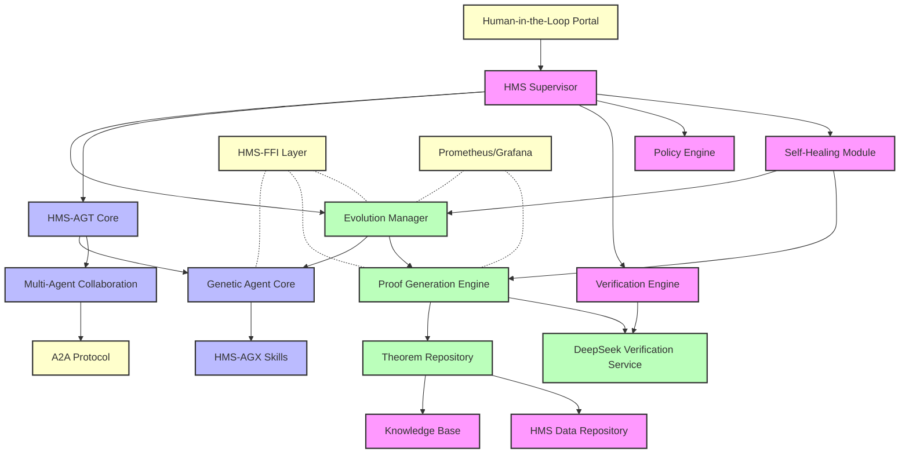
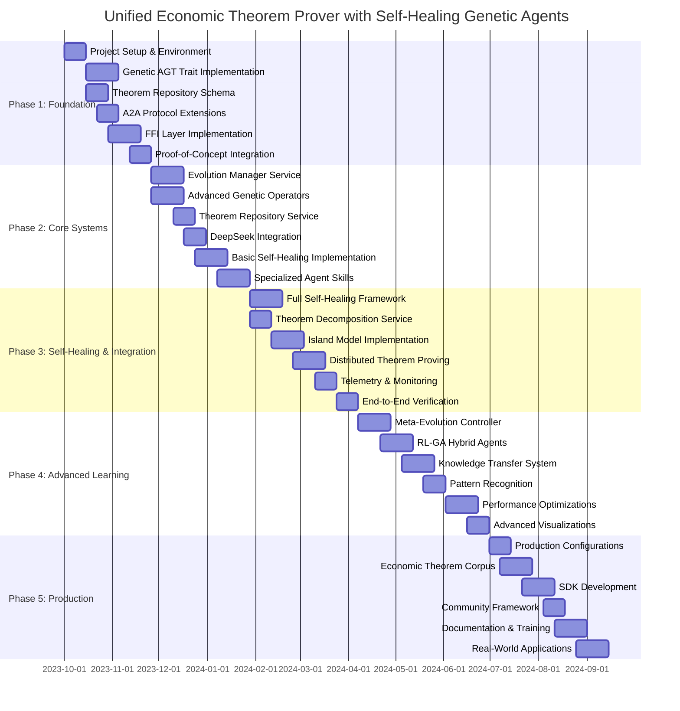
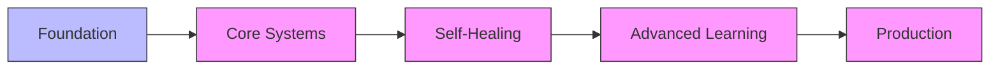

# Master Unified Plan: Economic Theorem Proving with Self-Healing Genetic Agents for HMS

## 1. Strategic Vision

### 1.1 Unified Mission Statement

To deliver a resilient, policy-compliant, and mathematically verifiable platform for economic theorem proving using genetic algorithms within the Health Monitoring System (HMS) architecture. This system will enable robust formal verification of economic theories, automatic recovery from failures, and continuous adaptation through genetic evolution - all governed by HMS's supervisor framework.

### 1.2 Key Performance Indicators (KPIs)

| Domain | Metric | Target | Measurement Method |
|--------|--------|--------|-------------------|
| **Resilience** | Automatic recovery rate | > 95% of failure modes | Self-healing success logs |
| | Mean Time to Recovery (MTTR) | < 3 minutes | Recovery time measurements |
| **Theorem Proving** | Success rate on complex theorems | > 80% | Benchmark results |
| | Proof elegance | 30% improvement over baseline | Elegance metrics |
| **Compliance** | Policy verification coverage | 100% | Verification records |
| | Formal verification success | > 95% | DeepSeek-Prover results |
| **Performance** | End-to-end proving time | 50% reduction | Benchmarking suite |
| | Resource efficiency | 30% improvement | System monitoring |
| **Scalability** | Concurrent theorem handling | > 500 theorems | Load testing |
| | Agent population size | Up to 10,000 | Kubernetes scaling tests |

### 1.3 Strategic Objectives

1. **Unified Architecture**: Create a seamless integration of Economic Theorem Proving with Genetic Agents (ETP-GA) into the HMS ecosystem
2. **Self-Healing Intelligence**: Implement advanced self-diagnosis and recovery mechanisms for theorem proving
3. **Evolutionary Optimization**: Leverage genetic algorithms to continuously improve proving strategies
4. **Formal Verification**: Ensure mathematical correctness through rigorous proof checking
5. **Compliant Governance**: Maintain policy compliance and human oversight through HMS's verification framework
6. **Scalable Performance**: Enable distributed, parallel theorem proving for large-scale economic models

## 2. Unified Architecture

### 2.1 High-Level Architecture Diagram



### 2.2 Core Components Unification

| Component | Source Systems | Unified Approach |
|-----------|----------------|------------------|
| **Supervisor** | HMS Supervisor + ETP-GA Population Manager | Extended HMS Supervisor with genetic evolution capabilities |
| **Agent Model** | HMS-AGT/AGX + Genetic Agents | HMS-AGT with genetic traits, theorem-proving skills as AGX modules |
| **Self-Healing** | HMS Self-Healing + GA Adaptation | Self-healing strategies specifically for theorem proving with genetic optimization |
| **Verification** | HMS Verification + DeepSeek-Prover | HMS Verification Engine extended with formal proof verification |
| **Knowledge Storage** | HMS Data/KB + Theorem Repository | Extended HMS data schema for theorem storage with specialized indices |
| **Communication** | HMS A2A + Direct Function Calls | A2A protocol extensions for theorem proving operations |
| **Metrics & Evaluation** | HMS Telemetry + ETP-GA Metrics | Unified metrics system with genetic algorithm-specific dashboards |

## 3. Genetic Self-Healing Framework

### 3.1 Self-Healing Capabilities

The unified system will implement advanced self-healing capabilities specifically designed for genetic-based theorem proving:

#### 3.1.1 Detection Mechanisms

- **Convergence Monitoring**: Detect stalled evolution or convergence plateaus
- **Resource Utilization**: Identify excessive resource consumption patterns
- **Verification Failures**: Track unsuccessful proof verification attempts
- **Genetic Diversity**: Monitor population diversity and prevent premature convergence
- **Timeout Detection**: Identify theorems taking excessive time to prove

#### 3.1.2 Diagnostic Capabilities

- **Root Cause Analysis**: Determine whether failures stem from genetic algorithm parameters, theorem complexity, resource constraints, or verification issues
- **Failure Categorization**: Classify failures into patterns for targeted remediation
- **Performance Profiling**: Identify bottlenecks in the proving process
- **Genetic Analysis**: Assess population health and genetic trait distributions

#### 3.1.3 Recovery Strategies

- **Genetic Intervention**: Modify mutation rates, introduce new genetic material, or reset portions of the population
- **Theorem Decomposition**: Break complex theorems into manageable sub-problems
- **Resource Reallocation**: Adjust computing resources based on theorem complexity
- **Strategy Switching**: Change proving strategies based on theorem characteristics
- **Checkpoint Restoration**: Return to last known good state when progress is lost

#### 3.1.4 Preventive Measures

- **Adaptive Parameters**: Continuously adjust genetic parameters based on performance
- **Diversity Preservation**: Enforce minimum diversity requirements in the population
- **Resource Forecasting**: Predict resource needs to prevent exhaustion
- **Pre-verification**: Validate intermediate proof steps to catch errors early

### 3.2 Genetic Evolution Framework

The genetic algorithm framework will be enhanced and tightly integrated with HMS's supervisory control:

#### 3.2.1 Enhanced Genetic Model

- **Hierarchical Genotypes**: Structured genetic traits organized by theorem aspects
- **Multi-objective Fitness**: Balance correctness, completeness, elegance, and efficiency
- **Adaptive Operators**: Context-aware mutation and crossover based on theorem domain
- **Meta-evolution**: Evolution of genetic parameters themselves
- **Specialized Gene Pools**: Maintain specialized sub-populations for different theorem types

#### 3.2.2 Evolution Control Mechanisms

- **Supervisor-managed Evolution**: HMS Supervisor controls evolution pace and direction
- **Policy-guided Selection**: Selection pressure aligned with system policies
- **Verification-validated Fitness**: Formal verification results influence fitness scores
- **Resource-aware Scheduling**: Evolution proceeds based on available resources
- **Human-guided Direction**: HITL interfaces allow expert guidance of evolution

## 4. Implementation Strategy

### 4.1 Phased Integration Approach

This unified plan adopts a phased approach that combines the timelines from both the ETP-GA optimization plan and the HMS integration plan:

#### Phase 1: Foundation (Weeks 1-6)
- **Objective**: Establish the core integration architecture and baseline genetic capabilities
- **Key Deliverables**:
  - Genetic agent trait specification integrated with HMS-AGT
  - Basic FFI interfaces for genetic operations
  - Theorem repository schema for HMS data store
  - A2A message specifications for theorem proving operations
  - Proof-of-concept end-to-end workflow

#### Phase 2: Core Systems & Genetic Enhancement (Weeks 7-14)
- **Objective**: Implement core ETP-GA capabilities within HMS and enhance genetic operations
- **Key Deliverables**:
  - Evolution Manager supervisor service
  - Advanced genetic operators (adaptive mutation, multi-point crossover)
  - Enhanced theorem repository with graph-based relationships
  - DeepSeek verification integration with HMS
  - Basic self-healing strategies for genetic operations
  - Initial specialized theorem-proving agent skills

#### Phase 3: Self-Healing & Integration (Weeks 15-22)
- **Objective**: Implement comprehensive self-healing and complete system integration
- **Key Deliverables**:
  - Full self-healing framework for theorem proving
  - Theorem decomposition service
  - Island model for parallel evolution
  - Distributed theorem proving pipeline
  - Comprehensive telemetry and monitoring
  - End-to-end verification of complex economic theorems

#### Phase 4: Advanced Learning & Optimization (Weeks 23-30)
- **Objective**: Enhance system with advanced learning capabilities and optimizations
- **Key Deliverables**:
  - Meta-evolution controller for genetic parameters
  - RL-GA hybrid agents
  - Knowledge transfer between theorem domains
  - Pattern recognition for proof strategies
  - Performance optimizations for large-scale operations
  - Advanced visualization of evolutionary processes

#### Phase 5: Production & Ecosystem (Weeks 31-36)
- **Objective**: Prepare system for production use and develop ecosystem
- **Key Deliverables**:
  - Production deployment configurations
  - Comprehensive economic theorem corpus
  - SDK for extending theorem proving capabilities
  - Community contribution framework
  - Comprehensive documentation and training
  - Real-world application demonstrations

### 4.2 Technical Implementation Details

#### 4.2.1 Genetic HMS-AGT Extension

```rust
// HMS-AGT extension for genetic theorem proving agents
pub struct GeneticTheoremAgent {
    // Base HMS-AGT traits
    base: BaseAgentTrait,
    
    // Genetic traits
    genotype: GeneticRepresentation,
    fitness_history: Vec<FitnessMeasurement>,
    mutation_params: MutationParameters,
    crossover_params: CrossoverParameters,
    
    // Theorem proving capabilities
    proving_strategy: TheoremProvingStrategy,
    theorem_context: Option<TheoremContext>,
    proof_history: VecDeque<ProofAttempt>,
    
    // Self-healing state
    health_metrics: AgentHealthMetrics,
    recovery_state: Option<RecoveryState>,
}

impl AgentTrait for GeneticTheoremAgent {
    // Standard HMS-AGT interface implementation
}

impl GeneticTrait for GeneticTheoremAgent {
    fn mutate(&mut self, rate_modifier: f32) -> Result<(), GeneticError>;
    fn crossover(&mut self, other: &dyn GeneticTrait) -> Result<Box<dyn GeneticTrait>, GeneticError>;
    fn calculate_fitness(&self, context: &FitnessContext) -> Result<f32, GeneticError>;
    fn get_genetic_diversity(&self, population: &[Box<dyn GeneticTrait>]) -> f32;
}

impl TheoremProvingTrait for GeneticTheoremAgent {
    fn prove_theorem(&mut self, theorem_id: &str) -> Result<ProofResult, ProvingError>;
    fn decompose_theorem(&self, theorem_id: &str) -> Result<Vec<SubTheorem>, ProvingError>;
    fn verify_proof(&self, proof: &ProofResult) -> Result<VerificationResult, VerificationError>;
}

impl SelfHealingTrait for GeneticTheoremAgent {
    fn diagnose(&self) -> AgentHealthStatus;
    fn recover(&mut self, strategy: RecoveryStrategy) -> Result<(), RecoveryError>;
    fn checkpoint(&self) -> Result<CheckpointId, CheckpointError>;
    fn restore(&mut self, checkpoint_id: CheckpointId) -> Result<(), RestoreError>;
}
```

#### 4.2.2 Evolution Manager Supervisor Service

```rust
// Evolution Manager Supervisor Service
pub struct EvolutionManagerSupervisor {
    // Base HMS Supervisor capabilities
    base: BaseSupervisorTrait,
    
    // Population management
    populations: HashMap<PopulationId, PopulationState>,
    evolution_params: EvolutionParameters,
    generation_history: VecDeque<GenerationStats>,
    
    // Theorem assignments
    theorem_assignments: HashMap<TheoremId, Vec<AgentId>>,
    theorem_progress: HashMap<TheoremId, TheoremProvingProgress>,
    
    // Self-healing capabilities
    population_health: HashMap<PopulationId, PopulationHealthMetrics>,
    healing_strategies: Vec<HealingStrategy>,
}

impl SupervisorTrait for EvolutionManagerSupervisor {
    // Standard HMS Supervisor interface implementation
}

impl EvolutionControlTrait for EvolutionManagerSupervisor {
    fn evolve_generation(&mut self, population_id: PopulationId) -> Result<GenerationStats, EvolutionError>;
    fn create_population(&mut self, config: PopulationConfig) -> Result<PopulationId, EvolutionError>;
    fn get_best_individual(&self, population_id: PopulationId) -> Result<AgentId, EvolutionError>;
    fn get_population_diversity(&self, population_id: PopulationId) -> Result<f32, EvolutionError>;
}

impl TheoremAssignmentTrait for EvolutionManagerSupervisor {
    fn assign_theorem(&mut self, theorem_id: TheoremId, strategy: AssignmentStrategy) -> Result<(), AssignmentError>;
    fn get_theorem_status(&self, theorem_id: TheoremId) -> Result<TheoremStatus, QueryError>;
    fn prioritize_theorems(&mut self, prioritization: TheoremPrioritization) -> Result<(), PrioritizationError>;
}

impl SelfHealingSupervisorTrait for EvolutionManagerSupervisor {
    fn monitor_population_health(&self, population_id: PopulationId) -> PopulationHealthStatus;
    fn apply_healing_strategy(&mut self, population_id: PopulationId, strategy: HealingStrategy) -> Result<HealingResult, HealingError>;
    fn optimize_parameters(&mut self, population_id: PopulationId) -> Result<ParameterChanges, OptimizationError>;
}
```

#### 4.2.3 A2A Protocol Extensions for Theorem Proving

```protobuf
// A2A Protocol extensions for genetic theorem proving
syntax = "proto3";

message GeneticTheoremTask {
    string task_id = 1;
    string theorem_id = 2;
    TheoremProvingStrategy strategy = 3;
    repeated string available_lemmas = 4;
    uint32 max_steps = 5;
    float timeout_seconds = 6;
    
    // Genetic parameters
    GeneticParameters genetic_params = 7;
    bool enable_self_healing = 8;
    SelfHealingConfig healing_config = 9;
}

message GeneticParameters {
    float mutation_rate = 1;
    float crossover_rate = 2;
    uint32 population_size = 3;
    uint32 max_generations = 4;
    SelectionMethod selection_method = 5;
    
    enum SelectionMethod {
        TOURNAMENT = 0;
        ROULETTE = 1;
        RANK = 2;
        ADAPTIVE = 3;
    }
}

message SelfHealingConfig {
    repeated HealingStrategy strategies = 1;
    uint32 check_frequency = 2;
    bool auto_parameter_tuning = 3;
    
    message HealingStrategy {
        string strategy_name = 1;
        map<string, string> parameters = 2;
        uint32 priority = 3;
    }
}

message GeneticTheoremResult {
    string task_id = 1;
    string theorem_id = 2;
    bool success = 3;
    ProvingStats stats = 4;
    repeated ProofStep steps = 5;
    string proof_id = 6;
    repeated HealingEvent healing_events = 7;
}

message ProvingStats {
    uint32 generations_elapsed = 1;
    float final_best_fitness = 2;
    float diversity_measure = 3;
    float time_elapsed_seconds = 4;
    uint32 total_evaluations = 5;
    uint32 theorem_decompositions = 6;
    repeated FitnessTimeSeries fitness_over_time = 7;
}

message FitnessTimeSeries {
    string metric_name = 1;
    repeated float values = 2;
    repeated uint64 timestamps = 3;
}

message HealingEvent {
    uint64 timestamp = 1;
    string issue_detected = 2;
    string strategy_applied = 3;
    bool success = 4;
    map<string, string> details = 5;
}
```

#### 4.2.4 Self-Healing Configuration

```yaml
# Self-healing configuration for genetic theorem proving
self_healing:
  # Failure detection
  detectors:
    genetic_stagnation:
      description: "Detects when genetic evolution stops making progress"
      enabled: true
      conditions:
        - metric: "population.best_fitness"
          window: "10 generations"
          pattern: "no_improvement"
          threshold: 0.01
      severity: high
    
    diversity_collapse:
      description: "Detects when genetic diversity falls below critical threshold"
      enabled: true
      conditions:
        - metric: "population.diversity"
          window: "1 generation"
          pattern: "below_threshold"
          threshold: 0.1
      severity: critical
    
    resource_exhaustion:
      description: "Detects excessive resource consumption"
      enabled: true
      conditions:
        - metric: "system.memory.usage"
          window: "5 minutes"
          pattern: "above_threshold"
          threshold: 0.9
        - metric: "system.cpu.usage"
          window: "5 minutes"
          pattern: "above_threshold"
          threshold: 0.9
      severity: high
    
    verification_failures:
      description: "Detects repeated formal verification failures"
      enabled: true
      conditions:
        - metric: "verification.consecutive_failures"
          window: "proof_attempt"
          pattern: "above_threshold"
          threshold: 3
      severity: medium
  
  # Recovery strategies
  strategies:
    genetic_reset:
      description: "Resets part of the population with fresh genetic material"
      triggers: ["genetic_stagnation", "diversity_collapse"]
      actions:
        - type: "reset_population"
          parameters:
            percentage: 0.3
            preserve_best: 5
            initialization_strategy: "random_diverse"
    
    diversity_boost:
      description: "Increases mutation rate temporarily to boost diversity"
      triggers: ["diversity_collapse"]
      actions:
        - type: "adjust_parameters"
          parameters:
            mutation_rate: "multiply_by_3"
            duration_generations: 5
    
    theorem_decomposition:
      description: "Breaks the theorem into simpler components"
      triggers: ["genetic_stagnation", "resource_exhaustion"]
      actions:
        - type: "decompose_theorem"
          parameters:
            max_components: 5
            strategy: "complexity_based"
    
    verification_strategy_switch:
      description: "Changes verification approach after repeated failures"
      triggers: ["verification_failures"]
      actions:
        - type: "change_verification_strategy"
          parameters:
            new_strategy: "incremental"
            timeout_multiplier: 1.5
    
    parameter_optimization:
      description: "Performs meta-optimization of genetic parameters"
      triggers: ["genetic_stagnation"]
      actions:
        - type: "optimize_parameters"
          parameters:
            method: "bayesian"
            max_trials: 10
            objective: "best_fitness"
  
  # Meta-healing (healing the healing system)
  meta_healing:
    strategy_effectiveness:
      description: "Monitors and adjusts healing strategies based on success rate"
      enabled: true
      review_window: "50 healing_events"
      min_effectiveness: 0.6
      actions:
        - type: "adjust_strategy_priority"
        - type: "disable_ineffective_strategies"
```

## 5. Detailed Roadmap

### 5.1 Work Breakdown Structure



### 5.2 Key Milestones and Deliverables

| Milestone | Date | Key Deliverables | Success Criteria |
|-----------|------|------------------|------------------|
| **M1: Foundation Complete** | 2023-11-25 | - Genetic AGT trait specification<br>- Basic HMS integration<br>- Proof-of-concept workflow | - Basic theorem proving through HMS<br>- Integration tests passing |
| **M2: Core Systems Built** | 2024-01-26 | - Evolution Manager<br>- Advanced genetic operators<br>- Theorem Repository<br>- Basic Self-Healing | - Genetic evolution under HMS control<br>- Simple theorems proved automatically |
| **M3: Self-Healing Framework** | 2024-04-06 | - Full self-healing system<br>- Distributed proving<br>- Comprehensive monitoring | - Auto-recovery from all defined failure modes<br>- Proving complex theorems reliably |
| **M4: Advanced Learning** | 2024-06-29 | - Meta-evolution<br>- RL-GA hybrid agents<br>- Pattern recognition | - Self-optimizing parameters<br>- Learning from past proofs<br>- 50% performance improvement |
| **M5: Production Ready** | 2024-09-15 | - Production configurations<br>- Economic theorem corpus<br>- Documentation & SDK | - Full HMS compliance<br>- Production deployment success<br>- Real-world use cases demonstrated |

### 5.3 Team Structure and Responsibilities

```mermaid
graph TD
    PL[Project Lead]
    
    ARC[Architecture Team]
    GEN[Genetic Algorithm Team]
    HMS[HMS Integration Team]
    SH[Self-Healing Team]
    ECON[Economic Domain Team]
    DEV[Development & Ops Team]
    
    PL --> ARC
    PL --> GEN
    PL --> HMS
    PL --> SH
    PL --> ECON
    PL --> DEV
    
    ARC --- GenArch[Genetic-HMS Architecture]
    ARC --- SelfArch[Self-Healing Architecture]
    ARC --- IntArch[Integration Patterns]
    
    GEN --- GeneOps[Genetic Operators]
    GEN --- Fitness[Fitness Functions]
    GEN --- EvolCtrl[Evolution Control]
    
    HMS --- SupInt[Supervisor Integration]
    HMS --- AGTExt[AGT Extensions]
    HMS --- A2AExt[A2A Extensions]
    
    SH --- Detect[Detection Mechanisms]
    SH --- Diag[Diagnostics]
    SH --- Recover[Recovery Strategies]
    
    ECON --- TheoremLib[Theorem Library]
    ECON --- Formal[Formalization]
    ECON --- Verification[Verification Experts]
    
    DEV --- DevOps[DevOps Pipeline]
    DEV --- Testing[Testing Framework]
    DEV --- Deploy[Deployment]
```



## 6. Technical Implementation Plan

### 6.1 Development Environment

To ensure consistent development across teams, a unified development environment will be established:

```yaml
# dev-environment.yaml
name: etp-genetic-hms
dependencies:
  - rust=1.70
  - python=3.10
  - lean=4.3
  - protobuf=3.20
  - kubernetes=1.26
  - pytorch=2.0
  - tensorflow=2.12
  - prometheus=2.43
  - grafana=9.5
  - docker=23.0
  - nix=2.15
development_tools:
  - rust-analyzer
  - pylint
  - mypy
  - lean-vscode
  - k9s
infrastructure:
  - kind
  - docker-compose
  - terraform
testing_frameworks:
  - pytest
  - cargo-test
  - k6
  - locust
```

### 6.2 Continuous Integration Pipeline

```yaml
# ci-pipeline.yaml
stages:
  - setup
  - build
  - unit_test
  - integration_test
  - system_test
  - performance_test
  - security_scan
  - deploy

setup:
  script:
    - setup_dev_environment
    - check_dependencies
    - initialize_test_db

build:
  artifacts:
    - hms_supervisor_bin
    - genetic_agt_lib
    - evolution_manager_service
    - theorem_repository_service
    - verification_integration
    - self_healing_framework
  script:
    - compile_rust_components
    - build_python_modules
    - generate_protobuf_bindings
    - package_components

unit_test:
  script:
    - run_rust_unit_tests
    - run_python_unit_tests
    - validate_a2a_messages
    - check_code_coverage

integration_test:
  environment: staging
  script:
    - start_integration_environment
    - deploy_minimal_components
    - run_integration_test_suite
    - verify_component_interactions

system_test:
  environment: staging
  script:
    - deploy_full_system
    - run_theorem_proving_workflow
    - inject_failures
    - verify_self_healing
    - check_verification_pipeline

performance_test:
  environment: perf
  script:
    - deploy_performance_config
    - run_benchmark_suite
    - capture_performance_metrics
    - compare_against_baseline
    - generate_performance_report

security_scan:
  script:
    - run_dependency_check
    - scan_container_images
    - verify_secrets_management
    - analyze_attack_surface

deploy:
  environment: production
  when: manual
  script:
    - validate_deployment_config
    - deploy_to_kubernetes
    - run_smoke_tests
    - monitor_deployment_health
```

### 6.3 Data Models and Schemas

#### 6.3.1 Theorem Repository Schema

```sql
-- SQL schema for Theorem Repository
CREATE TABLE theorems (
    id VARCHAR(64) PRIMARY KEY,
    statement TEXT NOT NULL,
    area VARCHAR(128) NOT NULL,
    complexity FLOAT NOT NULL,
    formal_representation TEXT,
    created_at TIMESTAMP NOT NULL,
    updated_at TIMESTAMP NOT NULL,
    status VARCHAR(32) NOT NULL,
    INDEX idx_area (area),
    INDEX idx_complexity (complexity),
    INDEX idx_status (status)
);

CREATE TABLE theorem_dependencies (
    theorem_id VARCHAR(64) NOT NULL,
    dependency_id VARCHAR(64) NOT NULL,
    relationship_type VARCHAR(32) NOT NULL,
    strength FLOAT NOT NULL,
    PRIMARY KEY (theorem_id, dependency_id),
    FOREIGN KEY (theorem_id) REFERENCES theorems(id),
    FOREIGN KEY (dependency_id) REFERENCES theorems(id),
    INDEX idx_relationship (relationship_type)
);

CREATE TABLE proofs (
    id VARCHAR(64) PRIMARY KEY,
    theorem_id VARCHAR(64) NOT NULL,
    agent_id VARCHAR(64) NOT NULL,
    generation_number INT NOT NULL,
    success BOOLEAN NOT NULL,
    verification_status VARCHAR(32) NOT NULL,
    elegance_score FLOAT,
    correctness_score FLOAT,
    completeness_score FLOAT,
    created_at TIMESTAMP NOT NULL,
    proof_data JSON,
    FOREIGN KEY (theorem_id) REFERENCES theorems(id),
    INDEX idx_theorem_agent (theorem_id, agent_id),
    INDEX idx_success (success),
    INDEX idx_verification (verification_status)
);

CREATE TABLE proof_steps (
    id VARCHAR(64) PRIMARY KEY,
    proof_id VARCHAR(64) NOT NULL,
    step_number INT NOT NULL,
    tactic VARCHAR(128) NOT NULL,
    goal_state_before TEXT NOT NULL,
    goal_state_after TEXT NOT NULL,
    verification_status VARCHAR(32) NOT NULL,
    FOREIGN KEY (proof_id) REFERENCES proofs(id),
    INDEX idx_proof_step (proof_id, step_number)
);

CREATE TABLE genetic_populations (
    id VARCHAR(64) PRIMARY KEY,
    name VARCHAR(128) NOT NULL,
    theorem_id VARCHAR(64),
    size INT NOT NULL,
    current_generation INT NOT NULL,
    best_fitness FLOAT NOT NULL,
    average_fitness FLOAT NOT NULL,
    diversity FLOAT NOT NULL,
    created_at TIMESTAMP NOT NULL,
    updated_at TIMESTAMP NOT NULL,
    status VARCHAR(32) NOT NULL,
    FOREIGN KEY (theorem_id) REFERENCES theorems(id),
    INDEX idx_theorem (theorem_id),
    INDEX idx_status (status)
);

CREATE TABLE genetic_agents (
    id VARCHAR(64) PRIMARY KEY,
    population_id VARCHAR(64) NOT NULL,
    generation_created INT NOT NULL,
    fitness FLOAT NOT NULL,
    genotype JSON NOT NULL,
    specialization VARCHAR(64),
    success_rate FLOAT NOT NULL,
    created_at TIMESTAMP NOT NULL,
    updated_at TIMESTAMP NOT NULL,
    FOREIGN KEY (population_id) REFERENCES genetic_populations(id),
    INDEX idx_population_fitness (population_id, fitness),
    INDEX idx_specialization (specialization)
);

CREATE TABLE self_healing_events (
    id VARCHAR(64) PRIMARY KEY,
    timestamp TIMESTAMP NOT NULL,
    detector VARCHAR(64) NOT NULL,
    issue_detected VARCHAR(128) NOT NULL,
    strategy_applied VARCHAR(64) NOT NULL,
    success BOOLEAN NOT NULL,
    details JSON,
    population_id VARCHAR(64),
    theorem_id VARCHAR(64),
    FOREIGN KEY (population_id) REFERENCES genetic_populations(id),
    FOREIGN KEY (theorem_id) REFERENCES theorems(id),
    INDEX idx_timestamp (timestamp),
    INDEX idx_detector (detector),
    INDEX idx_strategy (strategy_applied),
    INDEX idx_success (success)
);
```

#### 6.3.2 Genetic Agent State Schema

```json
// Genetic Agent State Schema
{
  "agent_id": "ga-12345",
  "agent_type": "genetic_theorem_agent",
  "hms_agt_state": {
    "status": "active",
    "created_at": "2023-10-15T14:30:00Z",
    "last_active": "2023-10-15T16:45:32Z",
    "memory_usage_mb": 128,
    "cpu_usage_percent": 15.3
  },
  "genetic_state": {
    "genotype": {
      "proving_strategy": {
        "decomposition_depth": 3,
        "tactic_weights": {
          "apply": 0.45,
          "rewrite": 0.35,
          "intro": 0.15,
          "exact": 0.05
        },
        "search_parameters": {
          "beam_width": 5,
          "max_depth": 10,
          "use_heuristic": true
        }
      },
      "verification_strategy": {
        "verify_frequency": 0.2,
        "confidence_threshold": 0.75,
        "use_incremental": true
      },
      "resource_management": {
        "time_allocation": {
          "exploration": 0.4,
          "exploitation": 0.6
        },
        "memory_policy": "conservative"
      }
    },
    "fitness": {
      "current": 0.78,
      "history": [0.45, 0.52, 0.65, 0.72, 0.78],
      "components": {
        "correctness": 0.95,
        "completeness": 0.85,
        "elegance": 0.65,
        "efficiency": 0.70
      }
    },
    "mutation_rate": 0.15,
    "crossover_parameters": {
      "rate": 0.7,
      "points": 2,
      "strategy": "homologous"
    },
    "generation": 15,
    "ancestry": ["ga-10012", "ga-10156"]
  },
  "theorem_proving_state": {
    "current_theorem": "economic_welfare_theorem_2",
    "proof_attempts": 7,
    "successful_proofs": 4,
    "current_proof_state": {
      "steps_completed": 8,
      "current_goal": "∀ x ∈ X, ∃ y ∈ Y, P(x, y) → Q(x, y)",
      "remaining_subgoals": 2,
      "verification_status": "partial"
    },
    "theorem_specialization": {
      "microeconomics": 0.85,
      "welfare_economics": 0.92,
      "game_theory": 0.41
    }
  },
  "self_healing_state": {
    "health_status": "normal",
    "recent_issues": [
      {
        "timestamp": "2023-10-15T16:30:22Z",
        "issue": "proof_stagnation",
        "resolution": "mutation_boost",
        "success": true
      }
    ],
    "recovery_attempts": 2,
    "adaptation_history": [
      {
        "timestamp": "2023-10-15T15:45:10Z",
        "parameter": "mutation_rate",
        "old_value": 0.1,
        "new_value": 0.15,
        "reason": "diversity_maintenance"
      }
    ]
  }
}
```

## 7. Risk Management

| Risk Category | Risk | Probability | Impact | Mitigation Strategy |
|---------------|------|------------|--------|---------------------|
| **Technical** | Complexity of integrating genetic algorithms with HMS | High | High | Develop clean interfaces with progressive integration; extensive mocking for early testing |
| | Performance degradation from language interoperability | Medium | High | Benchmark early; identify hot paths for optimization; minimize cross-language calls |
| | Self-healing false positives | Medium | Medium | Progressive rollout with human verification; telemetry-based tuning |
| **Resource** | Computational demands exceeding capacity | High | Medium | Cloud auto-scaling; resource-aware scheduling; prioritization framework |
| | Knowledge gap between teams | High | Medium | Cross-training program; embedded experts; comprehensive documentation |
| **Timeline** | Integration complexity exceeding estimates | High | High | Buffer periods; prioritized delivery; modular approach with clear milestones |
| | Theoretical challenges in economic formalization | Medium | High | Early proof-of-concept with domain experts; staged complexity approach |
| **Compliance** | Verification failures in formal proofs | Medium | High | Multiple verification backends; incremental verification approach; human expert review |
| | HMS policy compliance issues | Low | High | Early integration with verification pipeline; policy testing framework |
| **Strategic** | Shifting requirements from stakeholders | Medium | Medium | Regular review cycles; modular design for adaptability; change management process |
| | Scope creep in theorem domains | High | Medium | Clear boundary definitions; staged expansion approach; priority framework |

## 8. Governance Model

### 8.1 Decision Framework

A tiered governance model will be implemented to oversee the unified system:

1. **Strategic Oversight Board**
   - Composition: Project Lead, HMS Architect, Genetic Algorithm Lead, Economic Domain Expert, Self-Healing Specialist
   - Responsibilities: Strategic direction, major architectural decisions, resource allocation, milestone approvals
   - Meeting Frequency: Bi-weekly

2. **Technical Steering Committee**
   - Composition: Team leads from each functional area, rotating engineer representatives
   - Responsibilities: Technical approach decisions, standards enforcement, cross-team coordination
   - Meeting Frequency: Weekly

3. **Integration Working Group**
   - Composition: Representatives from HMS, Genetic, and Self-Healing teams
   - Responsibilities: Interface specifications, integration patterns, cross-component testing
   - Meeting Frequency: Daily standups, weekly deep-dives

### 8.2 Progress Tracking



### 8.3 Quality Gates

Each phase must pass these quality gates before proceeding:

1. **Architecture Review**
   - Documentation completeness
   - Alignment with HMS principles
   - Interface specifications
   - Security and compliance review

2. **Implementation Quality**
   - Code review completion
   - Test coverage (>90%)
   - Performance benchmark results
   - Security scan clearance

3. **Integration Validation**
   - End-to-end workflow testing
   - Failure injection and recovery
   - Cross-component compatibility
   - Verification pipeline success

4. **Operational Readiness**
   - Deployment automation
   - Monitoring and alerting
   - Resource scaling tests
   - Documentation and training

## 9. Knowledge Transfer and Documentation

### 9.1 Documentation Plan

| Documentation Type | Target Audience | Key Contents | Delivery Timeline |
|-------------------|-----------------|--------------|-------------------|
| **Architecture Guide** | Engineers, Architects | System design, component interactions, design patterns, evolution decisions | Phase 1, updated each phase |
| **API Reference** | Developers | Detailed interface specifications, message formats, error handling | Phase 2, updated continuously |
| **Developer Guide** | Implementers | How-to guides, best practices, troubleshooting, examples | Phase 2, expanded each phase |
| **Operations Manual** | DevOps, SRE | Deployment, monitoring, scaling, alerts, disaster recovery | Phase 3, finalized in Phase 5 |
| **Economic Theorem Library** | Domain Experts | Catalogue of theorems, formalization guide, proof strategies | Begins Phase 2, complete in Phase 5 |
| **Training Materials** | New Team Members | Tutorials, workshops, exercises, concept explanations | Phase 3, expanded in Phase 5 |
| **User Guide** | End Users | System capabilities, workflow examples, configuration options | Phase 4, finalized in Phase 5 |

### 9.2 Knowledge Sharing Mechanisms

- **Technical Workshops**: Bi-weekly deep-dive sessions on specific components
- **Office Hours**: Weekly open sessions for cross-team questions and consulting
- **Documentation Sprints**: Dedicated time for comprehensive documentation updates
- **Recorded Demos**: Video demonstrations of key workflows and features
- **Shared Knowledge Base**: Confluence or similar for searchable documentation
- **Code Walkthroughs**: Annotated repository tours for new team members

## 10. Conclusion

This master unified plan provides a comprehensive roadmap for integrating the Economic Theorem Proving system with Self-Healing Genetic Agents into the HMS architecture. By combining the strengths of all three approaches, we will create a powerful, resilient, and mathematically rigorous system capable of proving complex economic theorems while automatically recovering from failures.

The plan addresses all aspects of this ambitious integration:
- A unified architecture that preserves the strengths of each system
- Enhanced genetic algorithms with HMS's supervisory control
- Advanced self-healing capabilities specifically for theorem proving
- A comprehensive implementation roadmap with clear milestones
- Detailed technical specifications for key components
- Thorough risk management and governance frameworks
- Knowledge transfer and documentation strategies

By following this plan, we will deliver a system that serves as a powerful demonstration of HMS's capabilities while advancing the state of the art in automated theorem proving through genetic algorithms and self-healing mechanisms. The resulting platform will provide a foundation for future advancements in formal verification of economic theories and models.