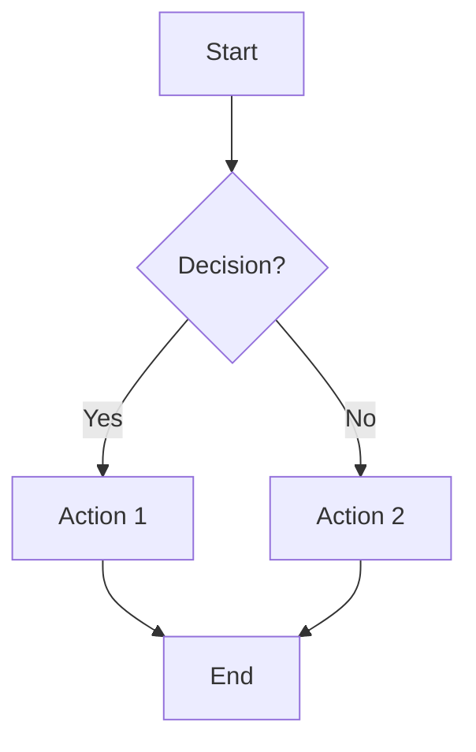
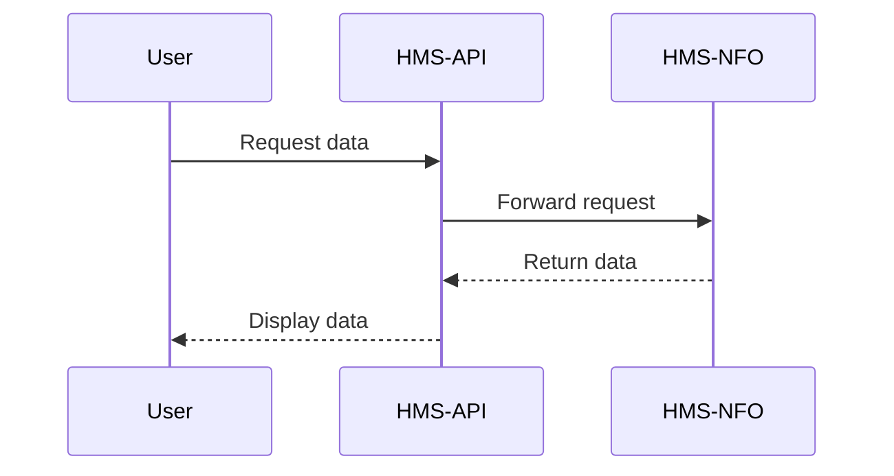
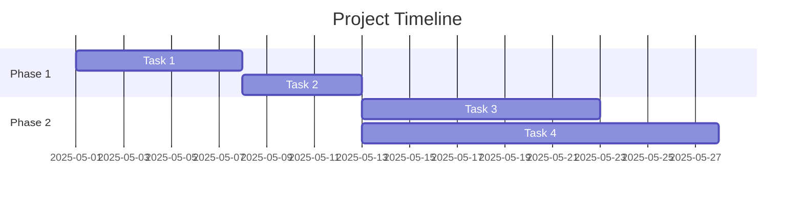
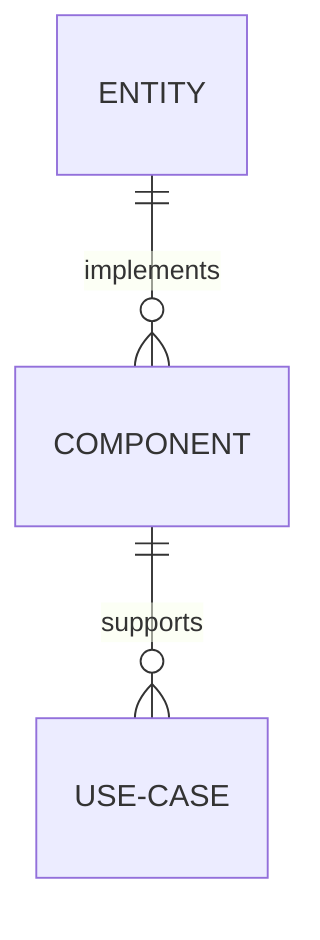
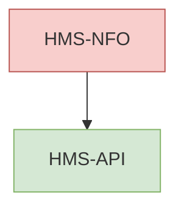
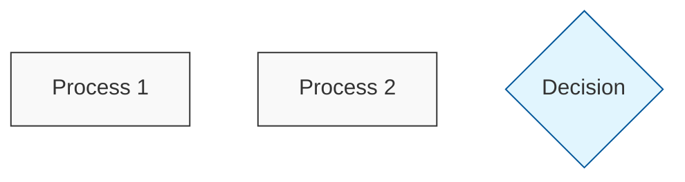
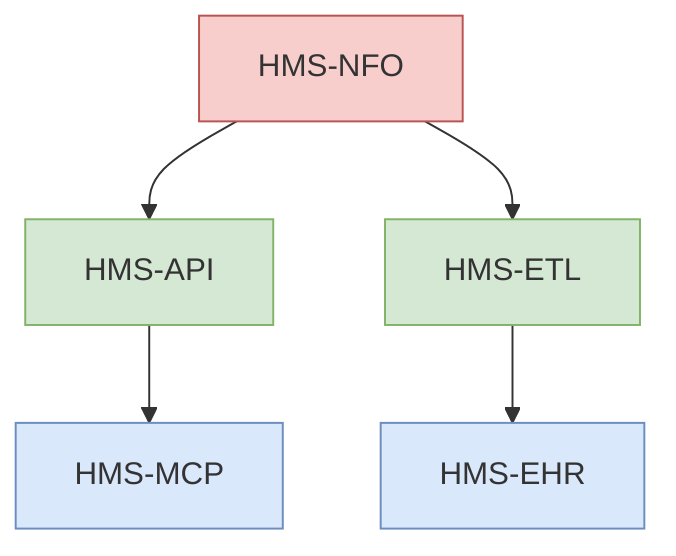
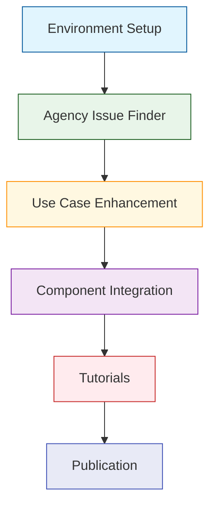
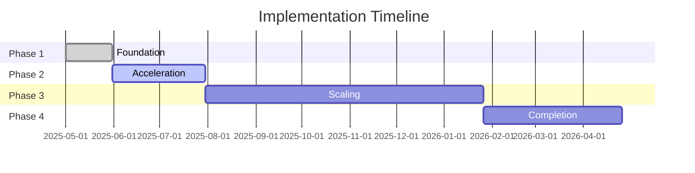
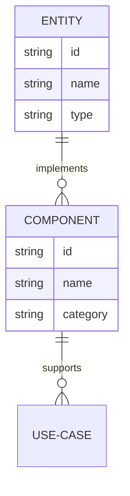

# Mermaid Diagram Implementation Guide for HMS Documentation

## Overview

This guide explains how to correctly implement Mermaid diagrams within HMS documentation. Mermaid is a JavaScript-based diagramming and charting tool that renders Markdown-inspired text definitions to create diagrams dynamically.

## Supported Diagram Types

The HMS documentation system supports the following Mermaid diagram types:

1. **Flowcharts** - For process flows and algorithms
2. **Sequence Diagrams** - For interaction sequences
3. **Gantt Charts** - For project timelines
4. **Entity Relationship Diagrams** - For data models
5. **Class Diagrams** - For component relationships
6. **State Diagrams** - For state transitions

## Diagram Implementation

### Basic Syntax

To include a Mermaid diagram in any Markdown document, use the following format:

```markdown
```mermaid
<diagram-type>
    <diagram-definition>
```
```

### Flowchart Example

```markdown

```

Renders as:


### Sequence Diagram Example

```markdown

```

Renders as:


### Gantt Chart Example

```markdown

```

Renders as:


### Entity Relationship Diagram Example

```markdown

```

Renders as:


## Styling Guidelines

### Colors

Use the HMS standard color palette for consistent styling:

```markdown

```

### Node Shapes

Use appropriate node shapes to represent different elements:

- Rectangles `[Text]` for processes
- Rounded rectangles `(Text)` for states
- Diamonds `{Text}` for decisions
- Circles `((Text))` for events

### Class Definitions

For larger diagrams, use class definitions to apply styles consistently:

```markdown

```

## Common Diagram Types for HMS Documentation

### Component Integration Diagram

Use flowcharts to show how HMS components integrate:



### Documentation Pipeline Diagram

Use flowcharts to illustrate the documentation pipeline:



### Implementation Timeline

Use Gantt charts to visualize implementation timelines:



### Data Model Relationships

Use entity-relationship diagrams to show data models:



## Best Practices

1. **Keep diagrams simple** - Focus on clarity over complexity
2. **Use consistent styling** - Follow HMS color and style guidelines
3. **Add meaningful labels** - Label all connections and relationships
4. **Test diagrams locally** - Verify rendering before committing
5. **Update diagrams when changes occur** - Keep diagrams in sync with text
6. **Use appropriate diagram types** - Choose the right type for your content
7. **Include diagrams in high-level sections** - Use diagrams for overviews

## Troubleshooting

### Common Issues

1. **Diagram not rendering**
   - Check for syntax errors in the Mermaid code
   - Ensure proper markdown format with triple backticks
   - Verify that there's no extra whitespace at the start of lines

2. **Formatting issues**
   - Use single spaces for indentation in Mermaid code
   - Make sure quotes are properly escaped
   - Avoid special characters in node labels

3. **Complex diagrams not displaying correctly**
   - Break into smaller, focused diagrams
   - Simplify the structure
   - Reduce the number of nodes and connections

## References

- [Mermaid Documentation](https://mermaid-js.github.io/mermaid/#/)
- [HMS Style Guide](/Users/arionhardison/Desktop/CodifyHQ/HMS-DOC/CLAUDE.md)
- [Example Diagrams](/Users/arionhardison/Desktop/CodifyHQ/HMS-DOC/comprehensive_documentation_progress_tracker.md)