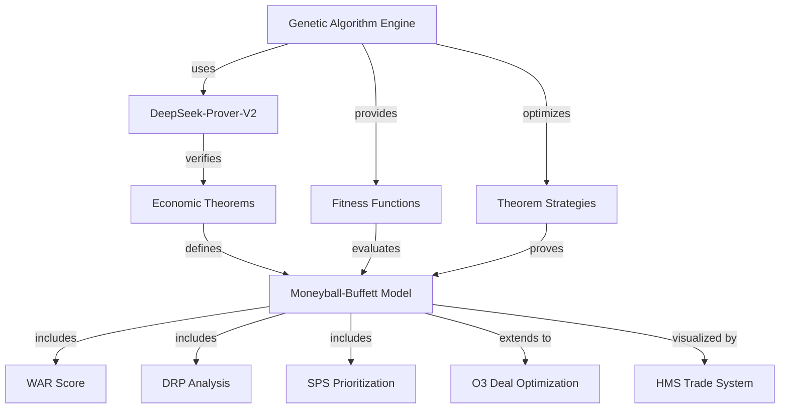
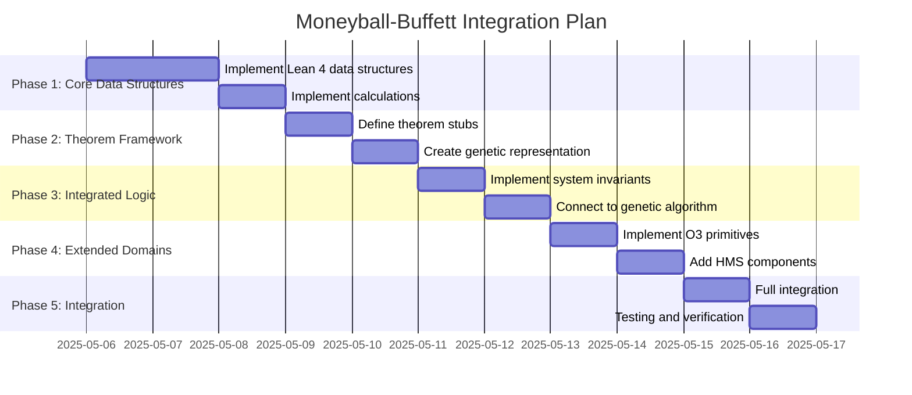

# Moneyball-Buffett Formal Specifications Integration Plan

This document outlines the integration of the Moneyball-Buffett Economic Model Formal Specifications with our existing Genetic Algorithm Engine and DeepSeek-Prover-V2 integration.

## 1. Architecture Overview

### Components

1. **Genetic Algorithm Engine**
   - Core genetics framework for optimizing proof strategies
   - Representation of theorem domains (trade analysis, deficit analysis)
   - Fitness functions for economic theorem verification

2. **DeepSeek-Prover-V2 Integration**
   - Direct interface with the DeepSeek-Prover-V2 system
   - Parsing and processing of proof results
   - Generation of proof strategies

3. **Economic Model Specifications**
   - Lean 4 data structures for WAR, DRP, and SPS calculations
   - Formal specifications of economic theorems
   - Integrated domain logic and invariants

4. **O3 Deal Optimization**
   - Hypergraph representation of deals and entities
   - Monte Carlo simulation for roadmap risk assessment
   - Performance optimizations for large-scale analysis

5. **HMS Trade System Integration**
   - Alternative scoring mechanisms (WAR-HMS)
   - Multi-year deficit projections
   - Dashboard data structures

### Integration Strategy



## 2. Implementation Phases

### Phase 1: Core Data Structures (Days 1-2)

1. Implement the core Lean 4 data structures:
   - `TradeAnalysisInput`, `DeficitAnalysisInput`, `SectorPrioritizationInput`
   - Implement `lookupD` helper for finmap-style operations
   - Define core calculation functions: `warScore`, `drp`, `sps`

2. Add constraints and validation:
   - Define predicates like `sumWeightsEqOne`, `bounded`, `nonneg`
   - Add struct fields to hold constraint information

### Phase 2: Theorem Framework (Days 3-4)

1. Define theorem stubs:
   - `warScore_bounds`, `drp_conservative`, `sps_bounds`
   - Outline proof sketches following JSON "proof_outline"

2. Create genetic representation:
   - Define chromosome encoding for proof strategies
   - Implement tactic genes specialized for economic theorems
   - Create proof strategy generation functions

### Phase 3: Integrated Domain Logic (Days 5-6)

1. Implement integrated system invariants:
   - Define multi-domain rules as composite Props
   - Create combined constraints across domains

2. Connect to genetic algorithm engine:
   - Implement specialized fitness functions for economic theorems
   - Create mutation operators optimized for Moneyball theorem spaces

### Phase 4: Extended Domains (Days 7-8)

1. Implement O3 Deal Optimization primitives:
   - Create `DealHypergraph` and optimization structs
   - Implement `o3_optimize_deals` and Monte Carlo simulation
   - Add caching and performance optimizations

2. Add HMS Trade System components:
   - Implement `HMSDashboardInput` and related structures
   - Add alternative calculation methods (`war_score_hms`)
   - Create projection utilities (`project_deficit_impact_hms`)

### Phase 5: Integration and Testing (Days 9-10)

1. Combine all components:
   - Integrate with DeepSeek-Prover-V2 pipeline
   - Set up genetic algorithm execution for theorem proving
   - Create supervisor interface for economic theorem verification

2. Testing and verification:
   - Create test cases based on JSON examples
   - Validate theorem validation with DeepSeek-Prover-V2
   - Benchmark performance optimizations

## 3. Technical Details

### Genetic Representations for Economic Theorems

```
┌─────────────────────────────────────────────────────────┐
│                   TacticChromosome                      │
├─────────┬─────────┬─────────┬─────────┬─────────┬───────┤
│ TacticA │ TacticB │ TacticC │ TacticD │ TacticE │ ...   │
└─────────┴─────────┴─────────┴─────────┴─────────┴───────┘
```

Economic theorems require specific tactics:
- Real number arithmetic tactics for bounded values
- Summation tactics for WAR, DRP calculations
- Inequality reasoning for bounds proofs

### DeepSeek-Prover-V2 Integration for Economics

The DeepSeek-Prover-V2 integration will need to handle:
- Lean 4 economic definitions
- Finset/Finmap summation lemmas
- Inequality and bounded value reasoning

### O3 Optimization Performance Enhancements

Our genetic algorithm engine will leverage:
- Advanced caching described in O3 documentation
- Parallel processing for fitness evaluation
- Accelerated Monte Carlo simulations

## 4. Timeline and Milestones



## 5. Next Steps

1. Create the core data structures in Lean 4
2. Set up genetic algorithm representation for economic theorems
3. Implement theorem proving mechanisms
4. Integrate with DeepSeek-Prover-V2 for verification
5. Develop O3 optimization primitives

## 6. Evaluation Metrics

- **Theorem Verification**: Success rate of formal proofs
- **Genetic Optimization**: Convergence speed for economic theorem proofs
- **Performance**: Runtime for large-scale economic analysis
- **Memory Efficiency**: Memory usage for O3 deal optimization
- **Integration Quality**: Smooth interaction between genetic algorithms and economic models

## 7. Open Questions

- Should we prioritize full theorem proofs or focus on executable verification?
- How much of the O3 optimization framework should be implemented in the first iteration?
- Should we include additional HMS visualization components in the integration?