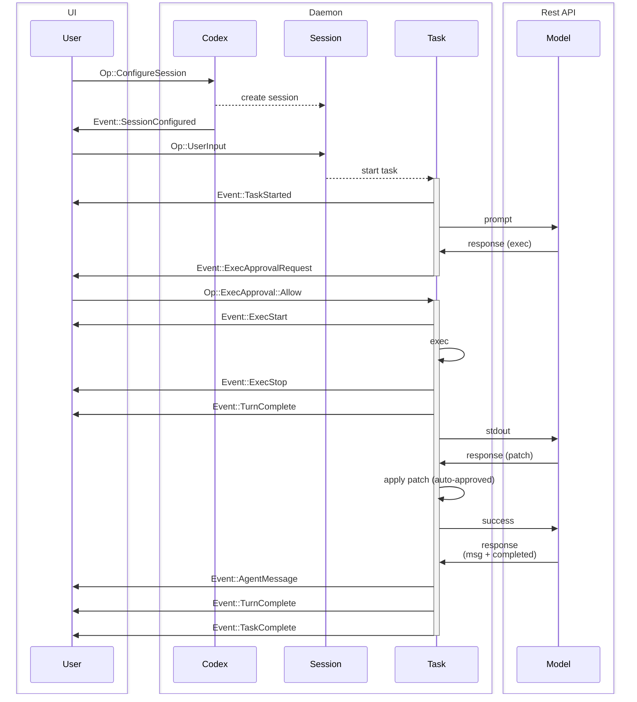
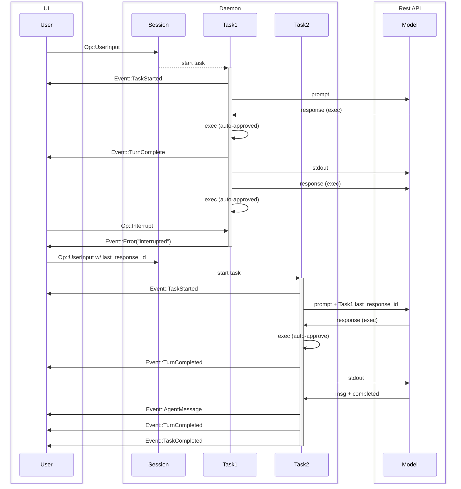

# Agent Protocol v1 (multi-dimensional-agent edition)

**Update History**
| Date       | Author        | Description                                       |
|------------|---------------|---------------------------------------------------|
| 2024-06-XX | Updates Team  | Migrated to multi-dimensional agent architecture; added classification, verification, CoRT, lifecycle, registry, demo scaffolding. |

Overview of Protocol Defined in [protocol.rs](../core/src/protocol.rs) and [agent.rs](../core/src/agent.rs).

The goal of this document is to define terminology used in the system and explain the expected behavior of the system.

NOTE: The code might not completely match this spec. There are a few minor changes that need to be made after this spec has been reviewed, which will not alter the existing TUI's functionality.

## Entities

These are entities exit on the codex backend. The intent of this section is to establish vocabulary and construct a shared mental model for the `Codex` core system.

0. `Model`
   - In our case, this is the Responses REST API
1. `Codex`
   - The core engine of codex
   - Runs locally, either in a background thread or separate process
   - Communicated to via a queue pair – SQ (Submission Queue) / EQ (Event Queue)
   - Takes user input, makes requests to the `Model`, executes commands and applies patches.
2. `Session`
   - The `Codex`'s current configuration and state
   - `Codex` starts with no `Session`, and it is initialized by `Op::ConfigureSession`, which should be the first message sent by the UI.
   - The current `Session` can be reconfigured with additional `Op::ConfigureSession` calls.
   - Any running execution is aborted when the session is reconfigured.
3. `Task`
   - A `Task` is `Codex` executing work in response to user input.
   - `Session` has at most one `Task` running at a time.
   - Receiving `Op::UserInput` starts a `Task`
   - Consists of a series of `Turn`s
   - The `Task` executes to until:
     - The `Model` completes the task and there is no output to feed into an additional `Turn`
     - Additional `Op::UserInput` aborts the current task and starts a new one
     - UI interrupts with `Op::Interrupt`
     - Fatal errors are encountered, eg. `Model` connection exceeding retry limits
     - Blocked by user approval (executing a command or patch)
4. `Turn`
   - One cycle of iteration in a `Task`, consists of:
     - A request to the `Model` - (initially) prompt + (optional) `last_response_id`, or (in loop) previous turn output
     - The `Model` streams responses back in an SSE, which are collected until "completed" message and the SSE terminates
     - `Codex` then executes command(s), applies patch(es), and outputs message(s) returned by the `Model`
     - Pauses to request approval when necessary
   - The output of one `Turn` is the input to the next `Turn`
   - A `Turn` yielding no output terminates the `Task`

The term "UI" is used to refer to the application driving `Codex`. This may be the CLI / TUI chat-like interface that users operate, or it may be a GUI interface like a VSCode extension. The UI is external to `Codex`, as `Codex` is intended to be operated by arbitrary UI implementations.

When a `Turn` completes, the `response_id` from the `Model`'s final `response.completed` message is stored in the `Session` state to resume the thread given the next `Op::UserInput`. The `response_id` is also returned in the `EventMsg::TurnComplete` to the UI, which can be used to fork the thread from an earlier point by providing it in the `Op::UserInput`.

Since only 1 `Task` can be run at a time, for parallel tasks it is recommended that a single `Codex` be run for each thread of work.

## Classification Notation

Agents use a dot-notation to express their multi-dimensional classification:

```
PrimaryType.Domain.Capability.Role.Lifecycle.Security
```

Example:
```
Component.Government.CoRT.Supervisor.Persistent.Restricted
```

## Interface

- `Codex`
  - Communicates with UI via a `SQ` (Submission Queue) and `EQ` (Event Queue).
- `Submission`
  - These are messages sent on the `SQ` (UI -> `Codex`)
  - Has an string ID provided by the UI, referred to as `sub_id`
  - `Op` refers to the enum of all possible `Submission` payloads
    - This enum is `non_exhaustive`; variants can be added at future dates
- `Event`
  - These are messages sent on the `EQ` (`Codex` -> UI)
  - Each `Event` has a non-unique ID, matching the `sub_id` from the `Op::UserInput` that started the current task.
  - `EventMsg` refers to the enum of all possible `Event` payloads
    - This enum is `non_exhaustive`; variants can be added at future dates
    - It should be expected that new `EventMsg` variants will be added over time to expose more detailed information about the model's actions.

For complete documentation of the `Op` and `EventMsg` variants, refer to [protocol.rs](../core/src/protocol.rs). Some example payload types:

- `Op`
  - `Op::UserInput` – Any input from the user to kick off a `Task`
  - `Op::Interrupt` – Interrupts a running task
  - `Op::ExecApproval` – Approve or deny code execution
- `EventMsg`
  - `EventMsg::AgentMessage` – Messages from the `Model`
  - `EventMsg::ExecApprovalRequest` – Request approval from user to execute a command
  - `EventMsg::TaskComplete` – A task completed successfully
  - `EventMsg::Error` – A task stopped with an error
  - `EventMsg::TurnComplete` – Contains a `response_id` bookmark for last `response_id` executed by the task. This can be used to continue the task at a later point in time, perhaps with additional user input.

The `response_id` returned from each task matches the OpenAI `response_id` stored in the API's `/responses` endpoint. It can be stored and used in future `Sessions` to resume threads of work.

### Agent Messaging Extensions

The protocol supports extended operations and event messages for agent-to-agent interactions:

**Extended Operations (`Op`):**
- `Op::ConfigureAgent` – Initialize or reconfigure an agent.
- `Op::SpawnSubAgent` – Request creation of a sub-agent with specified `SubAgentSpec`.
- `Op::RegisterAgent` – Register an agent in the `AgentRegistry`.
- `Op::LifecycleTransition` – Trigger an agent lifecycle state change.
- `Op::KnowledgeUpdate` – Provide new information to an agent's `KnowledgeBase`.

**Extended Event Messages (`EventMsg`):**
- `EventMsg::VerificationPassed` – Pre- or post-execution verification succeeded.
- `EventMsg::VerificationFailed` – Verification failed with detailed issues.
- `EventMsg::AgentStatusChanged` – Reports an agent's status update.
- `EventMsg::LifecycleEvent` – Conveys lifecycle transitions of an agent.
- `EventMsg::CoRTTraceAvailable` – Provides a `CoRTReasoningTree` summary.

## Transport

Can operate over any transport that supports bi-directional streaming. - cross-thread channels - IPC channels - stdin/stdout - TCP - HTTP2 - gRPC

Non-framed transports, such as stdin/stdout and TCP, should use newline-delimited JSON in sending messages.

## Example Flows

Sequence diagram examples of common interactions. In each diagram, some unimportant events may be eliminated for simplicity.

### Basic UI Flow

A single user input, followed by a 2-turn task



### Task Interrupt

Interrupting a task and continuing with additional user input.



## Agent Lifecycle & Registry

### Lifecycle States & Events
- `LifecycleState::Defined`
- `LifecycleState::Provisioning`
- `LifecycleState::Initialized`
- `LifecycleState::Running`
- `LifecycleState::Paused`
- `LifecycleState::Maintaining`
- `LifecycleState::Evolving`
- `LifecycleState::Retiring`
- `LifecycleState::Retired`
- `LifecycleEvent` – e.g., `Created`, `Started`, `Retired`, `ErrorOccurred`.

### Agent Registry & Queries
- `Op::RegisterAgent` – Register a new agent with optional parent.
- `AgentQuery` – Fields: primary_type, domain, capabilities, role, lifecycle, security, status, parent_id.
- `EventMsg::AgentStatusChanged` – Notifies status updates in the registry.

## Verification-First Workflow

Agents perform verification at two key points:
1. **Pre-Execution Verification** (`verify_task_full`) to ensure task validity.
2. **Post-Execution Verification** (`verify_result_full`) to validate results.
Results include `VerificationReport` and aggregated `confidence` scores, with human review hooks.

## Chain of Recursive Thoughts (CoRT)

The protocol defines deep recursive reasoning via `CoRTEngine`:
- Controlled by `CoRTOptions` (max_depth, max_branches, time_limit, verification_checkpoints).
- Generates `CoRTReasoningTree` with `Thought`s, `CriticalQuestion`s, snapshots, and verification checkpoints.
- Final solutions return with `CoRTContext` (trace ID and confidence).

## Demo Mode (Appendix)

A demo orchestrator (`DemoController` and `ScenarioManager`) enables end-to-end testing:
- Scenarios (e.g., `GitHubIssueScenario`, `DealMonitoringScenario`) showcasing agent-to-agent flows.
- Visualization and mock data providers can be integrated for richer demos.

## Backward Compatibility & Migration Notes

- Existing UI flows remain valid; new fields are optional with sensible defaults.
- Clients should start populating `classification` and `security` fields to prepare for v2.
- `Op::ConfigureSession` and TUI semantics remain unchanged.

## Appendix: Animated Visualization

The HMS system leverages animated Mermaid diagrams to provide dynamic visualizations of agent interactions, workflows, and data flows. This appendix outlines the conventions and protocol considerations for these animations.

### Purpose
- Enhance understanding of complex HMS processes.
- Visualize agent collaboration patterns and state transitions.
- Provide interactive walkthroughs for specific scenarios.

### Implementation
- Animations are primarily driven by CSS transitions and keyframes applied to Mermaid-generated SVG elements.
- A JavaScript controller manages the sequence of animation steps based on metadata associated with the diagram or scenario.
- HMS components (like HMS-DEV and HMS-NFO) may generate animation configurations alongside diagrams.

### CSS Naming Conventions
- Standardized CSS classes (e.g., `.hms-highlight`, `.hms-pulse`, `.hms-flow-right`) are defined in a shared library (`src/visualization/animation.css`).
- Agency-specific or scenario-specific themes may override base styles.

### Security Considerations
- Animations MUST NOT rely on external resources or third-party scripts loaded at runtime within the SVG.
- All animation logic should be self-contained or loaded via trusted HMS framework components.

### Accessibility
- Animations should respect `prefers-reduced-motion` media query.
- Provide static fallback diagrams or alternative textual descriptions.
- Ensure animation controls are keyboard-accessible and ARIA-compliant.

### Protocol Integration
- **Event Messages**: The following events relate to visualization state:
    - `EventMsg::VisualizationInit`: Signals the start of an animation sequence. Payload may include total steps, agency context.
    - `EventMsg::VisualizationStep`: Indicates progression to a specific animation step. Payload includes `stepIndex`, `stepId`, and description.
    - `EventMsg::VisualizationEnd`: Signals the completion or termination of an animation sequence.
- **Payloads**: Messages related to tasks or agent states may include optional context for visualization:
    ```json
    {
      "message_type": "response",
      // ... other fields ...
      "visualizationContext": {
        "diagramId": "agency-fdic-workflow",
        "animationStepId": "component-hms-ach",
        "highlightElements": ["FDIC", "HMS-ACH", "Outcomes"]
      },
      "cort_context": {
         // ... CoRT info ...
      }
    }
    ```
