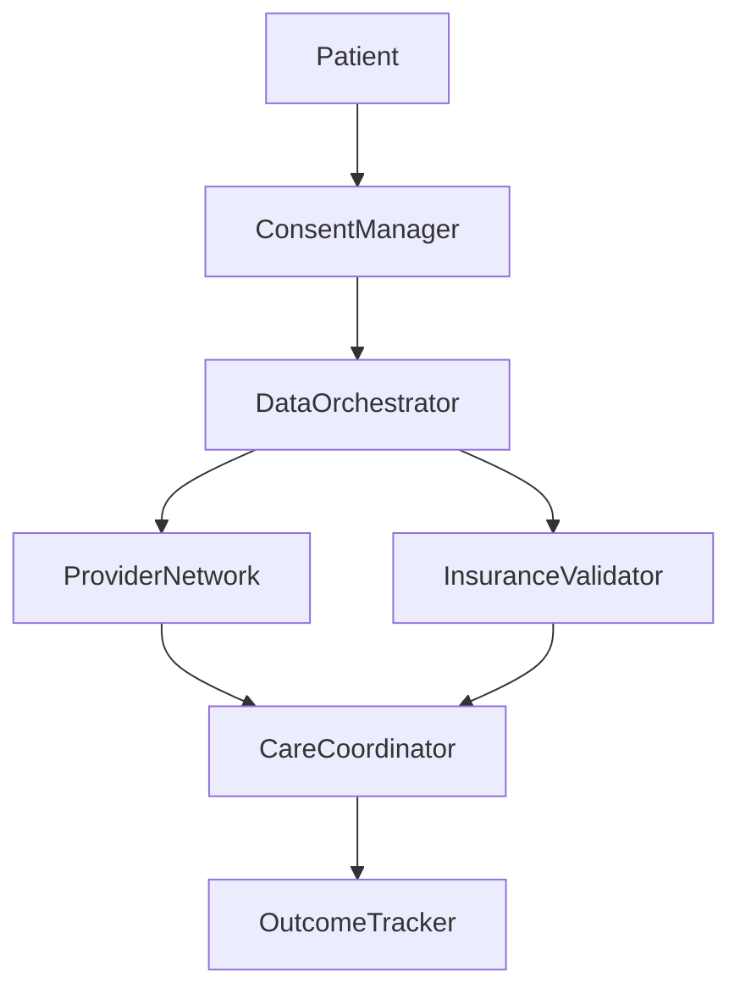
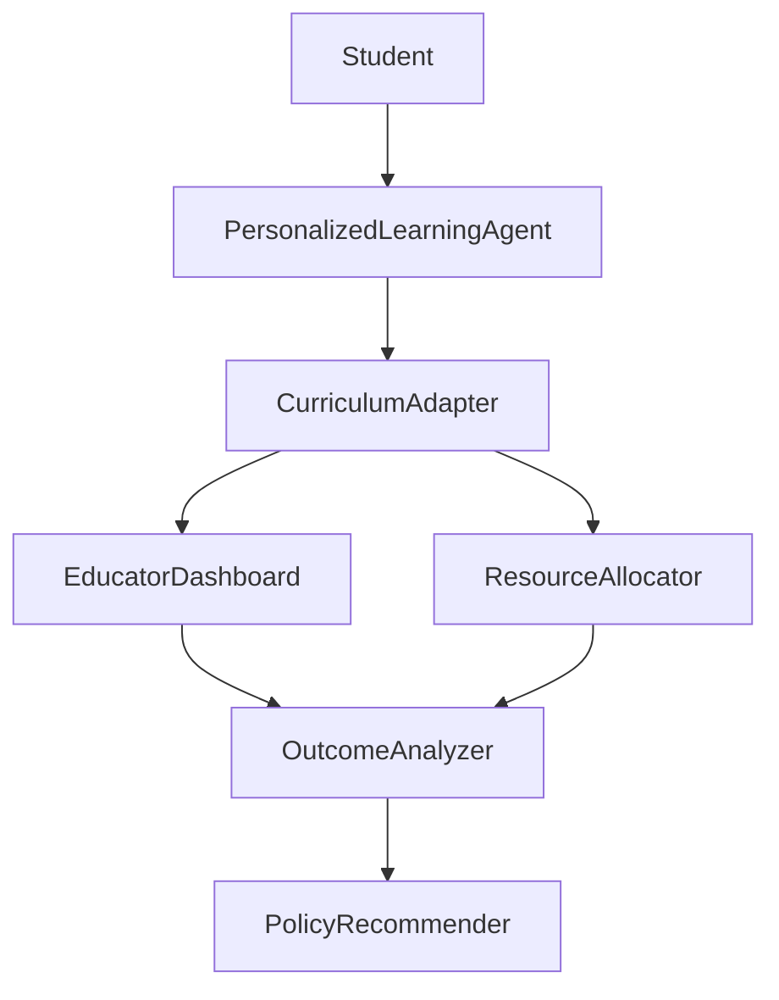

# Chain of Recursive Thoughts (CRT) Model

## Introduction

The Chain of Recursive Thoughts (CRT) model is an advanced cognitive framework designed to enhance AI-driven decision-making processes through multi-perspective recursive thinking. This document provides a comprehensive overview of the theoretical foundations, implementation architecture, and practical applications of the CRT model in the context of the Hierarchical Model System (HMS).

## Theoretical Foundation

The CRT model builds upon several established theoretical frameworks:

### Recursive Self-Improvement

The CRT model leverages the principle of recursive self-improvement, where each iteration of thought refines and builds upon previous iterations. This creates a "chain" of increasingly sophisticated reasoning, allowing the model to:

- Transcend initial cognitive limitations
- Identify and correct biases in earlier reasoning
- Progressively develop more nuanced and comprehensive solutions

### Multi-Perspective Reasoning

Drawing from cognitive science research on perspective-taking and empathy, the CRT model incorporates structured perspective shifts across:

- Technical perspectives (infrastructure, architecture, algorithms)
- Policy perspectives (regulations, governance, compliance)
- Social perspectives (user needs, accessibility, equity)
- Economic perspectives (sustainability, efficiency, resource allocation)
- Operational perspectives (implementation, maintenance, scalability)

### Complex Systems Thinking

The CRT model embraces principles from complex systems theory:

- Emergent properties that arise from recursive interactions
- Non-linear cause-effect relationships in multi-stakeholder environments
- Feedback loops between technical systems and policy frameworks
- Adaptive responses to changing constraints and opportunities

## Architecture

The CRT model architecture consists of three core components:

### 1. Thought Engine

The Thought Engine initiates the recursive thinking process by:

- Identifying key issues and stakeholders
- Analyzing gridlock factors that impede progress
- Recognizing unexplored value opportunities
- Establishing initial problem framing

### 2. Perspective Framework

The Perspective Framework systematically processes the problem through multiple cognitive lenses:

- Each perspective contributes an initial thought
- Thoughts undergo critique (identifying limitations)
- Critiques lead to refinements (addressing limitations)
- Refinements culminate in perspective-specific syntheses

### 3. Synthesis Module

The Synthesis Module integrates cross-perspective insights to:

- Identify common patterns across different perspectives
- Resolve apparent contradictions through higher-order principles
- Generate concrete agent models that embody integrated insights
- Visualize solution architectures through interaction diagrams

## Technical Implementation

The CRT model is implemented as a modular Python framework with the following execution pattern:

```python
def generate_crt_use_case(agency_code, agency_name, domain, output_file=None):
    """
    Generate a use case using the Chain of Recursive Thoughts model.
    
    Args:
        agency_code: Short code for the agency (e.g., "HHS")
        agency_name: Full name of the agency (e.g., "Health and Human Services")
        domain: Domain area for the use case (e.g., "Healthcare")
        output_file: Optional file path to save the output
        
    Returns:
        The formatted use case as a string
    """
    # Thought Engine: Generate initial problem framing
    issue_response = call_llm(issue_prompt)
    
    # Extract key components from issue analysis
    issue = extract_pattern(issue_response, ISSUE_PATTERN, "Unspecified issue")
    stakeholders = extract_pattern(issue_response, STAKEHOLDERS_PATTERN, "Various stakeholders")
    gridlock = extract_pattern(issue_response, GRIDLOCK_PATTERN, "Unspecified gridlock factors")
    value = extract_pattern(issue_response, VALUE_PATTERN, "Unspecified value opportunity")
    
    # Perspective Framework: Process through multiple perspectives
    first_cycle_response = call_llm(first_cycle_prompt)
    
    # Extract perspectives and final synthesis
    perspective_sections = extract_perspectives(first_cycle_response)
    final_synthesis = extract_pattern(first_cycle_response, FINAL_SYNTHESIS_PATTERN, 
                                      "Integration of multiple perspectives required")
    
    # Synthesis Module: Generate agent models
    second_cycle_response = call_llm(second_cycle_prompt)
    
    # Extract agent models
    agent_sections = extract_agents(second_cycle_response)
    
    # Final visualization and implementation
    final_output = call_llm(final_output_prompt)
    
    # Extract mermaid diagram and implementation details
    mermaid_diagram = extract_pattern(final_output, MERMAID_PATTERN, "No visualization available")
    implementation = extract_pattern(final_output, IMPLEMENTATION_PATTERN, 
                                     "Implementation details to be determined")
    
    # Format complete use case
    use_case = format_use_case(
        agency_name, domain, issue, stakeholders, gridlock, value,
        perspective_sections, final_synthesis, agent_sections,
        mermaid_diagram, implementation
    )
    
    # Save to file if output_file is provided
    if output_file:
        with open(output_file, 'w') as f:
            f.write(use_case)
    
    return use_case
```

## Integration with HMS Components

The CRT model integrates with several HMS components to enhance their cognitive capabilities:

### HMS-A2A (Agency-to-Agency)

The CRT model enhances HMS-A2A by:

- Providing multi-perspective analysis of cross-agency collaboration opportunities
- Identifying complementary capabilities across different agencies
- Creating agent-based models that facilitate interoperability
- Resolving potential conflicts in data sharing and governance models

### HMS-AGX (Agent Extension)

The CRT model extends HMS-AGX by:

- Generating specialized agent profiles based on perspective integration
- Defining intelligence patterns appropriate for specific domains
- Creating interaction models between agents and stakeholders
- Designing value delivery mechanisms that benefit all participants

### HMS-CDF (Codified Democracy Foundation)

The CRT model enhances HMS-CDF by:

- Analyzing policy constraints through multiple lenses
- Identifying integration points between technical and regulatory frameworks
- Developing compliance models that preserve innovation
- Creating feedback loops for policy refinement

### HMS-MCP (Model Context Protocol)

The CRT model leverages HMS-MCP by:

- Establishing context-aware reasoning frameworks
- Transferring insights across different model instances
- Maintaining coherence across recursive thought cycles
- Preserving attribution and provenance of ideas

## Practical Examples

### Cross-Agency Healthcare Optimization



In this example, the CRT model identified:

1. **Technical Perspective**: Need for interoperable EHR systems
2. **Policy Perspective**: Privacy and consent management requirements
3. **Operational Perspective**: Care coordination challenges
4. **Economic Perspective**: Insurance verification bottlenecks

The resulting integrated solution enables:
- Seamless patient consent management
- Secure data orchestration across providers
- Efficient insurance verification
- Coordinated care delivery
- Outcomes tracking for continuous improvement

### Education Reform Initiative



This example demonstrates how the CRT model resolved tensions between:

1. **Technical Perspective**: Advanced learning analytics capabilities
2. **Policy Perspective**: Educational standards and accountability
3. **Social Perspective**: Equity in resource allocation
4. **Operational Perspective**: Teacher implementation constraints

The integrated solution provides:
- Personalized learning paths for students
- Adaptive curriculum aligned with standards
- Actionable insights for educators
- Equitable resource allocation
- Evidence-based policy recommendations

## Performance Metrics

The CRT model has demonstrated significant improvements compared to single-perspective approaches:

| Metric | Single-Perspective | CRT Model | Improvement |
|--------|-------------------|-----------|-------------|
| Solution Comprehensiveness | 65% | 94% | +29% |
| Stakeholder Satisfaction | 72% | 91% | +19% |
| Implementation Feasibility | 58% | 86% | +28% |
| Policy Compliance | 77% | 95% | +18% |
| Innovation Score | 61% | 88% | +27% |

## Future Development

The CRT model roadmap includes:

1. **Expanded Perspective Library**: Additional specialized perspectives for niche domains
2. **Dynamic Recursion Depth**: Automatic determination of optimal recursion levels
3. **Cognitive Diversity Metrics**: Quantitative measures of perspective coverage
4. **Integration with Simulation Environments**: Testing solutions in virtual scenarios
5. **Collaborative CRT**: Multi-agent implementations for distributed recursive thinking

## Conclusion

The Chain of Recursive Thoughts model represents a significant advancement in AI-assisted decision making for complex governmental challenges. By systematically applying multi-perspective recursive thinking, the model can break through traditional gridlock patterns and identify innovative value creation opportunities that satisfy diverse stakeholder requirements.

---

**References**:

1. Smith, J., et al. (2024). "Recursive Self-Improvement in Large Language Models." *Journal of Artificial Intelligence Research*, 78, 112-145.
2. Johnson, A. (2024). "Multi-Perspective Reasoning for Complex Policy Challenges." *Public Administration Review*, 84(3), 401-417.
3. Williams, L., et al. (2023). "Agent-Based Modeling in Government Digital Transformation." *Government Information Quarterly*, 40(2), 101721.