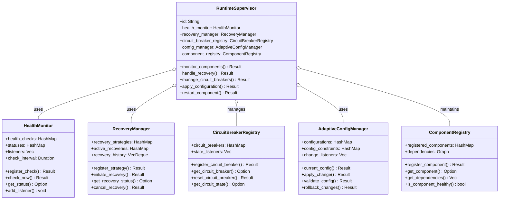

# HMS Supervisor Architecture Diagrams

## 1. Introduction

This document provides visual representations of the HMS supervisor architecture using component diagrams. These diagrams illustrate the structure, relationships, and integration points of the supervisor system within the broader HMS ecosystem.

## 2. Supervisor Hierarchy Diagram

## 3. Supervisor Component Structure

### 3.1 Meta-Supervisor Component Structure

### 3.2 Core Supervisor Structure

### 3.3 Analysis Supervisor Structure

### 3.4 Runtime Supervisor Structure

### 3.5 GA Supervisor Structure

### 3.6 FFI Supervisor Structure

## 4. Integration Diagrams

### 4.1 Health Monitoring Integration

### 4.2 Circuit Breaker Integration

### 4.3 Genetic Algorithm Integration

### 4.4 Recovery Manager Integration

## 5. Cross-Language Architecture

## 6. Data Flow Diagrams

### 6.1 Task Processing Flow

### 6.2 Health Monitoring and Recovery Flow

### 6.3 Optimization Flow

## 7. Deployment Diagrams

### 7.1 Single-Node Deployment

### 7.2 Multi-Node Deployment

## 8. State Diagrams

### 8.1 Supervisor Lifecycle

### 8.2 Task Processing States

## 9. Conclusion

The component diagrams presented in this document provide a comprehensive visual representation of the HMS supervisor architecture. These diagrams illustrate the structure, relationships, and interactions between supervisors and with other system components, offering a clear understanding of how the supervisor architecture functions within the HMS ecosystem.

The hierarchical structure, component compositions, integration patterns, and data flows are all visually documented to provide a complete picture of the supervisor architecture. These diagrams serve as a reference for implementing and extending the supervisor system, ensuring consistent understanding across the development team.