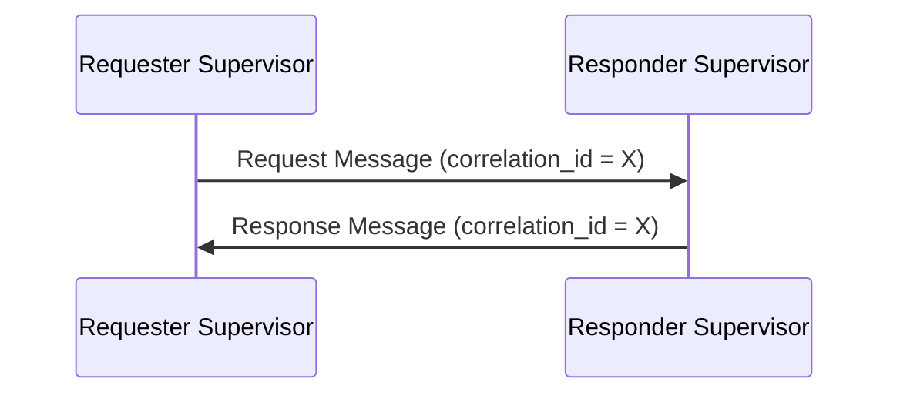
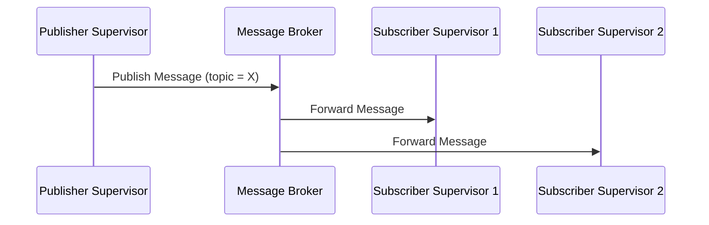
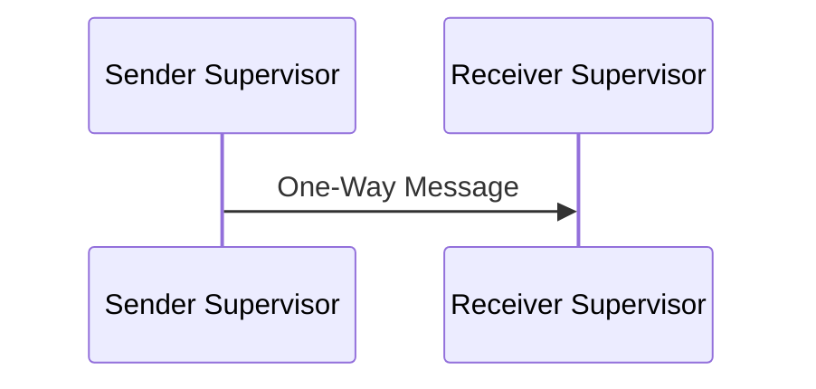
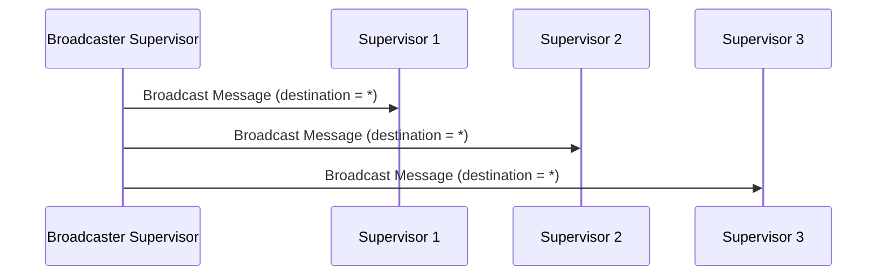
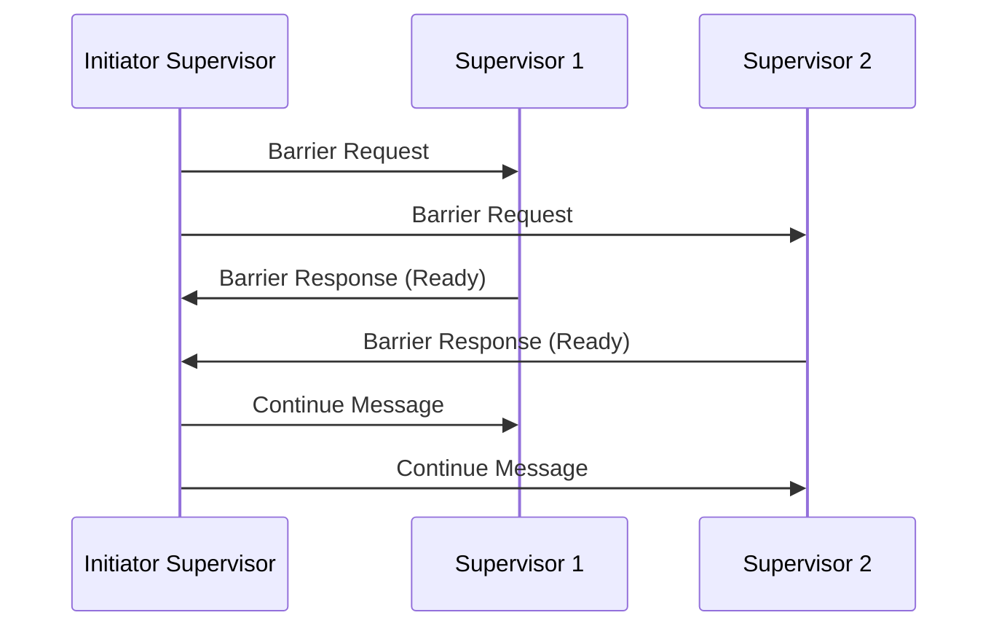

# HMS Supervisor Communication Protocols

## 1. Introduction

This document defines the communication interfaces and protocols used by supervisors within the HMS ecosystem. It establishes standardized methods for supervisors to exchange information, coordinate activities, and maintain system-wide awareness.

The communication protocols are designed to be:

- **Language-agnostic**: Supporting communication between supervisors implemented in different programming languages
- **Fault-tolerant**: Maintaining operation in the presence of failures
- **Scalable**: Supporting a growing number of supervisors and messages
- **Secure**: Ensuring authorized and authenticated communication
- **Extensible**: Allowing new message types and protocols to be added

## 2. Message Format

All supervisor communications use a standardized message format that ensures consistency and interoperability.

### 2.1 Base Message Structure

```typescript
interface SupervisorMessage {
  // Message identification
  id: string;                    // Unique message identifier
  source: string;                // Source supervisor ID
  destination: string;           // Destination supervisor ID ('*' for broadcast)
  
  // Message content
  message_type: string;          // Type of message
  content: any;                  // Message payload (serialized JSON)
  
  // Message metadata
  timestamp: string;             // ISO 8601 timestamp
  correlation_id?: string;       // Optional ID for related messages
  ttl?: number;                  // Time-to-live in milliseconds
  priority?: MessagePriority;    // Message priority (default: normal)
  version: string;               // Protocol version
}

enum MessagePriority {
  Low = 'low',
  Normal = 'normal',
  High = 'high',
  Critical = 'critical'
}
```

### 2.2 Content Schema

The message content must adhere to a schema based on the message type. Below is an example schema for a task assignment message:

```typescript
interface TaskAssignmentContent {
  task_id: string;               // Unique task identifier
  task_type: string;             // Type of task to perform
  parameters: Record<string, any>; // Task parameters
  dependencies?: string[];       // Optional dependencies on other tasks
  timeout?: number;              // Optional timeout in milliseconds
  priority: string;              // Task priority
}
```

### 2.3 Serialization

Messages are serialized using JSON for language-agnostic communication. Binary data within messages should be base64-encoded.

```json
{
  "id": "msg_01f7a3c8b94e",
  "source": "meta_supervisor",
  "destination": "runtime_supervisor",
  "message_type": "task_assignment",
  "content": {
    "task_id": "task_01f7a3c8b94f",
    "task_type": "component_recovery",
    "parameters": {
      "component_id": "api_service",
      "action": "restart"
    },
    "priority": "high"
  },
  "timestamp": "2025-05-01T14:30:00Z",
  "correlation_id": "corr_01f7a3c8b950",
  "ttl": 60000,
  "priority": "high",
  "version": "1.0"
}
```

## 3. Message Types

The supervisor architecture defines standard message types for common operations.

### 3.1 Administrative Messages

| Message Type | Description | Direction |
|--------------|-------------|-----------|
| `supervisor_registration` | Register a supervisor with the Meta-Supervisor | Supervisor → Meta-Supervisor |
| `supervisor_deregistration` | Deregister a supervisor | Supervisor → Meta-Supervisor |
| `supervisor_heartbeat` | Periodic heartbeat to indicate liveness | Supervisor → Meta-Supervisor |
| `supervisor_status_request` | Request supervisor status | Meta-Supervisor → Supervisor |
| `supervisor_status_response` | Response with supervisor status | Supervisor → Meta-Supervisor |
| `supervisor_configuration` | Configuration update for a supervisor | Meta-Supervisor → Supervisor |

### 3.2 Task Management Messages

| Message Type | Description | Direction |
|--------------|-------------|-----------|
| `task_assignment` | Assign a task to a supervisor | Meta-Supervisor → Supervisor |
| `task_acceptance` | Acknowledge task assignment | Supervisor → Meta-Supervisor |
| `task_rejection` | Reject task assignment | Supervisor → Meta-Supervisor |
| `task_progress` | Report task progress | Supervisor → Meta-Supervisor |
| `task_completion` | Report task completion | Supervisor → Meta-Supervisor |
| `task_failure` | Report task failure | Supervisor → Meta-Supervisor |
| `task_cancellation` | Cancel an in-progress task | Meta-Supervisor → Supervisor |

### 3.3 Coordination Messages

| Message Type | Description | Direction |
|--------------|-------------|-----------|
| `sync_request` | Request synchronization | Any Supervisor → Any Supervisor |
| `sync_response` | Response to synchronization request | Any Supervisor → Any Supervisor |
| `lock_request` | Request a distributed lock | Any Supervisor → Meta-Supervisor |
| `lock_response` | Response to lock request | Meta-Supervisor → Any Supervisor |
| `barrier_request` | Request participation in a barrier | Meta-Supervisor → Any Supervisor |
| `barrier_response` | Response to barrier request | Any Supervisor → Meta-Supervisor |

### 3.4 Notification Messages

| Message Type | Description | Direction |
|--------------|-------------|-----------|
| `health_notification` | Notification of health status change | Any Supervisor → Any Supervisor |
| `circuit_notification` | Notification of circuit breaker state change | Runtime Supervisor → Any Supervisor |
| `config_notification` | Notification of configuration change | Any Supervisor → Any Supervisor |
| `recovery_notification` | Notification of recovery action | Runtime Supervisor → Any Supervisor |

### 3.5 Query Messages

| Message Type | Description | Direction |
|--------------|-------------|-----------|
| `metrics_query` | Query for metrics | Any Supervisor → Analysis Supervisor |
| `metrics_response` | Response with metrics data | Analysis Supervisor → Any Supervisor |
| `state_query` | Query for state information | Any Supervisor → Any Supervisor |
| `state_response` | Response with state information | Any Supervisor → Any Supervisor |

### 3.6 Analysis Messages

| Message Type | Description | Direction |
|--------------|-------------|-----------|
| `analysis_result` | Results of analysis | Analysis Supervisor → Any Supervisor |
| `pattern_detection` | Detection of a pattern | Analysis Supervisor → Any Supervisor |
| `anomaly_detection` | Detection of an anomaly | Analysis Supervisor → Any Supervisor |
| `trend_detection` | Detection of a trend | Analysis Supervisor → Any Supervisor |

### 3.7 Optimization Messages

| Message Type | Description | Direction |
|--------------|-------------|-----------|
| `optimization_request` | Request for optimization | Any Supervisor → GA Supervisor |
| `optimization_result` | Results of optimization | GA Supervisor → Any Supervisor |
| `configuration_proposal` | Proposed configuration change | GA Supervisor → Runtime Supervisor |
| `configuration_feedback` | Feedback on configuration | Runtime Supervisor → GA Supervisor |

## 4. Communication Patterns

The supervisor architecture supports various communication patterns to accommodate different interaction needs.

### 4.1 Request-Response Pattern

The request-response pattern is used for synchronous interactions where a response is expected.



#### 4.1.1 Implementation

```rust
// Requester side
pub async fn send_request<T>(
    &self,
    destination: &str,
    request_type: &str,
    content: T
) -> Result<SupervisorMessage, Error>
where
    T: Serialize,
{
    // Generate correlation ID for this request
    let correlation_id = format!("req_{}", Uuid::new_v4().to_string());
    
    // Create request message
    let request_message = SupervisorMessage {
        id: format!("msg_{}", Uuid::new_v4().to_string()),
        source: self.id.clone(),
        destination: destination.to_string(),
        message_type: request_type.to_string(),
        content: serde_json::to_value(content)?,
        timestamp: Utc::now().to_rfc3339(),
        correlation_id: Some(correlation_id.clone()),
        ttl: Some(30000), // 30 seconds default timeout
        priority: Some(MessagePriority::Normal),
        version: "1.0".to_string(),
    };
    
    // Send message
    self.message_broker.send(request_message.clone())?;
    
    // Wait for response with matching correlation ID
    let response_future = self.wait_for_response(correlation_id, Duration::from_millis(30000));
    match tokio::time::timeout(Duration::from_millis(30000), response_future).await {
        Ok(Ok(response)) => Ok(response),
        Ok(Err(e)) => Err(e),
        Err(_) => Err(Error::Timeout("Request timed out".to_string())),
    }
}

// Responder side
pub async fn handle_message(&self, message: SupervisorMessage) -> Result<(), Error> {
    // Process the message based on type
    match message.message_type.as_str() {
        "metrics_query" => {
            // Extract query parameters from content
            let query_params: MetricsQueryParams = serde_json::from_value(message.content.clone())?;
            
            // Process the query
            let metrics = self.metrics_store.query(query_params)?;
            
            // Create response message
            let response = SupervisorMessage {
                id: format!("msg_{}", Uuid::new_v4().to_string()),
                source: self.id.clone(),
                destination: message.source,
                message_type: "metrics_response".to_string(),
                content: serde_json::to_value(metrics)?,
                timestamp: Utc::now().to_rfc3339(),
                correlation_id: message.correlation_id, // Use same correlation ID
                ttl: None,
                priority: message.priority,
                version: "1.0".to_string(),
            };
            
            // Send response
            self.message_broker.send(response)?;
        },
        // Handle other message types...
        _ => {}
    }
    
    Ok(())
}
```

### 4.2 Publish-Subscribe Pattern

The publish-subscribe pattern is used for one-to-many communications where multiple supervisors may be interested in the same message.



#### 4.2.1 Implementation

```rust
// Publisher side
pub async fn publish_notification<T>(
    &self,
    topic: &str,
    notification_type: &str,
    content: T
) -> Result<(), Error>
where
    T: Serialize,
{
    // Create notification message
    let notification = SupervisorMessage {
        id: format!("msg_{}", Uuid::new_v4().to_string()),
        source: self.id.clone(),
        destination: format!("topic:{}", topic), // Special format for topics
        message_type: notification_type.to_string(),
        content: serde_json::to_value(content)?,
        timestamp: Utc::now().to_rfc3339(),
        correlation_id: None,
        ttl: None,
        priority: Some(MessagePriority::Normal),
        version: "1.0".to_string(),
    };
    
    // Publish message
    self.message_broker.publish(topic, notification)?;
    
    Ok(())
}

// Subscriber side
pub async fn subscribe_to_topic(&self, topic: &str) -> Result<(), Error> {
    // Register interest in topic
    self.message_broker.subscribe(self.id.clone(), topic)?;
    
    Ok(())
}

pub async fn handle_topic_message(&self, topic: &str, message: SupervisorMessage) -> Result<(), Error> {
    // Process message based on type and topic
    match (topic, message.message_type.as_str()) {
        ("health", "health_notification") => {
            // Process health notification
            let health_data: HealthNotification = serde_json::from_value(message.content)?;
            self.process_health_notification(health_data)?;
        },
        // Handle other topic/message combinations...
        _ => {}
    }
    
    Ok(())
}
```

### 4.3 One-Way Messaging Pattern

The one-way messaging pattern is used for asynchronous notifications where no response is expected.



#### 4.3.1 Implementation

```rust
// Sender side
pub async fn send_notification<T>(
    &self,
    destination: &str,
    notification_type: &str,
    content: T
) -> Result<(), Error>
where
    T: Serialize,
{
    // Create notification message
    let notification = SupervisorMessage {
        id: format!("msg_{}", Uuid::new_v4().to_string()),
        source: self.id.clone(),
        destination: destination.to_string(),
        message_type: notification_type.to_string(),
        content: serde_json::to_value(content)?,
        timestamp: Utc::now().to_rfc3339(),
        correlation_id: None,
        ttl: None,
        priority: Some(MessagePriority::Normal),
        version: "1.0".to_string(),
    };
    
    // Send message
    self.message_broker.send(notification)?;
    
    Ok(())
}

// Receiver side
// Uses the same message handling logic as in the request-response pattern
```

### 4.4 Broadcast Pattern

The broadcast pattern is used to send a message to all supervisors in the system.



#### 4.4.1 Implementation

```rust
// Broadcaster side
pub async fn broadcast<T>(
    &self,
    broadcast_type: &str,
    content: T
) -> Result<(), Error>
where
    T: Serialize,
{
    // Create broadcast message
    let broadcast = SupervisorMessage {
        id: format!("msg_{}", Uuid::new_v4().to_string()),
        source: self.id.clone(),
        destination: "*".to_string(), // Special destination for broadcasts
        message_type: broadcast_type.to_string(),
        content: serde_json::to_value(content)?,
        timestamp: Utc::now().to_rfc3339(),
        correlation_id: None,
        ttl: None,
        priority: Some(MessagePriority::Normal),
        version: "1.0".to_string(),
    };
    
    // Send broadcast
    self.message_broker.broadcast(broadcast)?;
    
    Ok(())
}

// Receiver side
// Uses the same message handling logic as in the request-response pattern
```

### 4.5 Distributed Barrier Pattern

The distributed barrier pattern is used to synchronize multiple supervisors at a specific point in execution.



#### 4.5.1 Implementation

```rust
// Initiator side
pub async fn create_barrier(
    &self,
    barrier_id: &str,
    participants: &[String],
    timeout: Duration
) -> Result<bool, Error> {
    // Create barrier in distributed state
    self.barrier_manager.create_barrier(barrier_id, participants, timeout)?;
    
    // Send barrier request to all participants
    for participant in participants {
        let request = SupervisorMessage {
            id: format!("msg_{}", Uuid::new_v4().to_string()),
            source: self.id.clone(),
            destination: participant.clone(),
            message_type: "barrier_request".to_string(),
            content: serde_json::json!({
                "barrier_id": barrier_id,
                "timeout_ms": timeout.as_millis()
            }),
            timestamp: Utc::now().to_rfc3339(),
            correlation_id: Some(barrier_id.to_string()),
            ttl: Some(timeout.as_millis() as u64),
            priority: Some(MessagePriority::High),
            version: "1.0".to_string(),
        };
        
        self.message_broker.send(request)?;
    }
    
    // Wait for all participants to reach the barrier or timeout
    let barrier_result = self.barrier_manager.wait_for_barrier(barrier_id, timeout).await?;
    
    // Notify participants to continue
    if barrier_result.all_ready {
        for participant in participants {
            let continue_msg = SupervisorMessage {
                id: format!("msg_{}", Uuid::new_v4().to_string()),
                source: self.id.clone(),
                destination: participant.clone(),
                message_type: "barrier_continue".to_string(),
                content: serde_json::json!({
                    "barrier_id": barrier_id,
                    "all_ready": true
                }),
                timestamp: Utc::now().to_rfc3339(),
                correlation_id: Some(barrier_id.to_string()),
                ttl: None,
                priority: Some(MessagePriority::High),
                version: "1.0".to_string(),
            };
            
            self.message_broker.send(continue_msg)?;
        }
    }
    
    Ok(barrier_result.all_ready)
}

// Participant side
pub async fn handle_barrier_request(&self, message: SupervisorMessage) -> Result<(), Error> {
    let barrier_data: BarrierRequest = serde_json::from_value(message.content)?;
    let barrier_id = barrier_data.barrier_id;
    
    // Prepare for barrier
    let is_ready = self.prepare_for_barrier(barrier_id)?;
    
    // Send response
    let response = SupervisorMessage {
        id: format!("msg_{}", Uuid::new_v4().to_string()),
        source: self.id.clone(),
        destination: message.source,
        message_type: "barrier_response".to_string(),
        content: serde_json::json!({
            "barrier_id": barrier_id,
            "ready": is_ready
        }),
        timestamp: Utc::now().to_rfc3339(),
        correlation_id: message.correlation_id,
        ttl: None,
        priority: Some(MessagePriority::High),
        version: "1.0".to_string(),
    };
    
    self.message_broker.send(response)?;
    
    // Wait for continue message
    self.wait_for_barrier_continue(barrier_id).await?;
    
    Ok(())
}
```

## 5. Error Handling

The communication protocol defines standard error handling mechanisms to ensure reliable operation in the presence of failures.

### 5.1 Error Message Format

```typescript
interface ErrorResponse {
  error_code: string;           // Machine-readable error code
  error_message: string;        // Human-readable error message
  error_details?: any;          // Optional detailed error information
  source_message_id: string;    // ID of the message that caused the error
}
```

### 5.2 Common Error Codes

| Error Code | Description | Handling Strategy |
|------------|-------------|-------------------|
| `message_format_error` | Invalid message format | Reject message, notify sender |
| `destination_not_found` | Destination supervisor not found | Retry with fallback destination |
| `message_timeout` | Message processing timed out | Retry with exponential backoff |
| `authorization_error` | Sender not authorized for operation | Reject message, log security event |
| `validation_error` | Message content validation failed | Reject message, notify sender |
| `internal_error` | Internal processing error | Retry with different supervisor |

### 5.3 Retry Strategy

```rust
pub async fn send_with_retry<T>(
    &self,
    destination: &str,
    message_type: &str,
    content: T,
    max_retries: usize,
    initial_delay: Duration
) -> Result<SupervisorMessage, Error>
where
    T: Serialize + Clone,
{
    let mut retries = 0;
    let mut delay = initial_delay;
    
    loop {
        match self.send_request(destination, message_type, content.clone()).await {
            Ok(response) => return Ok(response),
            Err(e) => {
                if retries >= max_retries {
                    return Err(e);
                }
                
                // Check if error is retriable
                if !is_retriable_error(&e) {
                    return Err(e);
                }
                
                // Wait before retrying
                tokio::time::sleep(delay).await;
                
                // Increase retry count and delay
                retries += 1;
                delay = delay * 2; // Exponential backoff
            }
        }
    }
}

fn is_retriable_error(error: &Error) -> bool {
    match error {
        Error::Timeout(_) => true,
        Error::ConnectionError(_) => true,
        Error::TemporarilyUnavailable => true,
        // Other retriable errors...
        _ => false,
    }
}
```

## 6. Message Routing

The supervisor architecture includes a message routing system that ensures messages are delivered to the appropriate supervisors.

### 6.1 Direct Routing

Direct routing delivers a message to a specific supervisor identified by its ID.

```rust
pub async fn route_direct(&self, message: SupervisorMessage) -> Result<(), Error> {
    let destination = message.destination.clone();
    
    // Check if destination is local
    if let Some(channel) = self.local_channels.get(&destination) {
        // Send to local supervisor
        channel.send(message).await?;
    } else if let Some(node) = self.find_node_for_supervisor(&destination) {
        // Send to remote node
        self.send_to_node(node, message).await?;
    } else {
        // Destination not found
        return Err(Error::DestinationNotFound(destination));
    }
    
    Ok(())
}
```

### 6.2 Topic Routing

Topic routing delivers a message to all supervisors subscribed to a specific topic.

```rust
pub async fn route_topic(&self, topic: &str, message: SupervisorMessage) -> Result<(), Error> {
    // Get all subscribers for the topic
    let subscribers = self.topic_subscribers.get(topic).cloned().unwrap_or_default();
    
    // Send to all subscribers
    for subscriber in subscribers {
        let mut msg = message.clone();
        msg.destination = subscriber.clone();
        
        self.route_direct(msg).await?;
    }
    
    Ok(())
}
```

### 6.3 Broadcast Routing

Broadcast routing delivers a message to all supervisors in the system.

```rust
pub async fn route_broadcast(&self, message: SupervisorMessage) -> Result<(), Error> {
    // Get all registered supervisors
    let supervisors = self.get_all_supervisor_ids();
    
    // Send to all supervisors except the source
    for supervisor_id in supervisors {
        if supervisor_id != message.source {
            let mut msg = message.clone();
            msg.destination = supervisor_id.clone();
            
            // Ignore errors for individual destinations
            let _ = self.route_direct(msg).await;
        }
    }
    
    Ok(())
}
```

## 7. Security

The supervisor communication protocol includes security measures to ensure secure and trusted communication.

### 7.1 Authentication

Each supervisor message includes authentication information to verify the sender.

```rust
pub fn authenticate_message(&self, message: &SupervisorMessage) -> Result<bool, Error> {
    // Get sender's public key
    let sender_key = self.key_store.get_public_key(&message.source)?;
    
    // Verify signature (assuming signature is in metadata)
    let signature = message.get_signature()?;
    let message_data = message.get_signed_data()?;
    
    // Verify signature using sender's public key
    sender_key.verify(message_data.as_bytes(), &signature)
}
```

### 7.2 Authorization

Supervisors check if a sender is authorized to send a specific message type.

```rust
pub fn authorize_message(&self, message: &SupervisorMessage) -> Result<bool, Error> {
    // Get sender's roles
    let sender_roles = self.role_store.get_roles(&message.source)?;
    
    // Get required roles for message type
    let required_roles = self.get_required_roles_for_message_type(&message.message_type)?;
    
    // Check if sender has any of the required roles
    for role in &required_roles {
        if sender_roles.contains(role) {
            return Ok(true);
        }
    }
    
    // Sender not authorized
    Ok(false)
}
```

### 7.3 Message Integrity

Messages include integrity checks to ensure they have not been tampered with.

```rust
pub fn verify_message_integrity(&self, message: &SupervisorMessage) -> Result<bool, Error> {
    // Calculate hash of message content
    let calculated_hash = self.hash_message_content(message)?;
    
    // Get hash from message metadata
    let provided_hash = message.get_content_hash()?;
    
    // Compare hashes
    Ok(calculated_hash == provided_hash)
}
```

## 8. Cross-Language Support

The supervisor communication protocol is designed to work across multiple programming languages.

### 8.1 Rust Implementation

```rust
pub struct RustMessageBroker {
    // Implementation details
}

impl MessageBroker for RustMessageBroker {
    fn send(&self, message: SupervisorMessage) -> Result<(), Error> {
        // Implementation
    }
    
    fn receive(&self) -> Result<SupervisorMessage, Error> {
        // Implementation
    }
    
    // Other methods
}
```

### 8.2 TypeScript Implementation

```typescript
class TypeScriptMessageBroker implements MessageBroker {
    // Implementation details
    
    public async send(message: SupervisorMessage): Promise<void> {
        // Implementation
    }
    
    public async receive(): Promise<SupervisorMessage> {
        // Implementation
    }
    
    // Other methods
}
```

### 8.3 FFI Bridge

```rust
#[no_mangle]
pub extern "C" fn supervisor_send_message(
    supervisor_handle: *mut c_void,
    message_json_ptr: *const c_char,
    callback: extern "C" fn(*const c_char)
) {
    let supervisor = unsafe { &mut *(supervisor_handle as *mut Box<dyn Supervisor>) };
    let message_json = unsafe { CStr::from_ptr(message_json_ptr).to_string_lossy().into_owned() };
    
    // Parse message JSON
    let message: SupervisorMessage = match serde_json::from_str(&message_json) {
        Ok(msg) => msg,
        Err(e) => {
            let error_str = CString::new(format!("{{\"error\":\"{}\"}}.", e.to_string())).unwrap_or_default();
            callback(error_str.as_ptr());
            return;
        }
    };
    
    // Send message
    match supervisor.handle_message(message) {
        Ok(_) => {
            let success_str = CString::new("{}").unwrap_or_default();
            callback(success_str.as_ptr());
        },
        Err(e) => {
            let error_str = CString::new(format!("{{\"error\":\"{}\"}}.", e.to_string())).unwrap_or_default();
            callback(error_str.as_ptr());
        }
    }
}
```

## 9. Performance Considerations

The supervisor communication protocol includes optimizations to ensure efficient operation at scale.

### 9.1 Message Batching

Multiple messages can be batched together to reduce communication overhead.

```rust
pub async fn send_batch(&self, messages: Vec<SupervisorMessage>) -> Result<(), Error> {
    // Create batch message
    let batch = SupervisorMessage {
        id: format!("msg_{}", Uuid::new_v4().to_string()),
        source: self.id.clone(),
        destination: messages[0].destination.clone(), // Assume all messages have same destination
        message_type: "message_batch".to_string(),
        content: serde_json::to_value(messages)?,
        timestamp: Utc::now().to_rfc3339(),
        correlation_id: None,
        ttl: None,
        priority: Some(MessagePriority::Normal),
        version: "1.0".to_string(),
    };
    
    // Send batch
    self.message_broker.send(batch)?;
    
    Ok(())
}
```

### 9.2 Message Compression

Large messages can be compressed to reduce bandwidth usage.

```rust
pub fn compress_message(&self, message: &SupervisorMessage) -> Result<SupervisorMessage, Error> {
    // Serialize message to JSON
    let message_json = serde_json::to_string(message)?;
    
    // Compress using GZip
    let mut encoder = GzEncoder::new(Vec::new(), Compression::default());
    encoder.write_all(message_json.as_bytes())?;
    let compressed_data = encoder.finish()?;
    
    // Create compressed message
    let compressed_message = SupervisorMessage {
        id: message.id.clone(),
        source: message.source.clone(),
        destination: message.destination.clone(),
        message_type: format!("compressed:{}", message.message_type),
        content: serde_json::to_value(base64::encode(compressed_data))?,
        timestamp: message.timestamp.clone(),
        correlation_id: message.correlation_id.clone(),
        ttl: message.ttl,
        priority: message.priority.clone(),
        version: message.version.clone(),
    };
    
    Ok(compressed_message)
}

pub fn decompress_message(&self, compressed_message: &SupervisorMessage) -> Result<SupervisorMessage, Error> {
    // Check if message is compressed
    if !compressed_message.message_type.starts_with("compressed:") {
        return Err(Error::InvalidOperation("Message is not compressed".to_string()));
    }
    
    // Extract original message type
    let original_type = compressed_message.message_type.strip_prefix("compressed:").unwrap();
    
    // Get compressed data
    let compressed_data = compressed_message.content.as_str()
        .ok_or(Error::DeserializationError("Content is not a string".to_string()))?;
    let decoded_data = base64::decode(compressed_data)?;
    
    // Decompress data
    let mut decoder = GzDecoder::new(decoded_data.as_slice());
    let mut decompressed_data = String::new();
    decoder.read_to_string(&mut decompressed_data)?;
    
    // Parse original message
    let mut original_message: SupervisorMessage = serde_json::from_str(&decompressed_data)?;
    
    // Update message ID and timestamp to match compressed message
    original_message.id = compressed_message.id.clone();
    original_message.timestamp = compressed_message.timestamp.clone();
    
    Ok(original_message)
}
```

### 9.3 Priority Queuing

Messages are processed according to their priority to ensure critical messages are handled promptly.

```rust
pub struct PriorityMessageQueue {
    critical_queue: VecDeque<SupervisorMessage>,
    high_queue: VecDeque<SupervisorMessage>,
    normal_queue: VecDeque<SupervisorMessage>,
    low_queue: VecDeque<SupervisorMessage>,
}

impl PriorityMessageQueue {
    pub fn new() -> Self {
        Self {
            critical_queue: VecDeque::new(),
            high_queue: VecDeque::new(),
            normal_queue: VecDeque::new(),
            low_queue: VecDeque::new(),
        }
    }
    
    pub fn enqueue(&mut self, message: SupervisorMessage) {
        // Add to appropriate queue based on priority
        match message.priority {
            Some(MessagePriority::Critical) => self.critical_queue.push_back(message),
            Some(MessagePriority::High) => self.high_queue.push_back(message),
            Some(MessagePriority::Low) => self.low_queue.push_back(message),
            _ => self.normal_queue.push_back(message), // Default to normal priority
        }
    }
    
    pub fn dequeue(&mut self) -> Option<SupervisorMessage> {
        // Retrieve from highest priority non-empty queue
        if let Some(msg) = self.critical_queue.pop_front() {
            return Some(msg);
        }
        if let Some(msg) = self.high_queue.pop_front() {
            return Some(msg);
        }
        if let Some(msg) = self.normal_queue.pop_front() {
            return Some(msg);
        }
        if let Some(msg) = self.low_queue.pop_front() {
            return Some(msg);
        }
        
        None
    }
}
```

## 10. Testing and Validation

The supervisor communication protocol includes testing and validation mechanisms to ensure correct implementation.

### 10.1 Protocol Validator

```rust
pub struct ProtocolValidator {
    // Implementation details
}

impl ProtocolValidator {
    pub fn validate_message(&self, message: &SupervisorMessage) -> Result<(), Vec<ValidationError>> {
        let mut errors = Vec::new();
        
        // Validate message format
        if message.id.is_empty() {
            errors.push(ValidationError::new("Message ID cannot be empty"));
        }
        
        if message.source.is_empty() {
            errors.push(ValidationError::new("Source cannot be empty"));
        }
        
        if message.destination.is_empty() {
            errors.push(ValidationError::new("Destination cannot be empty"));
        }
        
        if message.message_type.is_empty() {
            errors.push(ValidationError::new("Message type cannot be empty"));
        }
        
        if message.timestamp.is_empty() {
            errors.push(ValidationError::new("Timestamp cannot be empty"));
        }
        
        // Validate content against schema for message type
        if let Err(e) = self.validate_content_schema(&message.message_type, &message.content) {
            errors.push(e);
        }
        
        // Return errors if any
        if errors.is_empty() {
            Ok(())
        } else {
            Err(errors)
        }
    }
    
    fn validate_content_schema(&self, message_type: &str, content: &Value) -> Result<(), ValidationError> {
        // Get schema for message type
        let schema = self.get_schema_for_message_type(message_type)?;
        
        // Validate content against schema
        if let Err(e) = schema.validate(content) {
            return Err(ValidationError::new(&format!("Content validation error: {}", e)));
        }
        
        Ok(())
    }
}
```

### 10.2 Protocol Tester

```rust
pub struct ProtocolTester {
    // Implementation details
}

impl ProtocolTester {
    pub async fn test_round_trip(&self, broker: &impl MessageBroker) -> Result<(), Error> {
        // Create test message
        let test_message = SupervisorMessage {
            id: format!("test_{}", Uuid::new_v4().to_string()),
            source: "test_sender".to_string(),
            destination: "test_receiver".to_string(),
            message_type: "test_message".to_string(),
            content: serde_json::json!({"test_key": "test_value"}),
            timestamp: Utc::now().to_rfc3339(),
            correlation_id: None,
            ttl: None,
            priority: Some(MessagePriority::Normal),
            version: "1.0".to_string(),
        };
        
        // Send message
        broker.send(test_message.clone())?;
        
        // Receive message
        let received_message = broker.receive().await?;
        
        // Verify message
        assert_eq!(test_message.id, received_message.id);
        assert_eq!(test_message.source, received_message.source);
        assert_eq!(test_message.destination, received_message.destination);
        assert_eq!(test_message.message_type, received_message.message_type);
        assert_eq!(test_message.content, received_message.content);
        
        Ok(())
    }
    
    pub async fn test_performance(&self, broker: &impl MessageBroker, message_count: usize) -> Result<Duration, Error> {
        let start_time = Instant::now();
        
        // Send multiple messages
        for i in 0..message_count {
            let test_message = SupervisorMessage {
                id: format!("perf_test_{}", i),
                source: "test_sender".to_string(),
                destination: "test_receiver".to_string(),
                message_type: "performance_test".to_string(),
                content: serde_json::json!({"test_index": i}),
                timestamp: Utc::now().to_rfc3339(),
                correlation_id: None,
                ttl: None,
                priority: Some(MessagePriority::Normal),
                version: "1.0".to_string(),
            };
            
            broker.send(test_message)?;
        }
        
        // Calculate elapsed time
        let elapsed = start_time.elapsed();
        
        Ok(elapsed)
    }
}
```

## 11. Implementation Examples

### 11.1 Task Assignment and Execution

This example shows how the Meta-Supervisor assigns a task to a Runtime Supervisor and receives the result.

```rust
// Meta-Supervisor side
pub async fn assign_recovery_task(&self, component_id: &str) -> Result<TaskResult, Error> {
    // Create task assignment content
    let task_content = TaskAssignmentContent {
        task_id: format!("task_{}", Uuid::new_v4().to_string()),
        task_type: "component_recovery".to_string(),
        parameters: [
            ("component_id".to_string(), component_id.to_string().into()),
            ("action".to_string(), "restart".to_string().into()),
        ].iter().cloned().collect(),
        dependencies: None,
        timeout: Some(60000), // 1 minute timeout
        priority: "high".to_string(),
    };
    
    // Send task assignment message to Runtime Supervisor
    let response = self.send_request(
        "runtime_supervisor",
        "task_assignment",
        task_content
    ).await?;
    
    // Process response
    if response.message_type == "task_acceptance" {
        // Task was accepted, wait for completion
        let task_id = task_content.task_id.clone();
        let completion = self.wait_for_task_completion(task_id, Duration::from_secs(120)).await?;
        
        // Parse task result
        let task_result: TaskResult = serde_json::from_value(completion.content)?;
        Ok(task_result)
    } else if response.message_type == "task_rejection" {
        // Task was rejected
        let rejection_reason: String = serde_json::from_value(response.content["reason"].clone())?;
        Err(Error::TaskRejected(rejection_reason))
    } else {
        // Unexpected response
        Err(Error::UnexpectedResponse(format!("Unexpected response type: {}", response.message_type)))
    }
}

// Runtime Supervisor side
pub async fn handle_task_assignment(&self, message: SupervisorMessage) -> Result<(), Error> {
    // Parse task assignment
    let task_content: TaskAssignmentContent = serde_json::from_value(message.content)?;
    let task_id = task_content.task_id.clone();
    
    // Check if task can be accepted
    if self.can_accept_task(&task_content) {
        // Accept the task
        let acceptance = SupervisorMessage {
            id: format!("msg_{}", Uuid::new_v4().to_string()),
            source: self.id.clone(),
            destination: message.source,
            message_type: "task_acceptance".to_string(),
            content: serde_json::json!({
                "task_id": task_id,
                "accepted_at": Utc::now().to_rfc3339()
            }),
            timestamp: Utc::now().to_rfc3339(),
            correlation_id: message.correlation_id,
            ttl: None,
            priority: message.priority,
            version: "1.0".to_string(),
        };
        
        self.message_broker.send(acceptance)?;
        
        // Execute the task asynchronously
        let self_clone = self.clone();
        let task_content_clone = task_content.clone();
        tokio::spawn(async move {
            if let Err(e) = self_clone.execute_task_async(task_content_clone).await {
                error!("Task execution failed: {}", e);
            }
        });
        
        Ok(())
    } else {
        // Reject the task
        let rejection = SupervisorMessage {
            id: format!("msg_{}", Uuid::new_v4().to_string()),
            source: self.id.clone(),
            destination: message.source,
            message_type: "task_rejection".to_string(),
            content: serde_json::json!({
                "task_id": task_id,
                "reason": "Cannot accept task at this time"
            }),
            timestamp: Utc::now().to_rfc3339(),
            correlation_id: message.correlation_id,
            ttl: None,
            priority: message.priority,
            version: "1.0".to_string(),
        };
        
        self.message_broker.send(rejection)?;
        
        Ok(())
    }
}

pub async fn execute_task_async(&self, task_content: TaskAssignmentContent) -> Result<(), Error> {
    let task_id = task_content.task_id.clone();
    
    // Send progress update
    self.send_task_progress(&task_id, "started", 0.0)?;
    
    // Execute task based on type
    let result = if task_content.task_type == "component_recovery" {
        self.execute_recovery_task(&task_content).await
    } else {
        // Handle other task types...
        Err(Error::UnsupportedTaskType(task_content.task_type))
    };
    
    // Send completion or failure
    match result {
        Ok(task_result) => {
            // Send progress update
            self.send_task_progress(&task_id, "completed", 1.0)?;
            
            // Send completion
            let completion = SupervisorMessage {
                id: format!("msg_{}", Uuid::new_v4().to_string()),
                source: self.id.clone(),
                destination: "meta_supervisor".to_string(), // Assume Meta-Supervisor always receives completions
                message_type: "task_completion".to_string(),
                content: serde_json::to_value(task_result)?,
                timestamp: Utc::now().to_rfc3339(),
                correlation_id: Some(task_id),
                ttl: None,
                priority: Some(MessagePriority::Normal),
                version: "1.0".to_string(),
            };
            
            self.message_broker.send(completion)?;
        },
        Err(e) => {
            // Send failure
            let failure = SupervisorMessage {
                id: format!("msg_{}", Uuid::new_v4().to_string()),
                source: self.id.clone(),
                destination: "meta_supervisor".to_string(),
                message_type: "task_failure".to_string(),
                content: serde_json::json!({
                    "task_id": task_id,
                    "error": e.to_string(),
                    "error_code": e.code()
                }),
                timestamp: Utc::now().to_rfc3339(),
                correlation_id: Some(task_id),
                ttl: None,
                priority: Some(MessagePriority::Normal),
                version: "1.0".to_string(),
            };
            
            self.message_broker.send(failure)?;
        }
    }
    
    Ok(())
}
```

### 11.2 Health Notification

This example shows how the Analysis Supervisor notifies other supervisors of a health issue.

```rust
// Analysis Supervisor side
pub async fn notify_health_issue(&self, component_id: &str, status: HealthStatus, metrics: HealthMetrics) -> Result<(), Error> {
    // Create health notification content
    let notification_content = HealthNotificationContent {
        component_id: component_id.to_string(),
        status: status.to_string(),
        message: format!("Health issue detected for component {}", component_id),
        metrics: metrics,
        timestamp: Utc::now().to_rfc3339(),
    };
    
    // Publish notification to health topic
    self.publish_notification(
        "health",
        "health_notification",
        notification_content
    )?;
    
    // If status is critical, also send direct notification to Runtime Supervisor
    if status == HealthStatus::Critical {
        self.send_notification(
            "runtime_supervisor",
            "health_notification",
            notification_content
        )?;
    }
    
    Ok(())
}

// Runtime Supervisor side
pub async fn handle_health_notification(&self, message: SupervisorMessage) -> Result<(), Error> {
    // Parse health notification
    let notification: HealthNotificationContent = serde_json::from_value(message.content)?;
    
    // Log the notification
    info!(
        "Health notification received for component {}: status={}",
        notification.component_id, notification.status
    );
    
    // Take action based on status
    match notification.status.as_str() {
        "Critical" => {
            // Create recovery task
            let recovery_task = SupervisorTask {
                id: format!("task_{}", Uuid::new_v4().to_string()),
                task_type: "component_recovery".to_string(),
                priority: TaskPriority::High,
                parameters: [
                    ("component_id".to_string(), notification.component_id.into()),
                    ("status".to_string(), notification.status.into()),
                ].iter().cloned().collect(),
                dependencies: Vec::new(),
                timeout: Some(Duration::from_secs(60)),
                created_at: Utc::now(),
            };
            
            // Assign task to self
            self.assign_self_task(recovery_task)?;
        },
        "Unhealthy" => {
            // Take less urgent action
            // ...
        },
        _ => {
            // No action needed for other statuses
        }
    }
    
    Ok(())
}
```

## 12. Protocol Extensions

The supervisor communication protocol can be extended to support new features and message types.

### 12.1 Protocol Versioning

The protocol includes versioning to ensure compatibility between different implementations.

```rust
pub fn is_compatible_version(&self, message_version: &str) -> bool {
    // Parse versions
    let message_parts: Vec<&str> = message_version.split('.').collect();
    let our_parts: Vec<&str> = self.protocol_version.split('.').collect();
    
    if message_parts.len() < 2 || our_parts.len() < 2 {
        return false; // Invalid version format
    }
    
    // Extract major and minor versions
    let message_major: u32 = message_parts[0].parse().unwrap_or(0);
    let our_major: u32 = our_parts[0].parse().unwrap_or(0);
    
    // Major versions must match for compatibility
    if message_major != our_major {
        return false;
    }
    
    // Compatible if major versions match
    true
}
```

### 12.2 Custom Message Types

The protocol allows defining custom message types for specialized supervisors.

```rust
// Custom message type for Prover Supervisor
pub struct ProofVerificationRequest {
    pub theorem_id: String,
    pub proof_steps: Vec<ProofStep>,
    pub verification_level: VerificationLevel,
    pub timeout_ms: u64,
}

// Extension to send proof verification requests
impl ProverSupervisor {
    pub async fn request_proof_verification(
        &self,
        theorem_id: &str,
        proof_steps: Vec<ProofStep>,
        verification_level: VerificationLevel
    ) -> Result<ProofVerificationResult, Error> {
        // Create request content
        let request_content = ProofVerificationRequest {
            theorem_id: theorem_id.to_string(),
            proof_steps,
            verification_level,
            timeout_ms: 60000, // 1 minute timeout
        };
        
        // Send request
        let response = self.send_request(
            "prover_supervisor",
            "proof_verification_request",
            request_content
        ).await?;
        
        // Parse result
        let verification_result: ProofVerificationResult = serde_json::from_value(response.content)?;
        
        Ok(verification_result)
    }
}
```

### 12.3 Protocol Extensions

The protocol can be extended with new capabilities while maintaining backward compatibility.

```rust
// Extended message format with encryption support
pub struct ExtendedSupervisorMessage {
    // Base fields
    pub id: String,
    pub source: String,
    pub destination: String,
    pub message_type: String,
    pub content: Value,
    pub timestamp: String,
    pub correlation_id: Option<String>,
    pub ttl: Option<u64>,
    pub priority: Option<MessagePriority>,
    pub version: String,
    
    // Extension fields
    pub encrypted: bool,
    pub encryption_method: Option<String>,
    pub encryption_key_id: Option<String>,
    pub signature: Option<String>,
}

impl ExtendedSupervisorMessage {
    // Convert to base message format for backward compatibility
    pub fn to_base_message(&self) -> SupervisorMessage {
        SupervisorMessage {
            id: self.id.clone(),
            source: self.source.clone(),
            destination: self.destination.clone(),
            message_type: self.message_type.clone(),
            content: self.content.clone(),
            timestamp: self.timestamp.clone(),
            correlation_id: self.correlation_id.clone(),
            ttl: self.ttl,
            priority: self.priority.clone(),
            version: self.version.clone(),
        }
    }
    
    // Create from base message
    pub fn from_base_message(base: SupervisorMessage) -> Self {
        Self {
            id: base.id,
            source: base.source,
            destination: base.destination,
            message_type: base.message_type,
            content: base.content,
            timestamp: base.timestamp,
            correlation_id: base.correlation_id,
            ttl: base.ttl,
            priority: base.priority,
            version: base.version,
            encrypted: false,
            encryption_method: None,
            encryption_key_id: None,
            signature: None,
        }
    }
}
```

## 13. Conclusion

The supervisor communication protocols defined in this document establish a comprehensive framework for supervisors to exchange information, coordinate activities, and maintain system-wide awareness. These protocols enable the HMS supervisor architecture to function as a cohesive system, with supervisors working together to provide self-healing, optimization, and management capabilities.

The message formats, communication patterns, error handling, routing, security measures, and cross-language support ensure that supervisors can communicate effectively and reliably, regardless of their implementation language or location. The protocol extensions and performance optimizations provide flexibility and scalability, allowing the supervisor architecture to evolve and grow over time.

By adhering to these communication protocols, developers can ensure that supervisors can interact seamlessly within the HMS ecosystem, enabling the unified supervisor-driven architecture envisioned in the meta-plan.