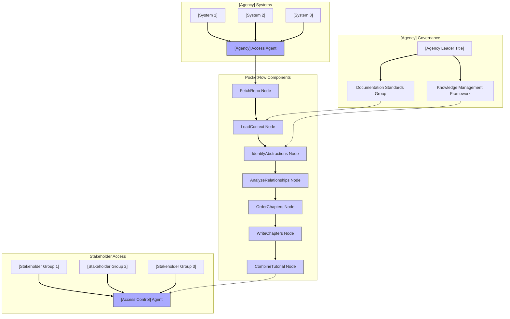

# PocketFlow Documentation Template System

## Overview
This document outlines a scalable approach for generating hundreds of agency-specific use cases for the PocketFlow Tutorial Codebase Knowledge system. The system will use a combination of templates and customization parameters to efficiently create unique documentation for each agency while maintaining consistent structure and quality.

## Template Structure
Each generated use case will follow a consistent structure:

```
# HMS Components + [Agency Name]: [System Type] Documentation Framework

**Agency Portal: [Portal URL]**

**Key Actors:**
- **[Actor 1]**: [Description]
- **[Actor 2]**: [Description]
- **[Actor 3]**: [Description]
- **[Actor 4]**: [Description]
- **[Actor 5]**: [Description]

For government personnel and leadership, visit: [gov-ai.co URL]  
For [stakeholder type] and developers, visit: [ai-gov.co URL]

## Introduction

[Agency] [manages/operates/coordinates] [description of agency systems and scope]. However, [agency] faces significant challenges in [primary documentation challenge], particularly when [specific constraint 1], [specific constraint 2], and [specific constraint 3] must be balanced. The PocketFlow Tutorial Codebase Knowledge system offers a transformative solution that can automatically analyze [domain]-focused codebases, identify core abstractions, and generate [adjective] documentation [that meets specific agency needs].

## Problem Statement

[Agency] faces critical challenges in documenting and maintaining knowledge about their technical systems:

* **[Challenge 1]** [brief explanation]
* **[Challenge 2]** [brief explanation]
* **[Challenge 3]** [brief explanation]
* **[Challenge 4]** [brief explanation]
* **[Challenge 5]** [brief explanation]
* **[Challenge 6]** [brief explanation]
* **[Challenge 7]** [brief explanation]
* **[Challenge 8]** [brief explanation]
* **[Challenge 9]** [brief explanation]
* **[Challenge 10]** [brief explanation]

These challenges create an environment where [critical systems become increasingly difficult to maintain/other consequences], potentially compromising [agency mission/operations/services].

### Stakeholders

* **[Stakeholder 1]:** [role and need]
* **[Stakeholder 2]:** [role and need]
* **[Stakeholder 3]:** [role and need]
* **[Stakeholder 4]:** [role and need]
* **[Stakeholder 5]:** [role and need]
* **[Stakeholder 6]:** [role and need]
* **[Stakeholder 7]:** [role and need]
* **[Stakeholder 8]:** [role and need]
* **[Stakeholder 9]:** [role and need]
* **[Stakeholder 10]:** [role and need]

### Political Gridlock Factors

* **[Factor 1]:** [brief explanation]
* **[Factor 2]:** [brief explanation]
* **[Factor 3]:** [brief explanation]
* **[Factor 4]:** [brief explanation]
* **[Factor 5]:** [brief explanation]
* **[Factor 6]:** [brief explanation]
* **[Factor 7]:** [brief explanation]
* **[Factor 8]:** [brief explanation]
* **[Factor 9]:** [brief explanation]
* **[Factor 10]:** [brief explanation]

### Value Opportunity

Implementing the PocketFlow Tutorial Codebase Knowledge system would unlock significant value for [Agency] by:

* **[Benefit 1]:** [X-Y%] [improvement metric]
* **[Benefit 2]:** [X-Y%] [improvement metric]
* **[Benefit 3]:** [X-Y%] [improvement metric]
* **[Benefit 4]:** [X-Y%] [improvement metric]
* **[Benefit 5]:** [X-Y%] [improvement metric]
* **[Benefit 6]:** [X-Y%] [improvement metric]
* **[Benefit 7]:** [X-Y%] [improvement metric]
* **[Benefit 8]:** [X-Y%] [improvement metric]
* **[Benefit 9]:** [X-Y%] [improvement metric]
* **[Benefit 10]:** [X-Y%] [improvement metric]



## HMS Solution

The HMS PocketFlow Tutorial Codebase Knowledge system provides [Agency] with an AI-driven solution for automatically analyzing [agency domain] systems and generating comprehensive, [domain-specific adjective] documentation. This solution bypasses traditional documentation bottlenecks while maintaining [key agency requirement] and enabling effective knowledge management across [agency scope].

### Bypassing Bottlenecks & Maintaining Attribution

[2 paragraphs explaining how PocketFlow helps this specific agency overcome documentation challenges]

### Mechanisms of Multi-Party Collaboration

[2 paragraphs explaining how PocketFlow enables collaboration between previously siloed groups within this agency context]

### The Power of 4th-Degree Connections

[2 paragraphs explaining how PocketFlow leverages 4th-degree connections in this agency's ecosystem]

### HMS-A2A Collaboration Agents

#### [Agent Name 1] ([Agent Acronym 1])

AGENT NAME: **[Agent Name 1] ([Agent Acronym 1])**  
FUNCTION: [What the agent does for this specific agency]  
INTELLIGENCE PATTERN: **[Pattern Type]**. [Explanation of pattern in this context]
INTERACTIONS: [How the agent interacts with other components]  
VALUE DELIVERY: [Specific value for this agency]

#### [Agent Name 2] ([Agent Acronym 2])

AGENT NAME: **[Agent Name 2] ([Agent Acronym 2])**  
FUNCTION: [What the agent does for this specific agency]  
INTELLIGENCE PATTERN: **[Pattern Type]**. [Explanation of pattern in this context]
INTERACTIONS: [How the agent interacts with other components]  
VALUE DELIVERY: [Specific value for this agency]

#### [Agent Name 3] ([Agent Acronym 3])

AGENT NAME: **[Agent Name 3] ([Agent Acronym 3])**  
FUNCTION: [What the agent does for this specific agency]  
INTELLIGENCE PATTERN: **[Pattern Type]**. [Explanation of pattern in this context]
INTERACTIONS: [How the agent interacts with other components]  
VALUE DELIVERY: [Specific value for this agency]

#### [Agent Name 4] ([Agent Acronym 4])

AGENT NAME: **[Agent Name 4] ([Agent Acronym 4])**  
FUNCTION: [What the agent does for this specific agency]  
INTELLIGENCE PATTERN: **[Pattern Type]**. [Explanation of pattern in this context]
INTERACTIONS: [How the agent interacts with other components]  
VALUE DELIVERY: [Specific value for this agency]

#### [Agent Name 5] ([Agent Acronym 5])

AGENT NAME: **[Agent Name 5] ([Agent Acronym 5])**  
FUNCTION: [What the agent does for this specific agency]  
INTELLIGENCE PATTERN: **[Pattern Type]**. [Explanation of pattern in this context]
INTERACTIONS: [How the agent interacts with other components]  
VALUE DELIVERY: [Specific value for this agency]

## Expected Outcomes

The implementation of the HMS PocketFlow Tutorial Codebase Knowledge system for [Agency] is expected to deliver:

1. **[Outcome 1]**: [Specific metrics and timeline]
2. **[Outcome 2]**: [Specific metrics and timeline]
3. **[Outcome 3]**: [Specific metrics and timeline]
4. **[Outcome 4]**: [Specific metrics and timeline]
5. **[Outcome 5]**: [Specific metrics and timeline]
6. **[Outcome 6]**: [Specific metrics and timeline]
7. **[Outcome 7]**: [Specific metrics and timeline]
8. **[Outcome 8]**: [Specific metrics and timeline]

## Chain of Recursive Thoughts Analysis

The [Agency] documentation solution emerges from a recursive thinking process that examines the challenge from multiple perspectives:

PERSPECTIVE: [Perspective 1]

THOUGHT: [Initial thought about approach]

CRITIQUE: [Critique of the initial thought]

REFINEMENT: [How the approach is refined based on critique]

SYNTHESIS: [Key insight from this perspective]

PERSPECTIVE: [Perspective 2]

THOUGHT: [Initial thought about approach]

CRITIQUE: [Critique of the initial thought]

REFINEMENT: [How the approach is refined based on critique]

SYNTHESIS: [Key insight from this perspective]

PERSPECTIVE: [Perspective 3]

THOUGHT: [Initial thought about approach]

CRITIQUE: [Critique of the initial thought]

REFINEMENT: [How the approach is refined based on critique]

SYNTHESIS: [Key insight from this perspective]

PERSPECTIVE: [Perspective 4]

THOUGHT: [Initial thought about approach]

CRITIQUE: [Critique of the initial thought]

REFINEMENT: [How the approach is refined based on critique]

SYNTHESIS: [Key insight from this perspective]

PERSPECTIVE: [Perspective 5]

THOUGHT: [Initial thought about approach]

CRITIQUE: [Critique of the initial thought]

REFINEMENT: [How the approach is refined based on critique]

SYNTHESIS: [Key insight from this perspective]

FINAL SYNTHESIS:

[3 paragraphs that bring together the insights from all perspectives and explain how the solution will address the agency's specific needs]
```

## Automation Approach
To generate use cases at scale, we will:

1. **Create Parameter Files**: For each agency, create a JSON file with all customization parameters:
   - Agency name, acronym, and type
   - System domain and specializations
   - Challenge set relevant to the agency
   - Stakeholder groups
   - Political factors
   - Expected benefits and metrics
   - Agent names and functions
   - Perspectives for recursive thought analysis

2. **Template Processing Script**: Develop a Python script that:
   - Takes the template and parameter file as input
   - Substitutes all placeholders with agency-specific values
   - Generates properly formatted Markdown
   - Saves to the appropriate directory structure

3. **Customization Depth Levels**:
   - Level 1: Basic substitution (agency name, domain)
   - Level 2: Context-aware substitution (domain-specific terminology)
   - Level 3: Structural adaptation (agency-specific sections)

4. **Quality Assurance**:
   - Automated validation of generated files
   - Manual review of representative samples
   - Consistency checks across agency types

## Parameter Categories

### Agency Parameters
- Full name
- Acronym
- Type (federal, state, international)
- Domain (health, transportation, etc.)
- Scale (staff size, budget, jurisdiction)
- Leadership structure

### System Parameters
- Primary systems
- Technology stack
- Modernization status
- Integration requirements
- Security classification
- User base size

### Documentation Challenges
- Legacy documentation status
- Knowledge transfer issues
- Regulatory requirements
- Technical complexity
- Resource constraints
- Current approach

### Political Context
- Oversight structure
- Budget process
- Interagency relationships
- Public visibility
- Reform initiatives
- Compliance frameworks

### Value Metrics
- Efficiency gains
- Cost savings
- Risk reduction
- Service improvement
- Staff productivity
- Compliance enhancement

## Implementation Plan
1. Develop and test template with 5 diverse agencies
2. Refine parameters based on test results
3. Create parameter files for all agencies
4. Develop and test automation script
5. Generate first batch (federal agencies)
6. Review and refine
7. Generate second batch (state agencies)
8. Review and refine
9. Generate third batch (international agencies)
10. Final QA and publication

This approach will allow us to efficiently generate hundreds of high-quality, consistent yet customized use cases that demonstrate how PocketFlow can address the specific documentation needs of different government agencies.