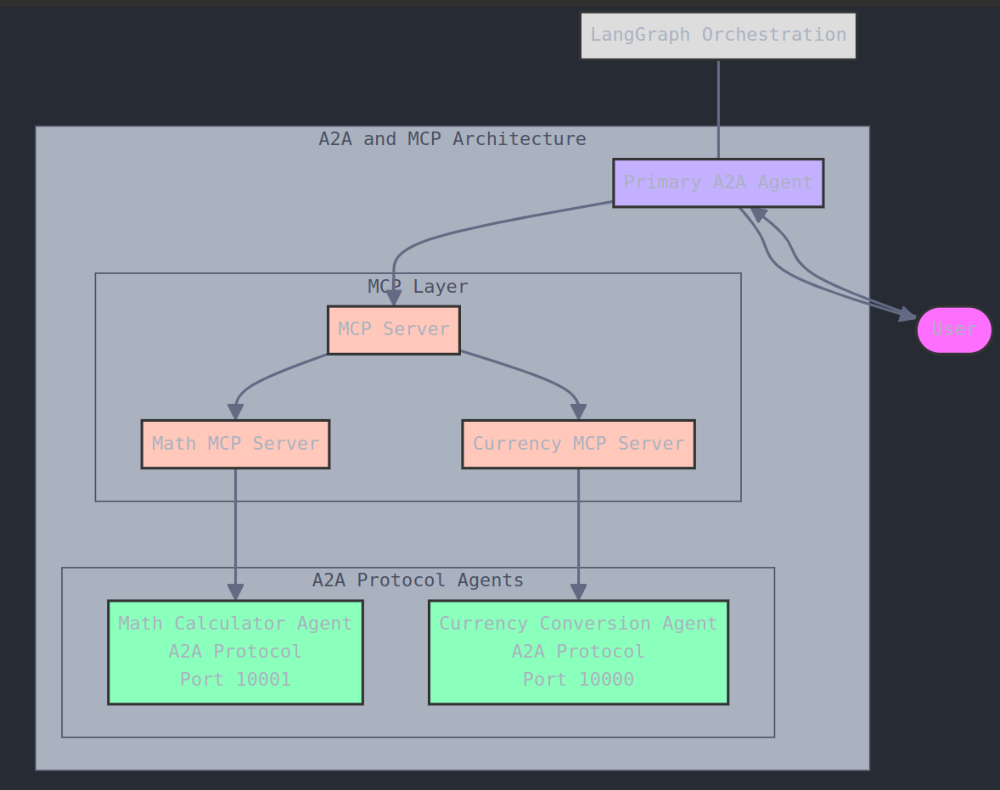

# HMS-A2A Integration with HMS-SVC

This document provides information about the integration between HMS-A2A (Agent-to-Agent framework) and HMS-SVC (Program Management API), including Chain of Recursive Thoughts (CoRT) enhanced capabilities.

## Integration Architecture

The integration is built on four main components:

1. **HMS-SVC Client** - A Python client for the HMS-SVC API
2. **HMS-SVC MCP Tools** - MCP-compatible tools exposing HMS-SVC functionality
3. **Government Agent System** - Specialized agents for government agencies
4. **Chain of Recursive Thoughts (CoRT)** - Enhanced reasoning capabilities for complex decisions



## HMS-SVC Overview

HMS-SVC is a Laravel-based API that provides structured program and protocol management. Key entities include:

- **Programs** - Top-level entities representing a series of government/NGO engagements
- **Protocols** - Step-by-step workflows within programs
- **Modules** - Specialized components used within protocols for various purposes:
  - Assessment: Collect and evaluate information
  - KPI: Track key performance indicators
  - Nudge: Send notifications and reminders
  - And more

## Integration Components

### HMS-SVC Client

The `HMSSVCClient` provides direct API access to HMS-SVC:

```python
from integration import HMSSVCClient

# Create a client
client = HMSSVCClient(
    base_url="https://api.hms-svc.example.com",
    api_token="your_api_token"
)

# Create a program
program = await client.create_program(
    name="Benefit Application Process",
    description="Application workflow for citizen benefits"
)
```

### MCP Tools

The integration provides several MCP tools:

1. **Program Tool** (`hms_svc_program`) - Manage program entities
2. **Protocol Tool** (`hms_svc_protocol`) - Manage workflow protocols
3. **Module Tool** (`hms_svc_module`) - Access specialized modules
4. **Workflow Tool** (`hms_svc_workflow`) - Create and manage complete workflows
5. **Specialized Module Tools** - Tools for specific module types:
   - `hms_svc_assessment` - Assessment modules
   - `hms_svc_kpi` - KPI tracking modules
   - `hms_svc_nudge` - Notification modules

### Integration with Government Agents

The integration works seamlessly with the Government Agent System:

1. Government agents provide agency-specific knowledge and capabilities
2. HMS-SVC integration provides structured workflow management
3. Together, they enable end-to-end civilian assistance with programs

## Example Use Cases

### Small Business Loan Application

1. SBA Government Agent provides domain expertise about loan requirements
2. HMS-SVC Program manages the application workflow:
   - Eligibility pre-screening protocol
   - Document collection protocol
   - Application review protocol
3. HMS-SVC Modules handle specific functionality:
   - Assessment modules evaluate eligibility
   - KPI modules track application progress
   - Nudge modules send reminders about missing documents

### Benefits Enrollment

1. HHS Government Agent provides information about benefit programs
2. HMS-SVC Program manages the enrollment workflow:
   - Initial screening protocol
   - Document verification protocol
   - Approval and enrollment protocol
3. HMS-SVC Modules handle specific steps:
   - Assessment modules determine eligibility
   - Document modules collect required paperwork
   - Checkpoint modules ensure completeness

## Implementation

The integration is implemented in the `integration/` directory:

- `hms_svc_integration.py` - Core client and data models
- `hms_svc_mcp_tools.py` - MCP tool implementations

To use the integration with CoRT-enhanced reasoning:

```python
from integration import register_hms_svc_tools
from graph.a2a_tools import ToolRegistry
from graph.cort_react_agent import CoRTReactAgent

# Create and register tools
registry = ToolRegistry()
tools = register_hms_svc_tools(
    registry=registry,
    base_url="https://api.hms-svc.example.com",
    api_token="your_api_token"
)

# Create a CoRT-enhanced agent with access to these tools
agent = CoRTReactAgent(
    name="program_assistant",
    registry=registry,
    system_message="You help civilians navigate government programs.",
    use_cort=True,
    max_rounds=3,
    generate_alternatives=3,
    dynamic_rounds=True
)

# Execute with enhanced reasoning for critical program decisions
result = await agent.invoke(
    {"messages": [("human", "I need help determining my eligibility for the small business disaster loan")]},
    prompt_instructions="Consider all eligibility factors and potential documentation issues"
)

# Access the thinking trace for auditing
thinking_trace = result.get("thinking_trace", [])
```

### CoRT-Enhanced Program Evaluation

For complex program decisions, you can leverage the recursive thinking capabilities:

```python
from integration import HMSSVCClient, CoRTEnhancedProgramEvaluator

# Create client
client = HMSSVCClient(base_url="https://api.hms-svc.example.com", api_token="your_token")

# Create CoRT-enhanced evaluator
evaluator = CoRTEnhancedProgramEvaluator(
    client=client,
    max_rounds=3,
    generate_alternatives=3
)

# Evaluate a complex program decision
result = await evaluator.evaluate_program_eligibility(
    program_id="sba_disaster_loan",
    applicant_data={
        "business_size": "small",
        "disaster_zone": True,
        "credit_score": 650,
        "years_in_business": 2.5
    },
    prompt_instructions="Consider both standard eligibility and potential exceptions"
)

# Check the result with full reasoning trace
eligibility = result["eligibility_status"]  # "eligible", "ineligible", or "needs_review"
explanation = result["explanation"]
thinking_trace = result["thinking_trace"]
```

## Benefits

The integration provides several key benefits:

1. **Compliance** - Ensures processes follow required government procedures
2. **Personalization** - Provides AI assistance tailored to individual needs
3. **Efficiency** - Automates routine tasks and document collection
4. **Transparency** - Tracks progress and provides status updates
5. **Engagement** - Sends timely reminders and notifications
6. **Enhanced Reasoning** - Uses CoRT to improve decision quality in complex cases
7. **Auditability** - Provides complete thinking traces for all decisions
8. **Multi-perspective Analysis** - Considers alternatives before making recommendations

## Future Enhancements

Planned enhancements to the integration include:

1. **Workflow Templates** - Pre-defined templates for common government processes
2. **Document Processing** - AI-assisted document completion and verification
3. **Progress Analytics** - Detailed metrics on process completion rates
4. **Multi-Agency Workflows** - Processes that span multiple government agencies
5. **Mobile Notifications** - Push notifications for mobile devices
6. **Advanced CoRT Integration** - Enhanced recursive reasoning for all critical government decisions
7. **Human Review System** - Flagging of decisions requiring human review based on CoRT uncertainty
8. **Multi-rounds Decision Evaluations** - Allowing decisions to be refined through multiple rounds of thinking
9. **Cross-domain Reasoning** - Using CoRT to integrate expertise across multiple government domains