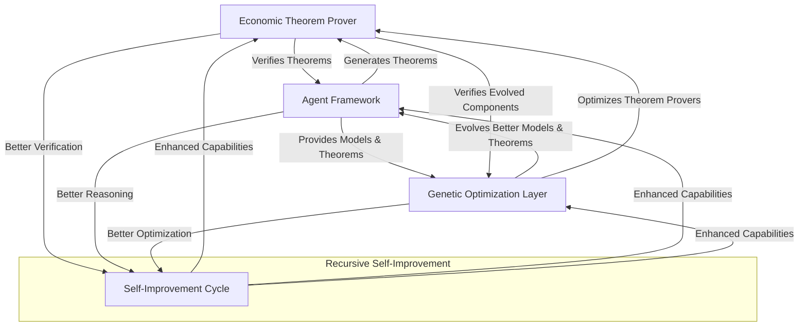

# Unified Economic Theorem Prover & HMS Integration Plan

## 1. Executive Summary

This document outlines a comprehensive plan to unify the Economic Theorem Proving with Genetic Agents system (ETP-GA) with the broader Health Monitoring System (HMS) architecture. The integration will leverage both systems' strengths: HMS's robust supervisor architecture, self-healing capabilities, and verification frameworks combined with ETP-GA's specialized genetic agent-based theorem proving capabilities.

The unified system will serve as a powerful example of HMS's ability to orchestrate complex, specialized agent ecosystems while maintaining compliance, reliability, and performance. The economic theorem proving capabilities will enhance HMS's ability to reason about and verify economic models, policies, and resource allocation mechanisms.

## 2. Current State Analysis

### 2.1 Systems Overview

#### Economic Theorem Prover with Genetic Agents (ETP-GA)
- **Core Purpose**: Automated proving of economic theorems using genetic algorithms
- **Key Components**:
  - Base genetic agent architecture (`/genetic_theorem_prover/core/base_agent.py`)
  - Population management (`/genetic_theorem_prover/evolution/population_manager.py`)
  - Specialized agents (`/genetic_theorem_prover/agents/specialized_agents.py`)
  - Theorem repository (`/genetic_theorem_prover/repository/theorem_repository.py`)
  - Decomposition engine (`/genetic_theorem_prover/core/theorem_decomposer.py`)
  - DeepSeek integration (`/genetic_theorem_prover/core/deepseek_prover.py`)
  - CoRT integration (`/genetic_theorem_prover/core/cort_integration.py`)
  - Evaluation framework (`/genetic_theorem_prover/evaluation/`)

#### Health Monitoring System (HMS)
- **Core Purpose**: Resilient, policy-compliant, and auditable multi-agent platform
- **Key Components**:
  - Unified Supervisor (agent lifecycle and orchestration)
  - Verification & Compliance Engine
  - Policy Engine
  - Agent Core (HMS-AGT) and Skills (HMS-AGX)
  - Multi-Agent Collaboration (MAC)
  - A2A Communication Protocol
  - Self-Healing Module
  - Foreign Function Interface (FFI) Layer
  - Data Repository and Knowledge Base

### 2.2 Architectural Alignment Analysis

| Aspect | ETP-GA | HMS | Alignment Gap |
|--------|--------|-----|---------------|
| Agent Model | Genetic agents with traits and fitness | Core identity (AGT) + pluggable skills (AGX) | Medium - Genetic traits need mapping to AGT/AGX paradigm |
| Orchestration | Population manager & evolution | Supervisor service with lifecycle management | Medium - Evolution process needs supervisor integration |
| Communication | Direct function calls | A2A protocol and gRPC | High - Protocol translation needed |
| Verification | DeepSeek-Prover integration | Verification & Compliance Engine | Low - Both focus on formal verification |
| Knowledge Storage | Theorem repository | Central data repository + Knowledge base | Low - Domain-specific schema extension needed |
| Self-Healing | Limited | Comprehensive detect-diagnose-act loop | High - ETP-GA needs self-healing capabilities |
| Evaluation | Comprehensive metrics framework | Telemetry via Prometheus/Grafana | Medium - Metric integration needed |

### 2.3 Code Structure Analysis

```
ETP-GA Structure                                HMS Target Structure
-------------------                             -------------------
genetic_theorem_prover/                         hms-components/
  ├── core/                                       ├── hms-supervisor/  
  │   ├── base_agent.py                           ├── hms-verification/
  │   ├── theorem_decomposer.py                   ├── hms-policy/
  │   ├── deepseek_prover.py                      ├── hms-agt/
  │   └── cort_integration.py                     ├── hms-agx/
  ├── evolution/                                  │   └── genetic-theorem-proving/
  │   └── population_manager.py                   ├── hms-data/
  ├── agents/                                     ├── hms-knowledge/
  │   └── specialized_agents.py                   ├── hms-a2a/
  ├── repository/                                 ├── hms-self-healing/
  │   ├── theorem_repository.py                   └── hms-ffi/
  │   └── repository_analyzer.py
  ├── utils/
  │   └── theorem_exporter.py
  └── evaluation/
      ├── metrics.py
      ├── benchmark.py
      └── visualization.py
```

## 3. Integration Strategy

### 3.1 Architecture Integration

The integration will follow HMS's component-based architecture, with ETP-GA capabilities exposed as specialized agents and skills within the HMS ecosystem:

```
graph TD
    Supervisor[HMS Supervisor]
    VerifEngine[Verification Engine]
    PolicyEngine[Policy Engine]
    DataRepo[Data Repository]
    KB[Knowledge Base]
    
    AGT[HMS-AGT Core]
    GeneticAGT[Genetic Agent Core]
    TheoremAGX[Theorem Proving Skills]
    MAC[Multi-Agent Collaboration]
    
    PopManager[Population Manager Service]
    TheoremRepo[Theorem Repository Service]
    DeepSeek[DeepSeek Verification Service]
    
    SelfHeal[Self-Healing Module]
    FFI[FFI Layer]
    
    Supervisor --> AGT
    Supervisor --> PopManager
    Supervisor --> VerifEngine
    Supervisor --> PolicyEngine
    
    AGT --> GeneticAGT
    GeneticAGT --> TheoremAGX
    GeneticAGT --> MAC
    
    PopManager --> DataRepo
    TheoremRepo --> DataRepo
    TheoremRepo --> KB
    
    VerifEngine --> DeepSeek
    
    SelfHeal --> AGT
    SelfHeal --> PopManager
    
    FFI --> GeneticAGT
    FFI --> TheoremAGX
    FFI --> PopManager
    
    classDef core fill:#f9f,stroke:#333,stroke-width:2px;
    classDef agent fill:#bbf,stroke:#333,stroke-width:2px;
    classDef theorem fill:#bfb,stroke:#333,stroke-width:2px;
    
    class Supervisor,VerifEngine,PolicyEngine,DataRepo,KB core;
    class AGT,GeneticAGT,TheoremAGX,MAC agent;
    class PopManager,TheoremRepo,DeepSeek theorem;
```

### 3.2 Integration Approaches by Component

#### 3.2.1 Genetic Agent Model Integration

**Approach**: Extend HMS-AGT with genetic capabilities and implement theorem-proving skills as HMS-AGX modules.

**Key Tasks**:
1. Create a `GeneticAgentTrait` in HMS-AGT that adds genetic properties to base agents
2. Implement the genetic operations (mutation, crossover, selection) as core HMS-AGT methods
3. Develop specialized theorem proving tactics as HMS-AGX skills
4. Maintain the genetic fitness model within the agent state

**Code Transition**:
- `base_agent.py` → HMS-AGT extension with genetic traits
- `specialized_agents.py` → HMS-AGX skills modules

#### 3.2.2 Population Management Integration

**Approach**: Implement the Population Manager as a specialized HMS Supervisor service.

**Key Tasks**:
1. Create a `PopulationManagerService` that extends the HMS Supervisor
2. Implement evolution algorithms that operate on agent populations
3. Expose population metrics through the HMS telemetry system
4. Enable the service to be controlled via A2A messages

**Code Transition**:
- `population_manager.py` → HMS Supervisor extension service

#### 3.2.3 Theorem Repository Integration

**Approach**: Extend HMS's Data Repository and Knowledge Base with theorem-specific schemas.

**Key Tasks**:
1. Design theorem storage schema for the HMS Data Repository
2. Implement theorem relationships as a graph structure in the Knowledge Base
3. Create repository services that provide theorem access APIs
4. Implement search and analysis capabilities on top of HMS data services

**Code Transition**:
- `theorem_repository.py` → HMS Data Repository service extension
- `repository_analyzer.py` → HMS Knowledge service extension

#### 3.2.4 Verification Integration

**Approach**: Integrate theorem verification with HMS's Verification Engine.

**Key Tasks**:
1. Add DeepSeek-Prover as a verification provider in the HMS Verification Engine
2. Implement verification workflows for economic theorems
3. Create policy rules for theorem proving correctness
4. Establish verification metrics and reporting

**Code Transition**:
- `deepseek_prover.py` → HMS Verification Engine provider

#### 3.2.5 Self-Healing Integration

**Approach**: Extend HMS's Self-Healing module to handle theorem proving failures.

**Key Tasks**:
1. Define failure modes for theorem proving (non-convergence, resource exhaustion, etc.)
2. Create diagnostic agents for theorem proving failures
3. Implement recovery strategies (population reset, agent mutation, theorem decomposition)
4. Develop automatic feedback loops for genetic algorithm parameters

**Code Transition**:
- New code based on HMS Self-Healing patterns, using ETP-GA evaluation metrics

#### 3.2.6 Evaluation Framework Integration

**Approach**: Map ETP-GA's evaluation metrics to HMS's telemetry system.

**Key Tasks**:
1. Define Prometheus metrics for theorem proving performance
2. Create Grafana dashboards for genetic algorithm visualization
3. Implement benchmark jobs as HMS workflow specifications
4. Extend the HMS reporting system with theorem-specific insights

**Code Transition**:
- `metrics.py`, `benchmark.py`, `visualization.py` → HMS telemetry extensions

### 3.3 FFI Strategy for Language Interoperability

The ETP-GA system (primarily Python) will integrate with HMS core services (primarily Rust) through the HMS-FFI layer:

**Approach**:
1. Use PyO3 for Rust → Python interoperability
2. Define clear API boundaries between the systems
3. Implement efficient serialization for genetic algorithm data structures
4. Create Rust abstractions for Python genetic operations

**Key FFI Interfaces**:
```rust
// Rust FFI interface examples
pub trait GeneticAgentFFI {
    fn get_genotype(&self) -> PyResult<PyObject>;
    fn set_genotype(&mut self, genotype: PyObject) -> PyResult<()>;
    fn calculate_fitness(&self, theorem_id: &str) -> PyResult<f64>;
    fn mutate(&mut self, rate: f64) -> PyResult<()>;
    fn crossover(&mut self, other_agent: &GeneticAgentFFI) -> PyResult<PyObject>;
}

pub trait TheoremRepositoryFFI {
    fn get_theorem(&self, id: &str) -> PyResult<PyObject>;
    fn add_theorem(&mut self, theorem: PyObject) -> PyResult<String>;
    fn find_related_theorems(&self, id: &str) -> PyResult<Vec<String>>;
}
```

## 4. Implementation Roadmap

### 4.1 Phase 1: Foundation (Weeks 1-6)

**Objective**: Establish core integration patterns and basic interoperability.

**Key Deliverables**:
1. HMS-compatible genetic agent trait definition
2. Basic FFI layer for genetic operations
3. Theorem repository schema for HMS data store
4. Initial A2A message definitions for theorem proving
5. Proof-of-concept integration of one simple theorem proving workflow

**Task Breakdown**:

| Week | Tasks | Owner |
|------|-------|-------|
| 1-2 | Define genetic agent trait specification and FFI interfaces | Architecture Team |
| 3-4 | Implement basic theorem repository in HMS data store | Data Team |
| 5-6 | Create proof-of-concept workflow with A2A messaging | Integration Team |

### 4.2 Phase 2: Core Systems (Weeks 7-12)

**Objective**: Implement key ETP-GA capabilities as HMS services.

**Key Deliverables**:
1. Population Manager Supervisor service
2. Theorem Repository service
3. DeepSeek verification provider
4. Specialized genetic agent skills (AGX modules)
5. Telemetry integration for genetic algorithm metrics

**Task Breakdown**:

| Week | Tasks | Owner |
|------|-------|-------|
| 7-8 | Implement Population Manager service & genetic agent core | Agent Team |
| 9-10 | Create specialized theorem proving skills as AGX modules | Skills Team |
| 11-12 | Integrate DeepSeek verification & telemetry | Verification Team |

### 4.3 Phase 3: Integration & Self-Healing (Weeks 13-18)

**Objective**: Complete full system integration with self-healing capabilities.

**Key Deliverables**:
1. Full A2A workflow for theorem proving
2. Self-healing strategies for theorem proving failures
3. Advanced theorem decomposition as a service
4. Comprehensive benchmark suite integrated with HMS workflows
5. End-to-end verification of complex economic theorems

**Task Breakdown**:

| Week | Tasks | Owner |
|------|-------|-------|
| 13-14 | Implement full A2A workflow for complex theorem proving | Integration Team |
| 15-16 | Develop self-healing strategies for theorem proving | Self-Healing Team |
| 17-18 | Create comprehensive benchmarking and advanced decomposition | Performance Team |

### 4.4 Phase 4: Advanced Learning (Weeks 19-24)

**Objective**: Enhance the integrated system with advanced learning capabilities.

**Key Deliverables**:
1. Meta-evolution controller for genetic parameters
2. Reinforcement learning integration with genetic algorithms
3. Adaptive theorem decomposition strategies
4. Collaborative multi-agent theorem proving
5. Proof pattern library and knowledge transfer

**Task Breakdown**:

| Week | Tasks | Owner |
|------|-------|-------|
| 19-20 | Implement meta-evolution and RL integration | ML Team |
| 21-22 | Develop adaptive decomposition strategies | Algorithm Team |
| 23-24 | Create collaborative proving and pattern library | Collaboration Team |

### 4.5 Phase 5: Production & Optimization (Weeks 25-30)

**Objective**: Prepare the integrated system for production use with optimized performance.

**Key Deliverables**:
1. Performance-optimized genetic operations
2. Scalable theorem proving on distributed infrastructure
3. Production-ready deployment configurations
4. Documentation and training materials
5. Real-world economic theorem corpus

**Task Breakdown**:

| Week | Tasks | Owner |
|------|-------|-------|
| 25-26 | Optimize genetic operations and theorem proving performance | Performance Team |
| 27-28 | Create production deployment configurations and documentation | DevOps Team |
| 29-30 | Develop comprehensive economic theorem corpus | Domain Experts |

## 5. Technical Specifications

### 5.1 Genetic Agent HMS-AGT Extension

```rust
// HMS-AGT extension for genetic agents
pub struct GeneticAgentTrait {
    genotype: Vec<Gene>,
    mutation_rate: f32,
    crossover_rate: f32,
    fitness_history: Vec<f32>,
    generation: u32,
}

impl AgentTrait for GeneticAgentTrait {
    fn initialize(&mut self, config: AgentConfig) -> Result<(), AgentError> {
        // Initialize genetic properties from config
        self.mutation_rate = config.get_f32("mutation_rate").unwrap_or(0.1);
        self.crossover_rate = config.get_f32("crossover_rate").unwrap_or(0.7);
        self.genotype = self.initialize_random_genotype();
        self.generation = 0;
        self.fitness_history = Vec::new();
        Ok(())
    }
    
    fn handle_message(&mut self, message: AgentMessage) -> Result<AgentResponse, AgentError> {
        match message.operation.as_str() {
            "mutate" => self.perform_mutation(),
            "crossover" => self.perform_crossover(message.payload),
            "evaluate_fitness" => self.evaluate_fitness(message.payload),
            // Other operations
            _ => Err(AgentError::UnsupportedOperation),
        }
    }
}
```

### 5.2 Population Manager Supervisor Service

```rust
// Population Manager Supervisor Service
pub struct PopulationManagerService {
    supervisor: SupervisorBase,
    population: Vec<AgentId>,
    population_config: PopulationConfig,
    evolution_state: EvolutionState,
}

impl SupervisorTrait for PopulationManagerService {
    fn initialize(&mut self, config: SupervisorConfig) -> Result<(), SupervisorError> {
        self.supervisor.initialize(config)?;
        self.population_config = self.load_population_config();
        self.evolution_state = EvolutionState::Initializing;
        
        // Initialize the initial population
        self.initialize_population()?;
        
        Ok(())
    }
    
    fn handle_control_message(&mut self, message: ControlMessage) -> Result<ControlResponse, SupervisorError> {
        match message.operation.as_str() {
            "evolve_generation" => self.evolve_generation(),
            "reset_population" => self.reset_population(),
            "get_population_stats" => self.get_population_stats(),
            // Other operations
            _ => self.supervisor.handle_control_message(message),
        }
    }
}
```

### 5.3 Theorem Repository Data Schema

```rust
// Theorem Repository Data Schema
pub struct Theorem {
    id: String,
    statement: String,
    area: String,
    complexity: f32,
    formal_representation: Option<String>,
    dependencies: Vec<String>,
    proof_status: ProofStatus,
    created_at: DateTime<Utc>,
    updated_at: DateTime<Utc>,
}

pub struct Proof {
    id: String,
    theorem_id: String,
    proof_steps: Vec<ProofStep>,
    verification_status: VerificationStatus,
    agent_id: String,
    metrics: ProofMetrics,
    created_at: DateTime<Utc>,
}

pub struct ProofStep {
    step_number: u32,
    tactic: String,
    goal_state_before: String,
    goal_state_after: String,
    local_context: HashMap<String, String>,
}
```

### 5.4 A2A Protocol Extensions for Theorem Proving

```protobuf
// A2A Protocol extensions for theorem proving
syntax = "proto3";

message TheoremProvingTask {
    string task_id = 1;
    string theorem_id = 2;
    TheoremProvingStrategy strategy = 3;
    repeated string available_lemmas = 4;
    uint32 max_steps = 5;
    float timeout_seconds = 6;
}

message TheoremProvingResult {
    string task_id = 1;
    string theorem_id = 2;
    bool success = 3;
    repeated ProofStep steps = 4;
    ProofMetrics metrics = 5;
    string proof_id = 6;
}

message ProofStep {
    uint32 step_number = 1;
    string tactic = 2;
    string goal_state_before = 3;
    string goal_state_after = 4;
    map<string, string> local_context = 5;
}

message TheoremProvingStrategy {
    enum StrategyType {
        DIRECT = 0;
        DECOMPOSITION = 1;
        GENETIC = 2;
        HYBRID = 3;
    }
    
    StrategyType type = 1;
    map<string, string> parameters = 2;
}

message ProofMetrics {
    float correctness_score = 1;
    float completeness_score = 2;
    float elegance_score = 3;
    uint32 steps_count = 4;
    uint32 lemmas_count = 5;
    uint32 axioms_count = 6;
    uint32 depth = 7;
    float time_to_prove = 8;
}
```

### 5.5 Self-Healing Strategies for Theorem Proving

```yaml
# Self-healing configuration for theorem proving
self_healing:
  failure_detectors:
    - name: "non_convergence_detector"
      description: "Detects when the genetic algorithm is not converging"
      conditions:
        - metric: "population.best_fitness"
          window: "10 generations"
          pattern: "no_improvement"
          threshold: 0.01
      actions:
        - type: "mutate_population"
          parameters:
            mutation_rate: 0.5
            target: "worst_performers"
            percentage: 0.3
    
    - name: "resource_exhaustion_detector"
      description: "Detects when theorem proving is consuming excessive resources"
      conditions:
        - metric: "system.cpu_usage"
          window: "5 minutes"
          pattern: "above_threshold"
          threshold: 0.9
      actions:
        - type: "decompose_theorem"
          parameters:
            max_subtheorems: 5
            strategy: "complexity_based"
    
    - name: "verification_failure_detector"
      description: "Detects repeated verification failures"
      conditions:
        - metric: "verification.failure_count"
          window: "proof_attempt"
          pattern: "above_threshold"
          threshold: 3
      actions:
        - type: "switch_verification_strategy"
          parameters:
            new_strategy: "incremental"
            timeout_multiplier: 1.5
```

## 6. Documentation & Knowledge Transfer Plan

### 6.1 Documentation Deliverables

1. **Architecture Documentation**
   - Integrated architecture diagrams
   - Component interaction specifications
   - Data flow and state transition models

2. **API Documentation**
   - HMS-AGT genetic trait interfaces
   - Population Manager Supervisor APIs
   - Theorem Repository service interfaces
   - A2A protocol message specifications

3. **Development Guides**
   - How to develop new genetic agent skills
   - Guide to implementing theorem proving strategies
   - Performance optimization guidelines
   - Troubleshooting and debugging

4. **Operational Documentation**
   - Deployment configurations
   - Monitoring and alerting setup
   - Backup and recovery procedures
   - Performance tuning recommendations

### 6.2 Knowledge Transfer Sessions

1. **Technical Overview Sessions**
   - Economic theorem proving concepts
   - Genetic algorithm fundamentals
   - HMS architecture and integration patterns
   - Verification and formal proof systems

2. **Hands-on Workshops**
   - Developing genetic agent skills
   - Creating and managing theorem repositories
   - Setting up theorem proving workflows
   - Using the evaluation and benchmark tools

3. **Code Walkthroughs**
   - Genetic agent implementation details
   - Population management algorithms
   - Theorem decomposition strategies
   - Self-healing mechanism deep-dive

## 7. Risk Management

| Risk | Probability | Impact | Mitigation Strategy |
|------|------------|--------|---------------------|
| Complexity of integrating genetic algorithms with HMS | High | Medium | Create clean abstractions with clear FFI boundaries; start with simplified genetic models |
| Performance degradation due to FFI overhead | Medium | High | Benchmark early; move critical operations to the same language; optimize serialization |
| Theorem proving scalability | Medium | High | Implement distributed proving techniques; optimize decomposition strategies |
| Knowledge gap between teams | High | Medium | Conduct cross-training sessions; establish collaborative development practices |
| Integration complexity exceeding timeline | Medium | High | Prioritize core capabilities; use phased approach with clear milestones |
| Self-healing false positives | Medium | Medium | Implement gradual rollout with human verification; tune thresholds based on real data |

## 8. Success Criteria

1. **Functional Integration**
   - All ETP-GA capabilities available through HMS interfaces
   - Theorem proving workflows executable via HMS Supervisor
   - Verification of proofs through HMS Verification Engine
   - Self-healing recovery from theorem proving failures

2. **Performance Metrics**
   - Minimal overhead (<10%) compared to standalone ETP-GA
   - Successful proving of complex economic theorems
   - Scalability to handle large theorem repositories
   - Reliable operation with automated recovery

3. **Code Quality**
   - Clean separation of concerns between components
   - Clear and documented interfaces
   - Comprehensive test coverage
   - Maintainable and extensible code structure

4. **Documentation & Knowledge**
   - Complete architectural documentation
   - Comprehensive API specifications
   - Detailed developer guides
   - Knowledge successfully transferred to all teams

## 9. Recursive Self-Improvement Mechanism

A critical aspect of the Economic Theorem Prover system is its recursive self-improvement capability. This mechanism enables the system to continuously evolve and improve without requiring explicit reprogramming, creating a virtuous cycle of enhancement across all system components.

### 9.1 Self-Improvement Architecture

The recursive self-improvement process operates across the three main layers of the system - the theorem prover, agent framework, and genetic optimization layer:



### 9.2 Self-Improvement Mechanisms

#### 9.2.1 Theorem Quality Improvement

The system continuously improves the quality of theorems through a feedback loop:

1. **Generation**: HMS-AGT agents generate candidate economic theorems
2. **Verification**: The theorem prover verifies them, providing feedback
3. **Evolution**: Genetic algorithms evolve better theorem structures
4. **Learning**: Agents incorporate successful patterns into future generation

**Implementation Components**:
```rust
// Self-improving theorem quality framework
pub struct TheoremQualityImprovement {
    // Track theorem success history
    theorem_history: TheoremHistory,
    
    // Pattern recognition for successful theorems
    pattern_recognizer: TheoremPatternRecognizer,
    
    // Feedback channels to genetic algorithms
    genetic_feedback: GeneticFeedback,
    
    // Agent learning channels
    agent_learning: AgentLearningChannel,
}

impl TheoremQualityImprovement {
    // Process verification results to improve theorem generation
    pub fn process_verification_result(&mut self, theorem: &Theorem, result: &VerificationResult) {
        // Record result in history
        self.theorem_history.record(theorem, result);
        
        // Extract patterns from successful theorems
        if result.verified {
            let patterns = self.pattern_recognizer.extract_patterns(theorem);
            
            // Provide feedback to genetic algorithms
            self.genetic_feedback.provide_successful_patterns(patterns.clone());
            
            // Provide learning to agents
            self.agent_learning.provide_successful_patterns(patterns);
        }
    }
    
    // Get improvement metrics
    pub fn get_improvement_metrics(&self) -> ImprovementMetrics {
        let success_rate_trend = self.theorem_history.calculate_success_rate_trend();
        let complexity_trend = self.theorem_history.calculate_complexity_trend();
        let pattern_diversity = self.pattern_recognizer.calculate_pattern_diversity();
        
        ImprovementMetrics {
            success_rate_trend,
            complexity_trend,
            pattern_diversity,
        }
    }
}
```

#### 9.2.2 Model Quality Improvement

The system evolves economic models through formal verification and genetic optimization:

1. **Model Analysis**: Agents analyze economic models for formal properties
2. **Property Verification**: The theorem prover verifies model properties
3. **Model Evolution**: Genetic algorithms evolve improved models
4. **Property Learning**: The system builds a library of verified properties

**Implementation Components**:
```rust
// Self-improving model quality framework
pub struct ModelQualityImprovement {
    // Model property database
    property_database: ModelPropertyDatabase,
    
    // Model evolution engine
    model_evolution: ModelEvolutionEngine,
    
    // Property verification tracker
    verification_tracker: PropertyVerificationTracker,
    
    // Cross-model learning system
    cross_model_learning: CrossModelLearningSystem,
}

impl ModelQualityImprovement {
    // Process model verification to improve models
    pub fn process_model_verification(&mut self, model: &EconomicModel, properties: &[VerifiedProperty]) {
        // Record properties in database
        for property in properties {
            self.property_database.record_property(model, property);
        }
        
        // Track verification results
        self.verification_tracker.record_verification(model, properties);
        
        // Perform cross-model learning
        let learned_patterns = self.cross_model_learning.learn_from_verification(model, properties);
        
        // Evolve models based on verification
        self.model_evolution.evolve_based_on_verification(model, properties, learned_patterns);
    }
    
    // Generate model improvement suggestions
    pub fn generate_improvement_suggestions(&self, model: &EconomicModel) -> Vec<ModelImprovement> {
        // Analyze model against database
        let property_gaps = self.property_database.find_property_gaps(model);
        
        // Generate improvements based on successful models
        let pattern_improvements = self.cross_model_learning.suggest_improvements(model);
        
        // Generate evolutionary improvements
        let evolutionary_improvements = self.model_evolution.suggest_improvements(model);
        
        // Combine and prioritize improvements
        combine_and_prioritize_improvements(property_gaps, pattern_improvements, evolutionary_improvements)
    }
}
```

#### 9.2.3 Reasoning Improvement

The system enhances agent reasoning capabilities through feedback from formal verification:

1. **Formal Reasoning**: Agents apply economic reasoning to problems
2. **Reasoning Verification**: The theorem prover verifies reasoning chains
3. **Strategy Evolution**: Genetic algorithms evolve improved reasoning strategies
4. **Adoption**: Successful strategies are incorporated into agent reasoning

**Implementation Components**:
```rust
// Self-improving reasoning framework
pub struct ReasoningImprovement {
    // Reasoning strategy repository
    strategy_repository: ReasoningStrategyRepository,
    
    // Strategy evolution engine
    strategy_evolution: StrategyEvolutionEngine,
    
    // Verification feedback system
    verification_feedback: VerificationFeedbackSystem,
    
    // Agent reasoning enhancement
    reasoning_enhancement: AgentReasoningEnhancement,
}

impl ReasoningImprovement {
    // Process reasoning verification
    pub fn process_reasoning_verification(&mut self, reasoning: &ReasoningChain, result: &VerificationResult) {
        // Record result
        self.verification_feedback.record_result(reasoning, result);
        
        // Extract strategy from reasoning
        let strategy = self.strategy_repository.extract_strategy(reasoning);
        
        // Update strategy success metrics
        self.strategy_repository.update_success_metrics(&strategy, result);
        
        // Evolve strategies based on results
        if result.verified {
            self.strategy_evolution.reinforce_successful_strategy(&strategy);
        } else {
            self.strategy_evolution.evolve_alternative_to_failed_strategy(&strategy, result);
        }
        
        // Enhance agent reasoning
        self.reasoning_enhancement.update_based_on_verification(reasoning, result);
    }
    
    // Get optimal reasoning strategy for a problem
    pub fn get_optimal_strategy(&self, problem: &EconomicProblem) -> ReasoningStrategy {
        // Find similar problems
        let similar_problems = self.strategy_repository.find_similar_problems(problem);
        
        // Get successful strategies for similar problems
        let candidate_strategies = similar_problems.iter()
            .flat_map(|p| self.strategy_repository.get_successful_strategies(p))
            .collect::<Vec<_>>();
        
        // Select optimal strategy
        self.strategy_evolution.select_optimal_strategy(problem, &candidate_strategies)
    }
}
```

#### 9.2.4 Verification Improvement

The system enhances theorem verification capabilities through learning from proof attempts:

1. **Proof Attempts**: The theorem prover attempts to verify theorems
2. **Strategy Analysis**: Successful and failed strategies are analyzed
3. **Tactic Evolution**: Genetic algorithms evolve improved verification tactics
4. **Tactic Adoption**: Successful tactics are incorporated into the prover

**Implementation Components**:
```rust
// Self-improving verification framework
pub struct VerificationImprovement {
    // Proof tactics repository
    tactics_repository: ProofTacticsRepository,
    
    // Tactic evolution engine
    tactic_evolution: TacticEvolutionEngine,
    
    // Proof experience database
    proof_experience: ProofExperienceDatabase,
    
    // Tactic selection optimization
    tactic_selection: TacticSelectionOptimizer,
}

impl VerificationImprovement {
    // Process proof attempt
    pub fn process_proof_attempt(&mut self, theorem: &Theorem, attempt: &ProofAttempt) {
        // Record proof experience
        self.proof_experience.record_attempt(theorem, attempt);
        
        // Extract tactics used
        let tactics = self.tactics_repository.extract_tactics(attempt);
        
        // Update tactic success metrics
        for tactic in &tactics {
            self.tactics_repository.update_success_metrics(tactic, attempt);
        }
        
        // Evolve tactics based on results
        if attempt.successful {
            self.tactic_evolution.reinforce_successful_tactics(&tactics);
        } else {
            self.tactic_evolution.evolve_alternatives_to_failed_tactics(&tactics, attempt);
        }
        
        // Optimize tactic selection
        self.tactic_selection.update_based_on_attempt(theorem, attempt);
    }
    
    // Get optimal tactics for a theorem
    pub fn get_optimal_tactics(&self, theorem: &Theorem) -> Vec<ProofTactic> {
        // Analyze theorem structure
        let theorem_features = extract_theorem_features(theorem);
        
        // Find similar theorems
        let similar_theorems = self.proof_experience.find_similar_theorems(theorem_features);
        
        // Get successful tactics for similar theorems
        let candidate_tactics = similar_theorems.iter()
            .flat_map(|t| self.tactics_repository.get_successful_tactics(t))
            .collect::<Vec<_>>();
        
        // Select optimal tactics
        self.tactic_selection.select_optimal_tactics(theorem, &candidate_tactics)
    }
}
```

### 9.3 Measuring Self-Improvement

The system continuously measures its improvement across multiple dimensions:

1. **Verification Success Rate**: Track percentage of theorems successfully verified
2. **Theorem Complexity**: Measure complexity of theorems successfully handled
3. **Verification Efficiency**: Measure resources required for verification
4. **Reasoning Quality**: Assess quality of agent reasoning
5. **Model Sophistication**: Track sophistication of economic models

**Implementation Components**:
```rust
// Self-improvement metrics system
pub struct SelfImprovementMetrics {
    // Success rate tracking
    success_rate: TimeSeriesTracker<SuccessRate>,
    
    // Complexity tracking
    complexity: TimeSeriesTracker<ComplexityMetrics>,
    
    // Efficiency tracking
    efficiency: TimeSeriesTracker<EfficiencyMetrics>,
    
    // Reasoning quality tracking
    reasoning_quality: TimeSeriesTracker<ReasoningQualityMetrics>,
    
    // Model sophistication tracking
    model_sophistication: TimeSeriesTracker<ModelSophisticationMetrics>,
}

impl SelfImprovementMetrics {
    // Record metrics for a time period
    pub fn record_period_metrics(&mut self, period: TimePeriod, metrics: PeriodMetrics) {
        self.success_rate.record(period, metrics.success_rate);
        self.complexity.record(period, metrics.complexity);
        self.efficiency.record(period, metrics.efficiency);
        self.reasoning_quality.record(period, metrics.reasoning_quality);
        self.model_sophistication.record(period, metrics.model_sophistication);
    }
    
    // Calculate improvement trends
    pub fn calculate_improvement_trends(&self, periods: usize) -> ImprovementTrends {
        ImprovementTrends {
            success_rate_trend: self.success_rate.calculate_trend(periods),
            complexity_trend: self.complexity.calculate_trend(periods),
            efficiency_trend: self.efficiency.calculate_trend(periods),
            reasoning_quality_trend: self.reasoning_quality.calculate_trend(periods),
            model_sophistication_trend: self.model_sophistication.calculate_trend(periods),
        }
    }
    
    // Generate improvement report
    pub fn generate_report(&self) -> ImprovementReport {
        // Generate comprehensive improvement report
        ImprovementReport {
            short_term_trends: self.calculate_improvement_trends(10),
            medium_term_trends: self.calculate_improvement_trends(50),
            long_term_trends: self.calculate_improvement_trends(200),
            key_breakthroughs: self.identify_breakthrough_points(),
            improvement_velocity: self.calculate_improvement_velocity(),
            plateaus: self.identify_improvement_plateaus(),
        }
    }
}
```

### 9.4 Integrating Self-Improvement with HMS Supervisor

The recursive self-improvement mechanism is integrated with the HMS Supervisor to enable system-wide learning:

```rust
// HMS Supervisor extension for self-improvement
pub struct SelfImprovingHmsSupervisor {
    supervisor: HmsSupervisor,
    
    // Self-improvement components
    theorem_quality: TheoremQualityImprovement,
    model_quality: ModelQualityImprovement,
    reasoning: ReasoningImprovement,
    verification: VerificationImprovement,
    
    // Metrics and reporting
    metrics: SelfImprovementMetrics,
    
    // Improvement orchestration
    improvement_orchestrator: ImprovementOrchestrator,
}

impl SelfImprovingHmsSupervisor {
    // Process system events for learning
    pub fn process_event(&mut self, event: SystemEvent) {
        match event {
            SystemEvent::TheoremVerified(theorem, result) => {
                self.theorem_quality.process_verification_result(&theorem, &result);
            },
            SystemEvent::ModelVerified(model, properties) => {
                self.model_quality.process_model_verification(&model, &properties);
            },
            SystemEvent::ReasoningVerified(reasoning, result) => {
                self.reasoning.process_reasoning_verification(&reasoning, &result);
            },
            SystemEvent::ProofAttempted(theorem, attempt) => {
                self.verification.process_proof_attempt(&theorem, &attempt);
            },
            // Other events
        }
        
        // Update metrics
        self.update_metrics();
        
        // Orchestrate improvement actions
        self.improvement_orchestrator.process_event(event);
    }
    
    // Apply learned improvements system-wide
    pub fn apply_system_improvements(&mut self) {
        // Get current improvement suggestions
        let theorem_improvements = self.theorem_quality.get_improvement_suggestions();
        let model_improvements = self.model_quality.get_improvement_suggestions();
        let reasoning_improvements = self.reasoning.get_improvement_suggestions();
        let verification_improvements = self.verification.get_improvement_suggestions();
        
        // Orchestrate improvements
        let orchestrated_improvements = self.improvement_orchestrator.orchestrate_improvements(
            theorem_improvements,
            model_improvements,
            reasoning_improvements,
            verification_improvements,
        );
        
        // Apply orchestrated improvements
        for improvement in orchestrated_improvements {
            match improvement {
                ImprovementAction::UpdateAgentModel(agent_id, model_update) => {
                    self.supervisor.update_agent_model(agent_id, model_update);
                },
                ImprovementAction::UpdateVerificationStrategy(strategy_update) => {
                    self.supervisor.update_verification_strategy(strategy_update);
                },
                ImprovementAction::UpdateGeneticParameters(params_update) => {
                    self.supervisor.update_genetic_parameters(params_update);
                },
                // Other improvement actions
            }
        }
        
        // Record improvement application
        self.metrics.record_improvement_application();
    }
}
```

## 10. HMS-Communication Optimization

Building on the integration strategy, we must implement highly-optimized communication channels between system components, particularly focusing on the HMS-Communication component which bridges Rust and Python components.

### 10.1 Performance Bottlenecks and Solutions

The identified performance bottlenecks in the current communication approach include:

| Bottleneck | Solution |
|------------|----------|
| FFI Overhead | Zero-copy data bridge and shared memory regions |
| Serialization Cost | Optimized Protocol Buffer handling with buffer reuse |
| GIL Contention | Thread pool with GIL-aware scheduling |
| Memory Copying | Buffer pooling and zero-copy techniques |
| Network Latency | Batched processing and asynchronous operations |
| Synchronous Processing | Non-blocking operations with async/await patterns |

### 10.2 Zero-Copy FFI Bridge

The bridge between Rust and Python components will use a zero-copy approach:

```rust
// Optimized FFI bridge implementation
pub struct OptimizedFfiBridge {
    // Use memory mapping for large data
    shared_memory: SharedMemoryRegion,
    
    // Zero-copy buffer pool
    buffer_pool: BufferPool,
    
    // Thread pool with Python GIL management
    thread_pool: ThreadPool,
}

impl OptimizedFfiBridge {
    // Zero-copy data transfer when possible
    pub fn transfer_large_data(&self, data: &[u8]) -> PyResult<PyObject> {
        // Allocate from buffer pool
        let buffer = self.buffer_pool.allocate(data.len());
        
        // Copy data once
        buffer.copy_from_slice(data);
        
        // Create Python buffer without copying
        Python::with_gil(|py| {
            PyByteArray::from_buffer(py, buffer)
        })
    }
    
    // Batch processing to reduce GIL acquisitions
    pub fn batch_process<T, R>(&self, items: Vec<T>, processor: fn(T) -> R) -> Vec<R> {
        // Process items in batches to minimize GIL acquisitions
        self.thread_pool.execute_batched(items, processor, 100)
    }
}
```

### 10.3 Asynchronous Processing

The system will use asynchronous processing to maximize throughput:

```rust
// Asynchronous HMS Supervisor
pub struct AsyncHmsSupervisor {
    // Task queue for work distribution
    task_queue: TaskQueue,
    
    // Result collectors
    result_collectors: HashMap<TaskId, ResultCollector>,
    
    // Work scheduler
    scheduler: WorkScheduler,
}

impl AsyncHmsSupervisor {
    // Non-blocking theorem proving
    pub async fn prove_theorem_async(&self, request: ProveTheoremRequest) -> impl Stream<Item = ProveTheoremProgress> {
        // Create progress stream
        let (sender, receiver) = mpsc::channel(100);
        
        // Submit task to queue
        let task_id = self.task_queue.submit(Task::ProveTheorem {
            request,
            progress_sender: sender.clone(),
        });
        
        // Schedule execution
        self.scheduler.schedule(task_id, Priority::Normal);
        
        // Return stream of progress updates
        receiver
    }
    
    // Parallel theorem decomposition
    pub async fn decompose_theorem_parallel(&self, theorem: Theorem) -> Result<TheoremDecomposition> {
        // Split theorem into independent parts
        let parts = self.theorem_splitter.split(theorem)?;
        
        // Process parts in parallel
        let part_results = futures::future::join_all(
            parts.into_iter().map(|part| self.process_theorem_part(part))
        ).await;
        
        // Combine results
        self.theorem_combiner.combine(part_results)
    }
}
```

### 10.4 Protocol Optimization

The communication protocols will be optimized for efficiency:

```rust
// Optimized Protocol Buffer handling
pub struct OptimizedProtoHandler {
    // Pre-allocated buffers for common message types
    buffers: HashMap<TypeId, Vec<Buffer>>,
    
    // Arena allocator for message allocation
    arena: Arena,
    
    // Message pools for common types
    message_pools: HashMap<TypeId, Pool<dyn Message>>,
}

impl OptimizedProtoHandler {
    // Efficient serialization with buffer reuse
    pub fn serialize<T: Message>(&self, message: &T) -> Result<Buffer> {
        // Get or create buffer
        let buffer = self.get_buffer::<T>()?;
        
        // Use specialized serializer with optimizations
        let mut serializer = OptimizedSerializer::new(buffer);
        message.serialize(&mut serializer)?;
        
        Ok(serializer.into_buffer())
    }
    
    // Message object pooling
    pub fn get_message<T: Message + Default + Clone>(&self) -> T {
        // Get from pool or create new
        self.message_pools
            .get(&TypeId::of::<T>())
            .map(|pool| pool.get().clone_into())
            .unwrap_or_default()
    }
}
```

### 10.5 Memory Optimization

The system will implement memory optimizations for data-intensive operations:

```rust
// Memory-optimized data structures
pub struct MemoryOptimizedStructures {
    // Use specialized allocators
    theorem_allocator: BumpAllocator,
    
    // String interning for common text
    interner: StringInterner,
    
    // Memory-mapped storage for large datasets
    large_data_storage: MmapStorage,
}

impl MemoryOptimizedStructures {
    // String interning for repeated text
    pub fn intern_string(&mut self, text: &str) -> InternedString {
        self.interner.intern(text)
    }
    
    // Create theorem with minimal allocations
    pub fn create_theorem(&self, id: InternedString, statement: InternedString) -> Theorem {
        let storage = self.theorem_allocator.allocate(Theorem::calculate_size(id, statement));
        Theorem::new_in_place(storage, id, statement)
    }
    
    // Memory-mapped storage for large datasets
    pub fn store_large_dataset(&mut self, data: &[u8]) -> DatasetHandle {
        self.large_data_storage.store(data)
    }
}
```

### 10.6 Continuous Optimization Strategy

The system will implement continuous optimization based on actual performance:

```rust
// Performance metrics collection
pub struct PerformanceMonitor {
    metrics_store: MetricsStore,
    latency_tracker: LatencyTracker,
    resource_monitor: ResourceMonitor,
}

impl PerformanceMonitor {
    // Track operation latency
    pub fn track_operation<F, R>(&self, operation: &str, f: F) -> R
    where
        F: FnOnce() -> R,
    {
        let start = Instant::now();
        let result = f();
        let duration = start.elapsed();
        
        // Record operation latency
        self.latency_tracker.record(operation, duration);
        
        result
    }
    
    // Generate performance report
    pub fn generate_report(&self) -> PerformanceReport {
        PerformanceReport {
            latency_stats: self.latency_tracker.get_stats(),
            resource_stats: self.resource_monitor.get_stats(),
            throughput: self.metrics_store.get_throughput(),
            bottlenecks: self.identify_bottlenecks(),
        }
    }
}
```

## 11. Consolidated Implementation Timeline

Combining the integration roadmap with the self-improvement and optimization strategies, we present a consolidated implementation timeline:

### 11.1 Phase 1: Foundation (Weeks 1-6)

| Week | Integration Tasks | Self-Improvement Tasks | Optimization Tasks |
|------|-----------------|---------------------|-------------------|
| 1-2 | Define genetic agent trait specification and FFI interfaces | Implement basic theorem quality tracking | Implement core zero-copy FFI bridge |
| 3-4 | Implement basic theorem repository in HMS data store | Create initial model quality framework | Develop optimized protocol buffer handling |
| 5-6 | Create proof-of-concept workflow with A2A messaging | Set up metrics collection for improvement tracking | Implement asynchronous processing framework |

### 11.2 Phase 2: Core Systems (Weeks 7-12)

| Week | Integration Tasks | Self-Improvement Tasks | Optimization Tasks |
|------|-----------------|---------------------|-------------------|
| 7-8 | Implement Population Manager service & genetic agent core | Develop reasoning improvement system | Create memory optimization structures |
| 9-10 | Create specialized theorem proving skills as AGX modules | Implement verification improvement tracking | Build parallel processing architecture |
| 11-12 | Integrate DeepSeek verification & telemetry | Establish initial self-improvement feedback loops | Optimize message flow with batching |

### 11.3 Phase 3: Integration & Self-Healing (Weeks 13-18)

| Week | Integration Tasks | Self-Improvement Tasks | Optimization Tasks |
|------|-----------------|---------------------|-------------------|
| 13-14 | Implement full A2A workflow for complex theorem proving | Develop comprehensive improvement metrics | Implement adaptive optimization |
| 15-16 | Develop self-healing strategies for theorem proving | Create improvement orchestration system | Create comprehensive benchmarking suite |
| 17-18 | Create comprehensive benchmarking and advanced decomposition | Integrate self-improvement with HMS Supervisor | Optimize end-to-end communication paths |

### 11.4 Phase 4: Advanced Learning (Weeks 19-24)

| Week | Integration Tasks | Self-Improvement Tasks | Optimization Tasks |
|------|-----------------|---------------------|-------------------|
| 19-20 | Implement meta-evolution and RL integration | Enhance theorem quality improvement with deep learning | Implement workload-adaptive configuration |
| 21-22 | Develop adaptive decomposition strategies | Create advanced model evolution system | Build feedback-driven optimization system |
| 23-24 | Create collaborative proving and pattern library | Implement cross-component learning mechanisms | Deploy continuous performance monitoring |

### 11.5 Phase 5: Production & Optimization (Weeks 25-30)

| Week | Integration Tasks | Self-Improvement Tasks | Optimization Tasks |
|------|-----------------|---------------------|-------------------|
| 25-26 | Optimize genetic operations and theorem proving performance | Create long-term learning history and trend analysis | Fine-tune all optimization parameters |
| 27-28 | Create production deployment configurations and documentation | Develop automated improvement suggestion system | Create deployment-specific optimization profiles |
| 29-30 | Develop comprehensive economic theorem corpus | Establish production self-improvement monitoring | Finalize optimization documentation and tuning guides |

## 12. Conclusion

The integration of the Economic Theorem Proving with Genetic Agents system into the Health Monitoring System architecture represents a significant advancement in both systems. By leveraging HMS's robust supervisor model, self-healing capabilities, and verification framework alongside ETP-GA's specialized genetic algorithms and theorem proving expertise, the unified system will provide a powerful platform for formal verification of economic theories.

This plan provides a comprehensive roadmap for achieving this integration, from architectural design to implementation details, with a phased approach that manages risks and ensures successful knowledge transfer. The result will be a unified system that demonstrates HMS's capability to orchestrate specialized agent ecosystems while maintaining compliance, reliability, and performance.

The recursive self-improvement mechanism ensures that the system will continue to evolve and improve over time, creating a virtuous cycle of enhancement. Meanwhile, the optimized HMS-Communication component will provide highly efficient data transfer between all system components, ensuring optimal performance even with complex operations.

The integrated system will serve as a reference implementation for future specialized agent ecosystems within the HMS framework, establishing patterns and practices that can be applied to other domains requiring sophisticated, autonomous reasoning capabilities.