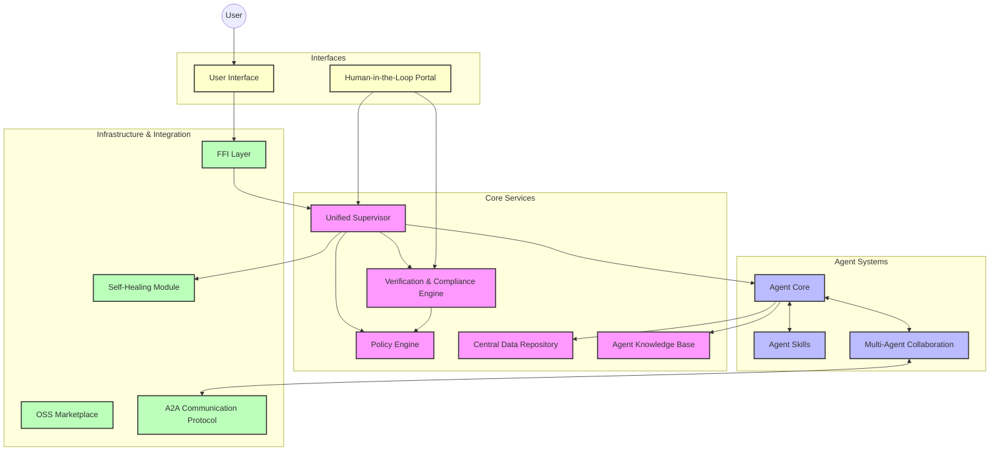

# HMS Unified Master Plan

## 1. Introduction & Goals

**(Placeholder)** This document provides a unified vision and plan for the Health Monitoring System (HMS). The primary goal of HMS is [**TODO: Define primary goal based on core documents or user input**]. It aims to leverage autonomous agents, advanced collaboration techniques, and robust verification to achieve [**TODO: Define key objectives**].

This plan synthesizes information from various existing HMS specifications and implementation plans, addressing fragmentation and introducing a unified concept for system supervision.

*Note: This plan is based on analysis of accessible documentation. Gaps may exist due to inaccessible core overview documents.*

## 2. Unified Architecture

**(Placeholder)** The HMS comprises several interconnected subsystems. A high-level overview:



**(TODO: Refine diagram and describe subsystem interactions based on further analysis or available documentation like HMS-SYSTEM-ARCHITECTURE-CHANGES.md if it becomes accessible).**

## 3. Core Components

### 3.1 Agents (HMS-AGT / HMS-AGX)
- **Definition:** Autonomous entities performing specific tasks. (`HMS-AGT` provides core identity, memory, messaging; `HMS-AGX` provides specialized skills).
- **Capabilities:** Task execution, reasoning, learning (memory storage), communication.
- **Skills:** Pluggable modules for specific functions (e.g., LegalCheck, API calls, Planning).
- **Reference:** `HMS-NFO/.../06_ai_agent_framework...md`

### 3.2 Unified Supervisor
- **Definition:** A central component (or potentially a hierarchical system) responsible for overseeing the agent ecosystem. It unifies concepts found across `HMS-A2A`, `HMS-NFO`, and `HMS-DEV`.
- **Responsibilities:**
    - **Agent Lifecycle Management:** Hiring (creating), starting, pausing, stopping, retiring, and scaling agents (via `hmsagt` APIs).
    - **Runtime Orchestration:** Assigning tasks/goals to agents or agent groups (MAC).
    - **Health Monitoring:** Tracking agent status, resource usage, and basic liveness.
    - **Self-Healing Initiation:** Triggering recovery or replacement procedures for failing agents/components.
    - **Performance Monitoring:** Observing agent/system throughput and efficiency.
    - **Verification Coordination:** Triggering checks via the Verification Pipeline based on agent actions or system state.
    - **Policy Enforcement Coordination:** Ensuring agent actions align with defined policies via the Policy Engine.
    - **Goal Alignment:** Monitoring agent activities to ensure they contribute to overall system objectives (as described for the `HMS-A2A` Supervisor Agent).
    - **HITL Interface:** Providing control points and reporting status to human overseers.
- **Architecture:** Likely implemented as a core Rust service (`HMS-DEV`'s `IAgentSupervisor` trait) interacting with other components via FFI/RPC. Needs clear separation from UI/Terminal layers.
- **Reference:** `HMS-A2A/mac/README.md`, `HMS-NFO/.../06_ai_agent_framework...md`, `HMS-DEV/implementation_plan.md`

### 3.3 Communication (A2A)
- **Protocols:** Define standard methods for agent-to-agent and agent-to-supervisor communication.
- **Market Mechanisms:** Potential use of economic models (Market Networks, Moneyball) for coordination and resource allocation, particularly within `HMS-A2A`/MAC.
- **Reference:** `HMS-A2A-COMMUNICATION-PROTOCOL.md`, `HMS-A2A/mac/README.md`

### 3.4 Verification & Compliance
- **Pipeline:** Automated checks for security, compliance (e.g., FedRAMP), and policy adherence.
- **Integration:** Triggered by Supervisor based on agent actions or specific events (e.g., file changes via tmuxAI adapter). Interacts closely with the Policy Engine.
- **Reference:** `HMS-DEV/implementation_plan.md`, `HMS-VERIFICATION-FIRST-FRAMEWORK.md`

### 3.5 Data & Knowledge
- **Central Repository:** Storage for agent state, memories (vector stores), logs, etc. (`HMS-DTA`?).
- **Knowledge Acquisition:** Systems for agents to learn and share information (`HMS-KNOWLEDGE-ACQUISITION-SYSTEM.md`).
- **Reference:** `HMS-NFO/.../06_ai_agent_framework...md` (mentions Central Data Repository)

### 3.6 FFI Layer
- **Strategy:** Define approach for seamless interoperability between Rust (core logic?) and Python (agent skills? scripting?).
- **Bindings:** Specify necessary bindings for agent lifecycle, supervisor control, etc.
- **Reference:** `HMS-FFI-ARCHITECTURE.md`, `HMS-FFI-API-SPECIFICATION.md`, etc.

### 3.7 Self-Healing
- **Mechanisms:** Define strategies for detecting failures (agents, services) and automatically recovering (restarting, replacing, reassigning tasks). Linked to Supervisor health monitoring.
- **Reference:** `HMS_SELF_HEALING_SPECIFICATION.md`, `HMS_SELF_HEALING_TEST_PLAN.md`

### 3.8 Governance & HITL
- **Oversight:** Mechanisms for human review, approval, or intervention (e.g., HMS-GOV portal).
- **Escalation:** Define paths for issues requiring human attention (e.g., supervisor reviews mentioned in `grep` results).
- **Reference:** `HMS-GOV-PORTAL-README.md`, `HMS-NFO/.../07_human_in_the_loop_oversight__hitl__.md` (linked from Agent Framework doc)

### 3.9 Other Components
- **Genetic Algorithms:** Usage and integration (`GENETIC_ALGORITHM_SPEC.md`).
- **OSS Marketplace:** Functionality and integration (`HMS-DEV/implementation_plan.md`).
- **(TODO: Add brief descriptions for other key systems inferred from file list, e.g., ETL, Security Frameworks, etc.)**

### 3.10 Plan Analysis & Consolidation Process
Before expanding HMS with any new sub-initiative (e.g., the Economic Theorem-Proving MAS), the following repeatable process is used to ingest disparate *.md* plans and merge them into this master plan.

1. **Plan Inventory & Tagging**  
   – Recursively scan the repo for `*.md` files matching prefixes such as `HMS-`, `CODEX-`, `AGENT-`, `SELF_HEALING`, etc.  
   – Tag each file with one or more categories: *Architecture*, *Specification*, *Implementation Plan*, *Testing*, *Governance*, *Research*.
2. **Prioritised Reading Queue**  
   – Rank plans by (a) recency, (b) centrality (links from other docs), and (c) declared impact.  
   – Create an ingestion backlog (Kanban) so the core architecture guild can distribute analysis tasks.
3. **Extraction Template**  
   For every plan, extract: goals, stakeholders, scope, dependencies, timelines, risks, artefacts (APIs, data models, diagrams).
4. **Diff & Conflict Detection**  
   – Auto-compare extracted requirements with the current master plan JSON source-of-truth.  
   – Flag overlaps, contradictions, or version drifts for human review.
5. **Design Review Workshop**  
   – Weekly session where guild leads walk through flagged diffs and decide: *accept / modify / park / reject*.
6. **Integration PR**  
   – Accepted changes are translated into pull-requests that patch this document and the corresponding architecture diagrams.  
   – CI requires passing Mermaid-render check and link validation.
7. **Traceability Links**  
   – Every integrated requirement receives a `[source:<filename.md>#<heading>]` backlink so future reviewers can trace provenance.

This process guarantees the master plan remains a living, coherent artifact even as dozens of satellite plans evolve.

## 4. Implementation Roadmap (Detailed)

### 4.1 Phase 1: Foundation Building (Months 1-3)
**Objective:** Establish core MAS infrastructure and economic formalization baseline

1. **MAS Core Development**
   - Implement Supervisor skeleton using Rust `hms-supervisor` crate
   - Create A2A protocol v0.1 (Protobuf schema)
   ```protobuf
   syntax = "proto3";
   message AgentTask {
       string theorem_id = 1;
       bytes lean_expr = 2; 
       repeated string axiom_deps = 3;
   }
   ```

2. **Economic Formalization**
   - Encode 50+ core economic concepts in Lean 4:
   ```lean4
   -- src/econ/basic.lean
   class PreferenceRelation (X : Type) :=
   (refl : ∀ x : X, x ≼ x)
   (trans : ∀ x y z : X, x ≼ y → y ≼ z → x ≼ z)
   ```

3. **Genetic Agent Framework**
   - Implement basic GA population manager:
   ```rust
   // src/ga/mod.rs
   pub struct Genome {
       pub tactics: Vec<LeanTactic>,
       pub mutation_rate: f32,
   }
   ```

### 4.2 Phase 2: Core System Development (Months 4-8)
**Objective:** Deploy specialized agents and enhanced genetic algorithms

1. **Agent Specialization Roadmap**
   | Agent Type        | Development Sprint | Key Capability |
   |-------------------|--------------------|----------------|
   | Decomposition     | Month 4            | Theorem tree generation |
   | Strategy          | Month 5            | Tactic selection MLP |
   | Verification      | Month 6            | Lean4 kernel integration |

2. **Genetic Optimization**
   - Implement multi-objective fitness function:
   ```python
   def calculate_fitness(proof):
       return 0.7 * correctness + 0.2 * elegance + 0.1 * novelty
   ```

### 4.3 Phase 3: Integration & Self-Healing (Months 9-12)
**Objective:** Implement full system automation and fault recovery

1. **Self-Healing Workflow
   ```mermaid
   graph TD
       Failure[Proof Failure] --> Diagnose{Diagnostic Agent}
       Diagnose -->|Missing Lemma| Spawn[Spawn Lemma Agent]
       Diagnose -->|Strategy Issue| Mutate[Mutate Genome Pool]
       Spawn --> Retry[Retry Proof]
       Mutate --> Retry
   ```

### 4.4 Phase 4: Advanced Learning (Months 13-18)
**Objective:** Integrate meta-learning and swarm capabilities

1. **RL-GA Hybrid Architecture
   ```python
   class HybridAgent:
       def __init__(self):
           self.ga = GeneticSolver()
           self.rl = PPOTrainer()
       
       def step(self, state):
           ga_action = self.ga.sample(state)
           rl_reward = self.rl.evaluate(ga_action)
           self.ga.update_fitness(rl_reward)
   ```

### 4.5 Phase 5: Productionization (Months 19-24)
**Objective:** Deploy enterprise-ready solution

1. **DevSecOps Pipeline
   ```nix
   # flake.nix
   outputs = { nixpkgs, ... }:
     let
       leanEnv = nixpkgs.lean4.override {
         extraPkgs = [ nixpkgs.cudaPackages.cudnn ];
       };
     in {
       devShell = leanEnv;
     };
   ```

## 5. Testing & Verification Strategy

- **Unit Testing:** For individual components (Rust/Python).
- **Integration Testing:** Verifying interactions between subsystems (Supervisor <-> Agents, Supervisor <-> Verification, etc.).
- **End-to-End Testing:** Simulating complex workflows through the entire system.
- **Verification-First Framework:** Incorporate compliance and security checks throughout development.
- **Self-Healing Tests:** Simulate failures to ensure recovery mechanisms work.
- **Reference:** `HMS-VERIFICATION-FIRST-FRAMEWORK.md`, `HMS_SELF_HEALING_TEST_PLAN.md`, `HMS-FFI-TESTING-FRAMEWORK.md`

## 6. Open Questions & Risks

- **Inaccessible Documentation:** Key overview documents (`HMS-MASTER-README.md`, `FINAL-OPTIMIZED-SYSTEM-WIDE-IMPLEMENTATION-PLAN.md`, `HMS-SYSTEM-ARCHITECTURE-CHANGES.md`, etc.) could not be read due to timeouts. This plan relies on inferences and analysis of lower-level files. The overall goals, detailed architecture, and existing roadmap might differ significantly. **Mitigation:** Attempt to gain access to these files or obtain summaries.
- **Supervisor Complexity:** Unifying the different "Supervisor" concepts into a single, coherent component is complex and requires careful design.
- **Integration Challenges:** Ensuring seamless communication and data flow between diverse subsystems (Rust, Python, potentially others) via FFI/RPC.
- **Scalability:** Ensuring the Supervisor and agent systems can scale effectively (partially addressed by `HMS-NFO` Supervisor mentioning Kubernetes).
- **(TODO: Add other risks identified during detailed planning).** 