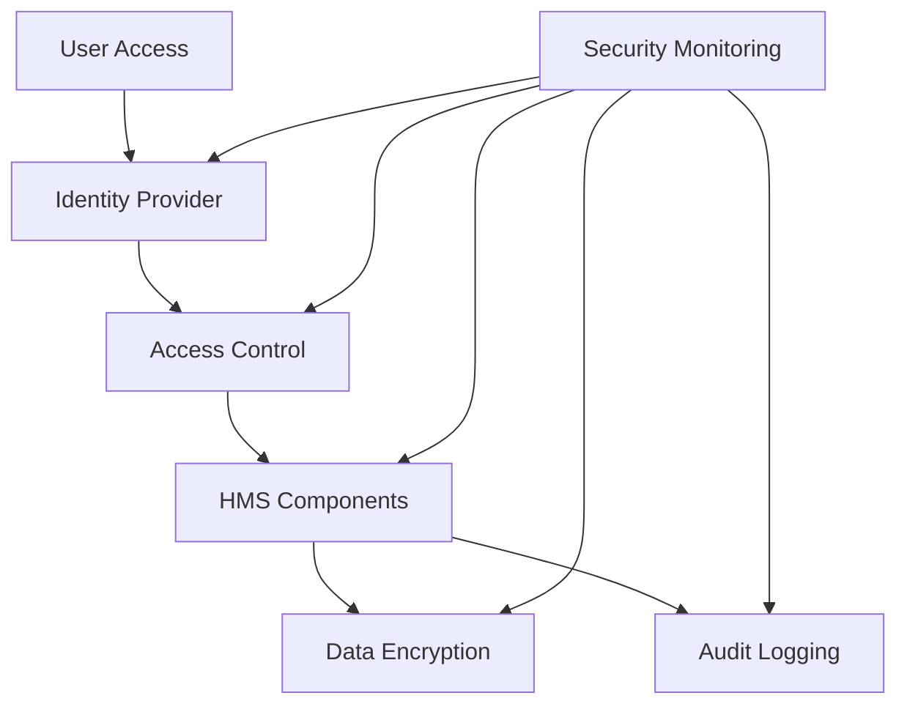

# {{agency_name}} - Federal Agency Overview

╔════════════════════════════════════════════════════════════════════╗
║ {{agency_name}} ({{agency_acronym}}) - HMS Integration Portals    ║
╠════════════════════════════════════════════════════════════════════╣
║ • Civilian Portal:    [https://{{agency_acronym}}.us.ai-gov.co](https://{{agency_acronym}}.us.ai-gov.co)  ║
║ • Government Portal:  [https://{{agency_acronym}}.us.gov-ai.co](https://{{agency_acronym}}.us.gov-ai.co)  ║
╚════════════════════════════════════════════════════════════════════╝

## Agency Overview

{{agency_name}} ({{agency_acronym}}) is a federal agency responsible for {{agency_mission_brief}}. With a workforce of approximately {{employee_count}} employees and an annual budget of ${{annual_budget}} billion, {{agency_acronym}} plays a critical role in {{agency_primary_role}}.

### Mission Statement

{{agency_mission_statement}}

### First Principles Analysis

At its core, {{agency_acronym}} exists to {{core_function}}. Its fundamental function is to {{fundamental_function}}. The agency operates on the following key principles:

{{first_principles_analysis}}

**Core Function:** {{core_function}}

**Fundamental Principles:**

- {{principle}}


**Key Mechanisms:**

- {{mechanism}}


### Organizational Structure

```mermaid
graph TD
    A[{{agency_head_title}}] --> B[{{deputy_title}}]
    A --> C[{{division_1_name}}]
    A --> D[{{division_2_name}}]
    A --> E[{{division_3_name}}]
    A --> F[{{division_4_name}}]
    
    C --> C1[{{division_1_office_1}}]
    C --> C2[{{division_1_office_2}}]
    
    D --> D1[{{division_2_office_1}}]
    D --> D2[{{division_2_office_2}}]
    
    E --> E1[{{division_3_office_1}}]
    E --> E2[{{division_3_office_2}}]
    
    F --> F1[{{division_4_office_1}}]
    F --> F2[{{division_4_office_2}}]
```

### Key Stakeholders

#### Internal Stakeholders
- **{{internal_stakeholder_1}}**: {{internal_stakeholder_1_role}}
- **{{internal_stakeholder_2}}**: {{internal_stakeholder_2_role}}
- **{{internal_stakeholder_3}}**: {{internal_stakeholder_3_role}}

#### External Stakeholders
- **{{external_stakeholder_1}}**: {{external_stakeholder_1_relationship}}
- **{{external_stakeholder_2}}**: {{external_stakeholder_2_relationship}}
- **{{external_stakeholder_3}}**: {{external_stakeholder_3_relationship}}

## Strategic Priorities

{{agency_acronym}}'s current strategic priorities include:

1. **{{priority_1}}**: {{priority_1_description}}
2. **{{priority_2}}**: {{priority_2_description}}
3. **{{priority_3}}**: {{priority_3_description}}
4. **{{priority_4}}**: {{priority_4_description}}

## HMS Integration Overview

{{agency_acronym}} is implementing HMS components to modernize its operations and enhance service delivery. The agency's HMS implementation strategy focuses on {{hms_implementation_focus}}.

### Implementation Strategy

```mermaid
graph TD
    subgraph "Phase 1: {{phase_1_name}}"
        A[{{phase_1_component_1}}]
        B[{{phase_1_component_2}}]
        C[{{phase_1_component_3}}]
    end
    
    subgraph "Phase 2: {{phase_2_name}}"
        D[{{phase_2_component_1}}]
        E[{{phase_2_component_2}}]
        F[{{phase_2_component_3}}]
    end
    
    subgraph "Phase 3: {{phase_3_name}}"
        G[{{phase_3_component_1}}]
        H[{{phase_3_component_2}}]
        I[{{phase_3_component_3}}]
    end
    
    A --> D
    B --> E
    C --> F
    D --> G
    E --> H
    F --> I
```

### Current Status

{{agency_acronym}} is currently in **Phase {{current_phase}}** of its HMS implementation, focusing on {{current_phase_focus}}. Key accomplishments to date include:

- {{accomplishment_1}}
- {{accomplishment_2}}
- {{accomplishment_3}}

### Implementation Timeline

| Phase | Focus | Timeline | Status |
|-------|-------|----------|--------|
| Phase 1: {{phase_1_name}} | {{phase_1_focus}} | {{phase_1_timeline}} | {{phase_1_status}} |
| Phase 2: {{phase_2_name}} | {{phase_2_focus}} | {{phase_2_timeline}} | {{phase_2_status}} |
| Phase 3: {{phase_3_name}} | {{phase_3_focus}} | {{phase_3_timeline}} | {{phase_3_status}} |
| Phase 4: {{phase_4_name}} | {{phase_4_focus}} | {{phase_4_timeline}} | {{phase_4_status}} |

## HMS Component Implementation

The following HMS components are currently being implemented or planned for {{agency_acronym}}:

### Core Components

#### HMS-A2A (Agent-to-Agent)
**Status:** {{hms_a2a_status}}  
**Use Cases:** 
- {{hms_a2a_use_case_1}}
- {{hms_a2a_use_case_2}}
- {{hms_a2a_use_case_3}}

#### HMS-API (API Services)
**Status:** {{hms_api_status}}  
**Use Cases:** 
- {{hms_api_use_case_1}}
- {{hms_api_use_case_2}}
- {{hms_api_use_case_3}}

#### HMS-CDF (Collaborative Decision Framework)
**Status:** {{hms_cdf_status}}  
**Use Cases:** 
- {{hms_cdf_use_case_1}}
- {{hms_cdf_use_case_2}}
- {{hms_cdf_use_case_3}}

### Domain-Specific Components

#### {{domain_component_1}} ({{domain_component_1_name}})
**Status:** {{domain_component_1_status}}  
**Use Cases:** 
- {{domain_component_1_use_case_1}}
- {{domain_component_1_use_case_2}}
- {{domain_component_1_use_case_3}}

#### {{domain_component_2}} ({{domain_component_2_name}})
**Status:** {{domain_component_2_status}}  
**Use Cases:** 
- {{domain_component_2_use_case_1}}
- {{domain_component_2_use_case_2}}
- {{domain_component_2_use_case_3}}

#### {{domain_component_3}} ({{domain_component_3_name}})
**Status:** {{domain_component_3_status}}  
**Use Cases:** 
- {{domain_component_3_use_case_1}}
- {{domain_component_3_use_case_2}}
- {{domain_component_3_use_case_3}}

## User Stories

### Citizen User Stories

1. **{{citizen_story_1_type}}**: {{citizen_story_1_description}}
2. **{{citizen_story_2_type}}**: {{citizen_story_2_description}}
3. **{{citizen_story_3_type}}**: {{citizen_story_3_description}}

### Expert User Stories

1. **{{expert_story_1_type}}**: {{expert_story_1_description}}
2. **{{expert_story_2_type}}**: {{expert_story_2_description}}
3. **{{expert_story_3_type}}**: {{expert_story_3_description}}

### Policy Maker User Stories

1. **{{policy_maker_story_1_type}}**: {{policy_maker_story_1_description}}
2. **{{policy_maker_story_2_type}}**: {{policy_maker_story_2_description}}
3. **{{policy_maker_story_3_type}}**: {{policy_maker_story_3_description}}

## Legacy Systems and Modernization

{{agency_acronym}} currently maintains the following legacy systems that will be modernized through HMS integration:

### Legacy System Inventory

| System Name | Function | Age | Technologies | Modernization Approach |
|-------------|----------|-----|--------------|------------------------|
| {{legacy_system_1}} | {{legacy_system_1_function}} | {{legacy_system_1_age}} | {{legacy_system_1_technologies}} | {{legacy_system_1_approach}} |
| {{legacy_system_2}} | {{legacy_system_2_function}} | {{legacy_system_2_age}} | {{legacy_system_2_technologies}} | {{legacy_system_2_approach}} |
| {{legacy_system_3}} | {{legacy_system_3_function}} | {{legacy_system_3_age}} | {{legacy_system_3_technologies}} | {{legacy_system_3_approach}} |
| {{legacy_system_4}} | {{legacy_system_4_function}} | {{legacy_system_4_age}} | {{legacy_system_4_technologies}} | {{legacy_system_4_approach}} |

### Modernization Strategy

{{agency_acronym}}'s modernization strategy focuses on {{modernization_strategy_focus}}. Key aspects of the approach include:

1. **{{modernization_aspect_1}}**: {{modernization_aspect_1_description}}
2. **{{modernization_aspect_2}}**: {{modernization_aspect_2_description}}
3. **{{modernization_aspect_3}}**: {{modernization_aspect_3_description}}
4. **{{modernization_aspect_4}}**: {{modernization_aspect_4_description}}

## Integration with Other Agencies

{{agency_acronym}} integrates with the following federal agencies:

### Federal Agency Integrations

| Agency | Integration Purpose | HMS Components | Status |
|--------|---------------------|---------------|--------|
| {{integration_agency_1}} | {{integration_purpose_1}} | {{integration_components_1}} | {{integration_status_1}} |
| {{integration_agency_2}} | {{integration_purpose_2}} | {{integration_components_2}} | {{integration_status_2}} |
| {{integration_agency_3}} | {{integration_purpose_3}} | {{integration_components_3}} | {{integration_status_3}} |

### State and Local Integration

{{agency_acronym}} also integrates with state and local government entities:

#### State Government Integration
- **{{state_integration_1}}**: {{state_integration_1_description}}
- **{{state_integration_2}}**: {{state_integration_2_description}}
- **{{state_integration_3}}**: {{state_integration_3_description}}

#### Local Government Integration
- **{{local_integration_1}}**: {{local_integration_1_description}}
- **{{local_integration_2}}**: {{local_integration_2_description}}
- **{{local_integration_3}}**: {{local_integration_3_description}}

## Performance Metrics

{{agency_acronym}} tracks the following performance metrics for its HMS implementation:

| Metric | Baseline | Current | Target | Timeline |
|--------|----------|---------|--------|----------|
| {{metric_1}} | {{metric_1_baseline}} | {{metric_1_current}} | {{metric_1_target}} | {{metric_1_timeline}} |
| {{metric_2}} | {{metric_2_baseline}} | {{metric_2_current}} | {{metric_2_target}} | {{metric_2_timeline}} |
| {{metric_3}} | {{metric_3_baseline}} | {{metric_3_current}} | {{metric_3_target}} | {{metric_3_timeline}} |
| {{metric_4}} | {{metric_4_baseline}} | {{metric_4_current}} | {{metric_4_target}} | {{metric_4_timeline}} |
| {{metric_5}} | {{metric_5_baseline}} | {{metric_5_current}} | {{metric_5_target}} | {{metric_5_timeline}} |

## Security and Compliance

{{agency_acronym}}'s HMS implementation adheres to the following security and compliance standards:

- **{{security_standard_1}}**: {{security_standard_1_approach}}
- **{{security_standard_2}}**: {{security_standard_2_approach}}
- **{{security_standard_3}}**: {{security_standard_3_approach}}
- **{{security_standard_4}}**: {{security_standard_4_approach}}

### Security Architecture



## Budget and Resources

{{agency_acronym}}'s HMS implementation is supported by the following budget and resources:

### Budget Allocation

| Category | FY{{current_fy}} | FY{{next_fy}} | FY{{next_fy_plus_1}} |
|----------|-----------------|---------------|----------------------|
| Hardware | ${{hardware_budget_current}} | ${{hardware_budget_next}} | ${{hardware_budget_next_plus_1}} |
| Software | ${{software_budget_current}} | ${{software_budget_next}} | ${{software_budget_next_plus_1}} |
| Services | ${{services_budget_current}} | ${{services_budget_next}} | ${{services_budget_next_plus_1}} |
| Personnel | ${{personnel_budget_current}} | ${{personnel_budget_next}} | ${{personnel_budget_next_plus_1}} |
| Training | ${{training_budget_current}} | ${{training_budget_next}} | ${{training_budget_next_plus_1}} |
| **Total** | ${{total_budget_current}} | ${{total_budget_next}} | ${{total_budget_next_plus_1}} |

### Staffing and Skills

{{agency_acronym}}'s HMS implementation team includes:

- **{{team_role_1}}**: {{team_role_1_count}} FTEs
- **{{team_role_2}}**: {{team_role_2_count}} FTEs
- **{{team_role_3}}**: {{team_role_3_count}} FTEs
- **{{team_role_4}}**: {{team_role_4_count}} FTEs
- **{{team_role_5}}**: {{team_role_5_count}} FTEs

## Future Roadmap

{{agency_acronym}}'s future HMS roadmap includes:

### Short-term Goals (Next 12 Months)
- {{short_term_goal_1}}
- {{short_term_goal_2}}
- {{short_term_goal_3}}

### Medium-term Goals (1-3 Years)
- {{medium_term_goal_1}}
- {{medium_term_goal_2}}
- {{medium_term_goal_3}}

### Long-term Vision (3-5 Years)
- {{long_term_goal_1}}
- {{long_term_goal_2}}
- {{long_term_goal_3}}

## Contact Information

For more information about {{agency_acronym}}'s HMS implementation:

- **Official Website**: [{{agency_website}}]({{agency_website}})
- **HMS Portal**: [https://{{agency_acronym}}.us.gov-ai.co](https://{{agency_acronym}}.us.gov-ai.co)
- **Email**: {{agency_contact_email}}
- **Phone**: {{agency_contact_phone}}

## Additional Resources

- [{{agency_acronym}} Strategic Plan]({{strategic_plan_url}})
- [HMS Implementation Roadmap]({{roadmap_url}})
- [API Documentation]({{api_docs_url}})
- [Developer Resources]({{developer_resources_url}})