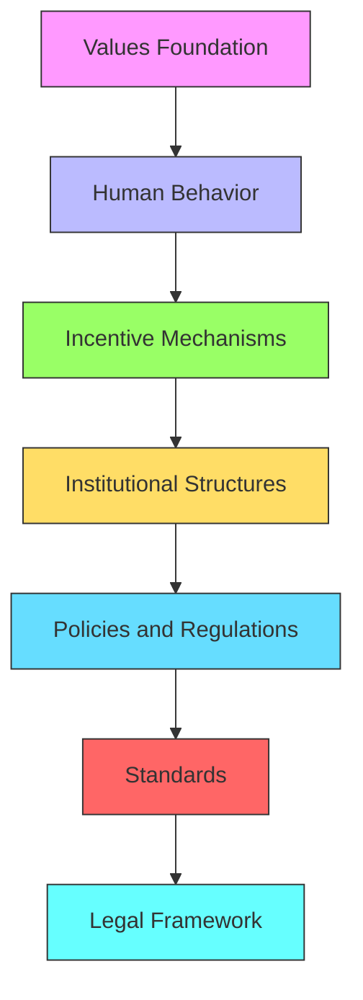

# {{agency_name}} ({{agency_acronym}}) - Use Cases

╔════════════════════════════════════════════════════════════════════╗
║ {{agency_name}} ({{agency_acronym}}) - HMS Use Cases               ║
╠════════════════════════════════════════════════════════════════════╣
║ • Civilian Portal:    [https://{{agency_acronym}}.us.ai-gov.co](https://{{agency_acronym}}.us.ai-gov.co)  ║
║ • Government Portal:  [https://{{agency_acronym}}.us.gov-ai.co](https://{{agency_acronym}}.us.gov-ai.co)  ║
╚════════════════════════════════════════════════════════════════════╝

## HMS Use Cases for {{agency_name}}

This document outlines key use cases for HMS components within {{agency_name}} ({{agency_acronym}}), demonstrating how AI-powered government services enhance mission delivery and improve citizen outcomes.

## Primary Use Cases

### Use Case 1: {{primary_use_case_1_title}}

**Challenge:** {{primary_use_case_1_challenge}}

**Solution:** 
{{agency_acronym}} implements an HMS-powered solution utilizing:
- **HMS Components**: {{primary_use_case_1_components}}
- **Integration Points**: {{primary_use_case_1_integration_points}}
- **Key Capabilities**: {{primary_use_case_1_capabilities}}

**Workflow:**
```mermaid
graph TD
    A[{{primary_use_case_1_step_1}}] --> B[{{primary_use_case_1_step_2}}]
    B --> C[{{primary_use_case_1_step_3}}]
    C --> D[{{primary_use_case_1_step_4}}]
    D --> E[{{primary_use_case_1_step_5}}]
    
    classDef start fill:#f9f,stroke:#333
    classDef process fill:#bbf,stroke:#333
    classDef decision fill:#9f6,stroke:#333
    classDef output fill:#fd6,stroke:#333
    
    class A start
    class B,C process
    class D decision
    class E output
```

**Outcomes:**
- {{primary_use_case_1_outcome_1}}
- {{primary_use_case_1_outcome_2}}
- {{primary_use_case_1_outcome_3}}

**Metrics:**
- **Baseline**: {{primary_use_case_1_baseline}}
- **Current Performance**: {{primary_use_case_1_current}}
- **Target**: {{primary_use_case_1_target}}

**User Stories:**
- **Citizen**: "{{primary_use_case_1_citizen_story}}"
- **Agency Staff**: "{{primary_use_case_1_staff_story}}"
- **Leadership**: "{{primary_use_case_1_leadership_story}}"

---

### Use Case 2: {{primary_use_case_2_title}}

**Challenge:** {{primary_use_case_2_challenge}}

**Solution:** 
{{agency_acronym}} implements an HMS-powered solution utilizing:
- **HMS Components**: {{primary_use_case_2_components}}
- **Integration Points**: {{primary_use_case_2_integration_points}}
- **Key Capabilities**: {{primary_use_case_2_capabilities}}

**Workflow:**
```mermaid
graph TD
    A[{{primary_use_case_2_step_1}}] --> B[{{primary_use_case_2_step_2}}]
    B --> C[{{primary_use_case_2_step_3}}]
    C --> D[{{primary_use_case_2_step_4}}]
    D --> E[{{primary_use_case_2_step_5}}]
    
    classDef start fill:#f9f,stroke:#333
    classDef process fill:#bbf,stroke:#333
    classDef decision fill:#9f6,stroke:#333
    classDef output fill:#fd6,stroke:#333
    
    class A start
    class B,C process
    class D decision
    class E output
```

**Outcomes:**
- {{primary_use_case_2_outcome_1}}
- {{primary_use_case_2_outcome_2}}
- {{primary_use_case_2_outcome_3}}

**Metrics:**
- **Baseline**: {{primary_use_case_2_baseline}}
- **Current Performance**: {{primary_use_case_2_current}}
- **Target**: {{primary_use_case_2_target}}

**User Stories:**
- **Citizen**: "{{primary_use_case_2_citizen_story}}"
- **Agency Staff**: "{{primary_use_case_2_staff_story}}"
- **Leadership**: "{{primary_use_case_2_leadership_story}}"

---

### Use Case 3: {{primary_use_case_3_title}}

**Challenge:** {{primary_use_case_3_challenge}}

**Solution:** 
{{agency_acronym}} implements an HMS-powered solution utilizing:
- **HMS Components**: {{primary_use_case_3_components}}
- **Integration Points**: {{primary_use_case_3_integration_points}}
- **Key Capabilities**: {{primary_use_case_3_capabilities}}

**Workflow:**
```mermaid
graph TD
    A[{{primary_use_case_3_step_1}}] --> B[{{primary_use_case_3_step_2}}]
    B --> C[{{primary_use_case_3_step_3}}]
    C --> D[{{primary_use_case_3_step_4}}]
    D --> E[{{primary_use_case_3_step_5}}]
    
    classDef start fill:#f9f,stroke:#333
    classDef process fill:#bbf,stroke:#333
    classDef decision fill:#9f6,stroke:#333
    classDef output fill:#fd6,stroke:#333
    
    class A start
    class B,C process
    class D decision
    class E output
```

**Outcomes:**
- {{primary_use_case_3_outcome_1}}
- {{primary_use_case_3_outcome_2}}
- {{primary_use_case_3_outcome_3}}

**Metrics:**
- **Baseline**: {{primary_use_case_3_baseline}}
- **Current Performance**: {{primary_use_case_3_current}}
- **Target**: {{primary_use_case_3_target}}

**User Stories:**
- **Citizen**: "{{primary_use_case_3_citizen_story}}"
- **Agency Staff**: "{{primary_use_case_3_staff_story}}"
- **Leadership**: "{{primary_use_case_3_leadership_story}}"

## Division-Specific Use Cases

### {{division_1}} Use Case: {{division_1_use_case_title}}

**Challenge:** {{division_1_use_case_challenge}}

**Solution:** 
- **HMS Components**: {{division_1_use_case_components}}
- **Integration Points**: {{division_1_use_case_integration_points}}
- **Key Capabilities**: {{division_1_use_case_capabilities}}

**Outcomes:**
- {{division_1_use_case_outcome_1}}
- {{division_1_use_case_outcome_2}}
- {{division_1_use_case_outcome_3}}

---

### {{division_2}} Use Case: {{division_2_use_case_title}}

**Challenge:** {{division_2_use_case_challenge}}

**Solution:** 
- **HMS Components**: {{division_2_use_case_components}}
- **Integration Points**: {{division_2_use_case_integration_points}}
- **Key Capabilities**: {{division_2_use_case_capabilities}}

**Outcomes:**
- {{division_2_use_case_outcome_1}}
- {{division_2_use_case_outcome_2}}
- {{division_2_use_case_outcome_3}}

---

### {{division_3}} Use Case: {{division_3_use_case_title}}

**Challenge:** {{division_3_use_case_challenge}}

**Solution:** 
- **HMS Components**: {{division_3_use_case_components}}
- **Integration Points**: {{division_3_use_case_integration_points}}
- **Key Capabilities**: {{division_3_use_case_capabilities}}

**Outcomes:**
- {{division_3_use_case_outcome_1}}
- {{division_3_use_case_outcome_2}}
- {{division_3_use_case_outcome_3}}

## Cross-Agency Use Cases

### Cross-Agency Use Case 1: {{cross_agency_use_case_1_title}}

**Partner Agencies:** {{cross_agency_use_case_1_partners}}

**Challenge:** {{cross_agency_use_case_1_challenge}}

**Solution:** 
- **HMS Components**: {{cross_agency_use_case_1_components}}
- **Integration Method**: {{cross_agency_use_case_1_integration}}
- **Key Capabilities**: {{cross_agency_use_case_1_capabilities}}

**Architecture:**
```mermaid
graph TD
    subgraph "{{agency_acronym}}"
        A1[{{agency_acronym}} Systems]
        B1[HMS Components]
    end
    
    subgraph "{{partner_agency_1}}"
        A2[{{partner_agency_1}} Systems]
        B2[HMS Components]
    end
    
    subgraph "{{partner_agency_2}}"
        A3[{{partner_agency_2}} Systems]
        B3[HMS Components]
    end
    
    B1 <--> C[HMS-A2A Integration]
    B2 <--> C
    B3 <--> C
    
    A1 --> B1
    A2 --> B2
    A3 --> B3
    
    classDef agency1 fill:#f9f,stroke:#333
    classDef agency2 fill:#bbf,stroke:#333
    classDef agency3 fill:#9f6,stroke:#333
    classDef integration fill:#fd6,stroke:#333
    
    class A1,B1 agency1
    class A2,B2 agency2
    class A3,B3 agency3
    class C integration
```

**Outcomes:**
- {{cross_agency_use_case_1_outcome_1}}
- {{cross_agency_use_case_1_outcome_2}}
- {{cross_agency_use_case_1_outcome_3}}

---

### Cross-Agency Use Case 2: {{cross_agency_use_case_2_title}}

**Partner Agencies:** {{cross_agency_use_case_2_partners}}

**Challenge:** {{cross_agency_use_case_2_challenge}}

**Solution:** 
- **HMS Components**: {{cross_agency_use_case_2_components}}
- **Integration Method**: {{cross_agency_use_case_2_integration}}
- **Key Capabilities**: {{cross_agency_use_case_2_capabilities}}

**Outcomes:**
- {{cross_agency_use_case_2_outcome_1}}
- {{cross_agency_use_case_2_outcome_2}}
- {{cross_agency_use_case_2_outcome_3}}

## Emerging Use Cases

### Future Use Case 1: {{future_use_case_1_title}}

**Challenge:** {{future_use_case_1_challenge}}

**Proposed Solution:** 
- **HMS Components**: {{future_use_case_1_components}}
- **Development Status**: {{future_use_case_1_status}}
- **Timeline**: {{future_use_case_1_timeline}}

**Expected Outcomes:**
- {{future_use_case_1_outcome_1}}
- {{future_use_case_1_outcome_2}}
- {{future_use_case_1_outcome_3}}

---

### Future Use Case 2: {{future_use_case_2_title}}

**Challenge:** {{future_use_case_2_challenge}}

**Proposed Solution:** 
- **HMS Components**: {{future_use_case_2_components}}
- **Development Status**: {{future_use_case_2_status}}
- **Timeline**: {{future_use_case_2_timeline}}

**Expected Outcomes:**
- {{future_use_case_2_outcome_1}}
- {{future_use_case_2_outcome_2}}
- {{future_use_case_2_outcome_3}}

## Implementation Lessons Learned

### Success Factors

1. **{{success_factor_1}}**: {{success_factor_1_description}}
2. **{{success_factor_2}}**: {{success_factor_2_description}}
3. **{{success_factor_3}}**: {{success_factor_3_description}}

### Implementation Challenges

1. **{{challenge_1}}**: {{challenge_1_description}}
   - **Resolution**: {{challenge_1_resolution}}

2. **{{challenge_2}}**: {{challenge_2_description}}
   - **Resolution**: {{challenge_2_resolution}}

3. **{{challenge_3}}**: {{challenge_3_description}}
   - **Resolution**: {{challenge_3_resolution}}

## Citizen Impact Stories

### Citizen Story 1: {{citizen_story_1_title}}

{{citizen_story_1_content}}

**HMS Components Involved**: {{citizen_story_1_components}}

**Metrics**:
- {{citizen_story_1_metric_1}}: {{citizen_story_1_metric_1_value}}
- {{citizen_story_1_metric_2}}: {{citizen_story_1_metric_2_value}}

---

### Citizen Story 2: {{citizen_story_2_title}}

{{citizen_story_2_content}}

**HMS Components Involved**: {{citizen_story_2_components}}

**Metrics**:
- {{citizen_story_2_metric_1}}: {{citizen_story_2_metric_1_value}}
- {{citizen_story_2_metric_2}}: {{citizen_story_2_metric_2_value}}

## AI Governance Framework

{{agency_acronym}}'s use cases operate within a comprehensive AI governance framework:

### Core AI Values

- **Transparency**: {{transparency_approach}}
- **Truth**: {{truth_approach}}
- **Safety and Security**: {{safety_approach}}
- **Ethics**: {{ethics_approach}}
- **Privacy**: {{privacy_approach}}

### Governance Hierarchy



### Use Case Compliance

| Use Case | Transparency Score | Ethics Review | Privacy Impact | Security Assessment |
|----------|-------------------|--------------|---------------|---------------------|
| {{primary_use_case_1_title}} | {{primary_use_case_1_transparency}} | {{primary_use_case_1_ethics}} | {{primary_use_case_1_privacy}} | {{primary_use_case_1_security}} |
| {{primary_use_case_2_title}} | {{primary_use_case_2_transparency}} | {{primary_use_case_2_ethics}} | {{primary_use_case_2_privacy}} | {{primary_use_case_2_security}} |
| {{primary_use_case_3_title}} | {{primary_use_case_3_transparency}} | {{primary_use_case_3_ethics}} | {{primary_use_case_3_privacy}} | {{primary_use_case_3_security}} |

## Resources and Documentation

For more detailed information on {{agency_acronym}}'s HMS use cases:

- [{{agency_acronym}} Use Case Catalog](https://{{agency_acronym}}.us.gov-ai.co/use-cases)
- [Implementation Guides](https://{{agency_acronym}}.us.gov-ai.co/implementation-guides)
- [Success Metrics Dashboard](https://{{agency_acronym}}.us.gov-ai.co/metrics)
- [AI Governance Framework](https://{{agency_acronym}}.us.gov-ai.co/ai-governance)