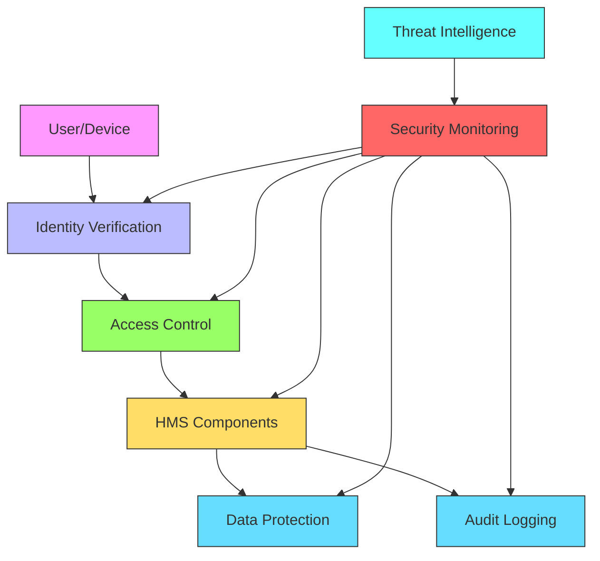

# {{agency_name}} ({{agency_acronym}}) - HMS Components Integration

╔════════════════════════════════════════════════════════════════════╗
║ {{agency_name}} ({{agency_acronym}}) - HMS Components              ║
╠════════════════════════════════════════════════════════════════════╣
║ • Civilian Portal:    [https://{{agency_acronym}}.us.ai-gov.co](https://{{agency_acronym}}.us.ai-gov.co)  ║
║ • Government Portal:  [https://{{agency_acronym}}.us.gov-ai.co](https://{{agency_acronym}}.us.gov-ai.co)  ║
╚════════════════════════════════════════════════════════════════════╝

## HMS System Components for {{agency_name}}

{{agency_name}} ({{agency_acronym}}) leverages the following HMS system components to deliver enhanced government services with AI-powered capabilities. Each component serves a specific purpose in the overall architecture.

### Core Components

#### HMS-A2A (Agent-to-Agent)
**Purpose:** Enables collaborative communication between intelligent agents.  
**Implementation Status:** {{hms_a2a_status}}  
**Key Applications:** 
- {{hms_a2a_application_1}}
- {{hms_a2a_application_2}}
- {{hms_a2a_application_3}}
**Integration Points:** HMS-MCP, HMS-DEV, HMS-DOC, HMS-CDF

#### HMS-ABC (Adaptive Business Capabilities)
**Purpose:** Provides flexible business capability modeling and implementation.  
**Implementation Status:** {{hms_abc_status}}  
**Key Applications:** 
- {{hms_abc_application_1}}
- {{hms_abc_application_2}}
- {{hms_abc_application_3}}
**Integration Points:** HMS-API, HMS-MFE, HMS-DOC

#### HMS-ACH (Automated Clearing House)
**Purpose:** Handles financial transaction processing and clearing.  
**Implementation Status:** {{hms_ach_status}}  
**Key Applications:** 
- {{hms_ach_application_1}}
- {{hms_ach_application_2}}
- {{hms_ach_application_3}}
**Integration Points:** HMS-CUR, HMS-API, HMS-DOC

#### HMS-ACT (Agent Collaboration Tools)
**Purpose:** Toolkit for building agent collaboration systems.  
**Implementation Status:** {{hms_act_status}}  
**Key Applications:** 
- {{hms_act_application_1}}
- {{hms_act_application_2}}
- {{hms_act_application_3}}
**Integration Points:** HMS-A2A, HMS-MCP, HMS-LLM

#### HMS-AGT (Agent Tooling)
**Purpose:** Provides tools and utilities for agent functionality.  
**Implementation Status:** {{hms_agt_status}}  
**Key Applications:** 
- {{hms_agt_application_1}}
- {{hms_agt_application_2}}
- {{hms_agt_application_3}}
**Integration Points:** HMS-A2A, HMS-DEV, HMS-MCP, HMS-LLM

#### HMS-AGX (Advanced Graph Experience)
**Purpose:** Graph-based reasoning and visualization for complex systems.  
**Implementation Status:** {{hms_agx_status}}  
**Key Applications:** 
- {{hms_agx_application_1}}
- {{hms_agx_application_2}}
- {{hms_agx_application_3}}
**Integration Points:** HMS-A2A, HMS-LLM, HMS-CDF

### Interface and Integration Components

#### HMS-API (API Services)
**Purpose:** API management and integration layer.  
**Implementation Status:** {{hms_api_status}}  
**Key Applications:** 
- {{hms_api_application_1}}
- {{hms_api_application_2}}
- {{hms_api_application_3}}
**Integration Points:** HMS-DOC, HMS-DEV, HMS-SYS

#### HMS-CDF (Collaborative Decision Framework)
**Purpose:** Framework for policy formalization, debate, and implementation.  
**Implementation Status:** {{hms_cdf_status}}  
**Key Applications:** 
- {{hms_cdf_application_1}}
- {{hms_cdf_application_2}}
- {{hms_cdf_application_3}}
**Integration Points:** HMS-A2A, HMS-GOV, HMS-DOC

#### HMS-CUR (Currency Management)
**Purpose:** Financial and currency management system.  
**Implementation Status:** {{hms_cur_status}}  
**Key Applications:** 
- {{hms_cur_application_1}}
- {{hms_cur_application_2}}
- {{hms_cur_application_3}}
**Integration Points:** HMS-ACH, HMS-API, HMS-MFE

#### HMS-DEV (Development Framework)
**Purpose:** Development tools and OSS marketplace.  
**Implementation Status:** {{hms_dev_status}}  
**Key Applications:** 
- {{hms_dev_application_1}}
- {{hms_dev_application_2}}
- {{hms_dev_application_3}}
**Integration Points:** HMS-A2A, HMS-DOC, HMS-MCP, HMS-SYS

#### HMS-DOC (Documentation System)
**Purpose:** Documentation generation and management.  
**Implementation Status:** {{hms_doc_status}}  
**Key Applications:** 
- {{hms_doc_application_1}}
- {{hms_doc_application_2}}
- {{hms_doc_application_3}}
**Integration Points:** HMS-DEV, HMS-A2A, HMS-SYS

### Education and Healthcare Components

#### HMS-EDU (Education System)
**Purpose:** Educational content and learning management.  
**Implementation Status:** {{hms_edu_status}}  
**Key Applications:** 
- {{hms_edu_application_1}}
- {{hms_edu_application_2}}
- {{hms_edu_application_3}}
**Integration Points:** HMS-DOC, HMS-API, HMS-LLM

#### HMS-EHR (Electronic Health Records)
**Purpose:** Health record management and processing.  
**Implementation Status:** {{hms_ehr_status}}  
**Key Applications:** 
- {{hms_ehr_application_1}}
- {{hms_ehr_application_2}}
- {{hms_ehr_application_3}}
**Integration Points:** HMS-API, HMS-UHC, HMS-EMR

#### HMS-EMR (Electronic Medical Records)
**Purpose:** Detailed medical record system with clinical focus.  
**Implementation Status:** {{hms_emr_status}}  
**Key Applications:** 
- {{hms_emr_application_1}}
- {{hms_emr_application_2}}
- {{hms_emr_application_3}}
**Integration Points:** HMS-EHR, HMS-API, HMS-UHC

### Quality and Economic Components

#### HMS-ESQ (Enhanced System Quality)
**Purpose:** Quality assurance and system improvement.  
**Implementation Status:** {{hms_esq_status}}  
**Key Applications:** 
- {{hms_esq_application_1}}
- {{hms_esq_application_2}}
- {{hms_esq_application_3}}
**Integration Points:** HMS-DEV, HMS-SYS, HMS-DOC

#### HMS-ESR (Economic System Representation)
**Purpose:** Economic modeling and simulation.  
**Implementation Status:** {{hms_esr_status}}  
**Key Applications:** 
- {{hms_esr_application_1}}
- {{hms_esr_application_2}}
- {{hms_esr_application_3}}
**Integration Points:** HMS-CUR, HMS-NFO, HMS-DOC

### Data Management Components

#### HMS-ETL (Extract, Transform, Load)
**Purpose:** Data pipeline and transformation system.  
**Implementation Status:** {{hms_etl_status}}  
**Key Applications:** 
- {{hms_etl_application_1}}
- {{hms_etl_application_2}}
- {{hms_etl_application_3}}
**Integration Points:** HMS-API, HMS-DOC, HMS-NFO

#### HMS-FLD (Field Data Collection)
**Purpose:** Mobile and field data collection tools.  
**Implementation Status:** {{hms_fld_status}}  
**Key Applications:** 
- {{hms_fld_application_1}}
- {{hms_fld_application_2}}
- {{hms_fld_application_3}}
**Integration Points:** HMS-ETL, HMS-API, HMS-DOC

### Administrative Components

#### HMS-GOV (Governance Framework)
**Purpose:** System governance and compliance management.  
**Implementation Status:** {{hms_gov_status}}  
**Key Applications:** 
- {{hms_gov_application_1}}
- {{hms_gov_application_2}}
- {{hms_gov_application_3}}
**Integration Points:** HMS-CDF, HMS-API, HMS-DOC

#### HMS-LLM (Large Language Model Operations Platform)
**Purpose:** Comprehensive LLMOps platform for building, deploying, and monitoring LLM applications.  
**Implementation Status:** {{hms_llm_status}}  
**Key Applications:** 
- {{hms_llm_application_1}}
- {{hms_llm_application_2}}
- {{hms_llm_application_3}}
**Integration Points:** HMS-A2A, HMS-MCP, HMS-DEV, HMS-DOC

#### HMS-MCP (Model-Compute-Publish)
**Purpose:** Framework for model execution and result publishing.  
**Implementation Status:** {{hms_mcp_status}}  
**Key Applications:** 
- {{hms_mcp_application_1}}
- {{hms_mcp_application_2}}
- {{hms_mcp_application_3}}
**Integration Points:** HMS-A2A, HMS-LLM, HMS-DEV

### Frontend Components

#### HMS-MFE (Micro Frontend Engine)
**Purpose:** Micro frontend architecture and management.  
**Implementation Status:** {{hms_mfe_status}}  
**Key Applications:** 
- {{hms_mfe_application_1}}
- {{hms_mfe_application_2}}
- {{hms_mfe_application_3}}
**Integration Points:** HMS-API, HMS-ABC, HMS-DOC

#### HMS-MKT (Market Analytics)
**Purpose:** Market analysis and business intelligence.  
**Implementation Status:** {{hms_mkt_status}}  
**Key Applications:** 
- {{hms_mkt_application_1}}
- {{hms_mkt_application_2}}
- {{hms_mkt_application_3}}
**Integration Points:** HMS-API, HMS-NFO, HMS-DOC

### Financial and Operational Components

#### HMS-NFO (National Financial Organizations)
**Purpose:** Management system for financial organization data.  
**Implementation Status:** {{hms_nfo_status}}  
**Key Applications:** 
- {{hms_nfo_application_1}}
- {{hms_nfo_application_2}}
- {{hms_nfo_application_3}}
**Integration Points:** HMS-ETL, HMS-ESR, HMS-DOC

#### HMS-OMS (Order Management System)
**Purpose:** Order processing and management.  
**Implementation Status:** {{hms_oms_status}}  
**Key Applications:** 
- {{hms_oms_application_1}}
- {{hms_oms_application_2}}
- {{hms_oms_application_3}}
**Integration Points:** HMS-API, HMS-SCM, HMS-DOC

#### HMS-OPS (Operations Management)
**Purpose:** Operational processes and management tools.  
**Implementation Status:** {{hms_ops_status}}  
**Key Applications:** 
- {{hms_ops_application_1}}
- {{hms_ops_application_2}}
- {{hms_ops_application_3}}
**Integration Points:** HMS-DEV, HMS-SYS, HMS-DOC

### Data and Supply Chain Components

#### HMS-RED (Reactive Data Engine)
**Purpose:** Reactive data processing and event handling.  
**Implementation Status:** {{hms_red_status}}  
**Key Applications:** 
- {{hms_red_application_1}}
- {{hms_red_application_2}}
- {{hms_red_application_3}}
**Integration Points:** HMS-ETL, HMS-API, HMS-DOC

#### HMS-SCM (Supply Chain Management)
**Purpose:** Supply chain visibility and management.  
**Implementation Status:** {{hms_scm_status}}  
**Key Applications:** 
- {{hms_scm_application_1}}
- {{hms_scm_application_2}}
- {{hms_scm_application_3}}
**Integration Points:** HMS-OMS, HMS-API, HMS-DOC

### Skills and Expertise Components

#### HMS-SKL (Skills Management)
**Purpose:** Skills tracking and development system.  
**Implementation Status:** {{hms_skl_status}}  
**Key Applications:** 
- {{hms_skl_application_1}}
- {{hms_skl_application_2}}
- {{hms_skl_application_3}}
**Integration Points:** HMS-API, HMS-EDU, HMS-DOC

#### HMS-SME (Subject Matter Expertise)
**Purpose:** Knowledge management and expert systems.  
**Implementation Status:** {{hms_sme_status}}  
**Key Applications:** 
- {{hms_sme_application_1}}
- {{hms_sme_application_2}}
- {{hms_sme_application_3}}
**Integration Points:** HMS-DOC, HMS-LLM, HMS-EDU

### Infrastructure Components

#### HMS-SYS (System Core)
**Purpose:** Core system infrastructure and services.  
**Implementation Status:** {{hms_sys_status}}  
**Key Applications:** 
- {{hms_sys_application_1}}
- {{hms_sys_application_2}}
- {{hms_sys_application_3}}
**Integration Points:** HMS-DEV, HMS-OPS, HMS-DOC

#### HMS-UHC (Universal Healthcare Components)
**Purpose:** Universal healthcare system components.  
**Implementation Status:** {{hms_uhc_status}}  
**Key Applications:** 
- {{hms_uhc_application_1}}
- {{hms_uhc_application_2}}
- {{hms_uhc_application_3}}
**Integration Points:** HMS-EHR, HMS-EMR, HMS-DOC

#### HMS-UTL (Utilities)
**Purpose:** Common utilities and shared functions.  
**Implementation Status:** {{hms_utl_status}}  
**Key Applications:** 
- {{hms_utl_application_1}}
- {{hms_utl_application_2}}
- {{hms_utl_application_3}}
**Integration Points:** HMS-DEV, HMS-SYS, HMS-DOC

## {{agency_acronym}}-Specific Component Implementation

### Implementation Approach

The {{agency_acronym}} approach to HMS component implementation:

1. **Assessment**: {{assessment_approach}}
2. **Prioritization**: {{prioritization_approach}}
3. **Integration**: {{integration_approach}}
4. **Validation**: {{validation_approach}}
5. **Deployment**: {{deployment_approach}}

### Priority Components

Based on {{agency_acronym}}'s mission and strategic objectives, the following HMS components have been prioritized:

1. **{{priority_component_1}}**: {{priority_component_1_reason}}
2. **{{priority_component_2}}**: {{priority_component_2_reason}}
3. **{{priority_component_3}}**: {{priority_component_3_reason}}
4. **{{priority_component_4}}**: {{priority_component_4_reason}}
5. **{{priority_component_5}}**: {{priority_component_5_reason}}

### Component Architecture

```mermaid
graph TD
    subgraph "User Interface Layer"
        UI1[HMS-MFE - Micro Frontend Engine]
        UI2[HMS-MKT - Market Analytics]
    end
    
    subgraph "Agent Intelligence Layer"
        AI1[HMS-A2A - Agent-to-Agent]
        AI2[HMS-LLM - LLM Operations Platform]
        AI3[HMS-AGT - Agent Tooling]
        AI4[HMS-ACT - Agent Collaboration Tools]
        AI5[HMS-AGX - Advanced Graph Experience]
    end
    
    subgraph "Core Services Layer"
        CS1[HMS-API - API Services]
        CS2[HMS-MCP - Model-Compute-Publish]
        CS3[HMS-CDF - Collaborative Decision Framework]
        CS4[HMS-GOV - Governance Framework]
    end
    
    subgraph "Data Layer"
        DI1[HMS-ETL - Extract, Transform, Load]
        DI2[HMS-NFO - Financial Organizations]
        DI3[HMS-RED - Reactive Data Engine]
    end
    
    subgraph "Agency-Specific Domain Layer"
        DS1[{{agency_domain_1}}]
        DS2[{{agency_domain_2}}]
        DS3[{{agency_domain_3}}]
    end
    
    subgraph "Infrastructure Layer"
        IO1[HMS-DEV - Development Framework]
        IO2[HMS-SYS - System Core]
        IO3[HMS-OPS - Operations Management]
        IO4[HMS-DOC - Documentation System]
    end
    
    UI1 --> CS1
    UI2 --> CS1
    
    AI1 --> CS2
    AI2 --> CS2
    AI3 --> AI1
    AI4 --> AI1
    AI5 --> AI1
    
    CS1 --> DI1
    CS2 --> DI1
    CS3 --> CS4
    CS4 --> CS1
    
    DI1 --> DI2
    DI1 --> DI3
    
    CS1 --> DS1
    CS1 --> DS2
    CS1 --> DS3
    
    IO1 --> IO2
    IO2 --> IO3
    IO4 --> IO1
    
    classDef ui fill:#f9f,stroke:#333
    classDef ai fill:#bbf,stroke:#333
    classDef core fill:#9f6,stroke:#333
    classDef data fill:#fd6,stroke:#333
    classDef domain fill:#6df,stroke:#333
    classDef infra fill:#f66,stroke:#333
    
    class UI1,UI2 ui
    class AI1,AI2,AI3,AI4,AI5 ai
    class CS1,CS2,CS3,CS4 core
    class DI1,DI2,DI3 data
    class DS1,DS2,DS3 domain
    class IO1,IO2,IO3,IO4 infra
```

## Implementation Roadmap

{{agency_acronym}} is implementing HMS components according to the following roadmap:

### Phase 1: Foundation ({{phase_1_timeline}})
- **Focus**: {{phase_1_focus}}
- **Components**: 
  - {{phase_1_component_1}}
  - {{phase_1_component_2}}
  - {{phase_1_component_3}}
- **Status**: {{phase_1_status}}
- **Key Milestones**:
  - {{phase_1_milestone_1}}
  - {{phase_1_milestone_2}}
  - {{phase_1_milestone_3}}

### Phase 2: Core Capabilities ({{phase_2_timeline}})
- **Focus**: {{phase_2_focus}}
- **Components**: 
  - {{phase_2_component_1}}
  - {{phase_2_component_2}}
  - {{phase_2_component_3}}
- **Status**: {{phase_2_status}}
- **Key Milestones**:
  - {{phase_2_milestone_1}}
  - {{phase_2_milestone_2}}
  - {{phase_2_milestone_3}}

### Phase 3: Advanced Capabilities ({{phase_3_timeline}})
- **Focus**: {{phase_3_focus}}
- **Components**: 
  - {{phase_3_component_1}}
  - {{phase_3_component_2}}
  - {{phase_3_component_3}}
- **Status**: {{phase_3_status}}
- **Key Milestones**:
  - {{phase_3_milestone_1}}
  - {{phase_3_milestone_2}}
  - {{phase_3_milestone_3}}

### Phase 4: Full Integration ({{phase_4_timeline}})
- **Focus**: {{phase_4_focus}}
- **Components**: 
  - {{phase_4_component_1}}
  - {{phase_4_component_2}}
  - {{phase_4_component_3}}
- **Status**: {{phase_4_status}}
- **Key Milestones**:
  - {{phase_4_milestone_1}}
  - {{phase_4_milestone_2}}
  - {{phase_4_milestone_3}}

## Division-Specific Implementation

| Division | HMS Components | Implementation Status | Timeline |
|----------|---------------|------------------------|----------|
| {{division_1}} | {{division_1_components}} | {{division_1_status}} | {{division_1_timeline}} |
| {{division_2}} | {{division_2_components}} | {{division_2_status}} | {{division_2_timeline}} |
| {{division_3}} | {{division_3_components}} | {{division_3_status}} | {{division_3_timeline}} |
| {{division_4}} | {{division_4_components}} | {{division_4_status}} | {{division_4_timeline}} |
| {{division_5}} | {{division_5_components}} | {{division_5_status}} | {{division_5_timeline}} |

## Integration with Other Federal Agencies

{{agency_acronym}} HMS components integrate with the following agencies:

| Agency | Shared Components | Integration Method | Status |
|--------|------------------|-------------------|--------|
| {{partner_agency_1}} | {{partner_agency_1_components}} | {{partner_agency_1_method}} | {{partner_agency_1_status}} |
| {{partner_agency_2}} | {{partner_agency_2_components}} | {{partner_agency_2_method}} | {{partner_agency_2_status}} |
| {{partner_agency_3}} | {{partner_agency_3_components}} | {{partner_agency_3_method}} | {{partner_agency_3_status}} |
| {{partner_agency_4}} | {{partner_agency_4_components}} | {{partner_agency_4_method}} | {{partner_agency_4_status}} |

## Integration with State Agencies

{{agency_acronym}} HMS components integrate with state-level agencies:

| State | HMS Components | Integration Method | Status |
|-------|---------------|-------------------|--------|
| {{state_1}} | {{state_1_components}} | {{state_1_method}} | {{state_1_status}} |
| {{state_2}} | {{state_2_components}} | {{state_2_method}} | {{state_2_status}} |
| {{state_3}} | {{state_3_components}} | {{state_3_method}} | {{state_3_status}} |
| {{state_4}} | {{state_4_components}} | {{state_4_method}} | {{state_4_status}} |

## Technical Standards and Compliance

{{agency_acronym}} HMS implementation adheres to the following technical standards:

1. **{{standard_1}}**: {{standard_1_description}}
   - Compliance Approach: {{standard_1_compliance}}
   - Verification Method: {{standard_1_verification}}

2. **{{standard_2}}**: {{standard_2_description}}
   - Compliance Approach: {{standard_2_compliance}}
   - Verification Method: {{standard_2_verification}}

3. **{{standard_3}}**: {{standard_3_description}}
   - Compliance Approach: {{standard_3_compliance}}
   - Verification Method: {{standard_3_verification}}

4. **{{standard_4}}**: {{standard_4_description}}
   - Compliance Approach: {{standard_4_compliance}}
   - Verification Method: {{standard_4_verification}}

## Security Architecture

{{agency_acronym}} implements a comprehensive security architecture across all HMS components:



### Security Controls

| Control Category | Implementation | Compliance Standard |
|------------------|----------------|---------------------|
| Identity and Access Management | {{iam_implementation}} | {{iam_compliance}} |
| Data Protection | {{data_protection_implementation}} | {{data_protection_compliance}} |
| Network Security | {{network_security_implementation}} | {{network_security_compliance}} |
| Application Security | {{application_security_implementation}} | {{application_security_compliance}} |
| Security Monitoring | {{security_monitoring_implementation}} | {{security_monitoring_compliance}} |
| Incident Response | {{incident_response_implementation}} | {{incident_response_compliance}} |

## Budget and Resource Allocation

{{agency_acronym}}'s investment in HMS component implementation:

| Component Category | FY{{current_fy}} Budget | FY{{next_fy}} Budget | FY{{next_fy_plus_1}} Budget |
|--------------------|------------------------|----------------------|-----------------------------|
| Core Components | ${{core_budget_current}} | ${{core_budget_next}} | ${{core_budget_next_plus_1}} |
| Integration Components | ${{integration_budget_current}} | ${{integration_budget_next}} | ${{integration_budget_next_plus_1}} |
| Domain-Specific Components | ${{domain_budget_current}} | ${{domain_budget_next}} | ${{domain_budget_next_plus_1}} |
| Infrastructure | ${{infrastructure_budget_current}} | ${{infrastructure_budget_next}} | ${{infrastructure_budget_next_plus_1}} |
| Security | ${{security_budget_current}} | ${{security_budget_next}} | ${{security_budget_next_plus_1}} |
| **Total** | ${{total_budget_current}} | ${{total_budget_next}} | ${{total_budget_next_plus_1}} |

## Resources and Documentation

For more information about {{agency_acronym}}'s HMS component implementation:

- [{{agency_acronym}} HMS Implementation Guide](https://{{agency_acronym}}.us.gov-ai.co/implementation-guide)
- [Component API Documentation](https://{{agency_acronym}}.us.gov-ai.co/api-docs)
- [HMS Architecture Standards](https://{{agency_acronym}}.us.gov-ai.co/standards)
- [Integration Tutorials](https://{{agency_acronym}}.us.gov-ai.co/tutorials)
- [Security Documentation](https://{{agency_acronym}}.us.gov-ai.co/security)